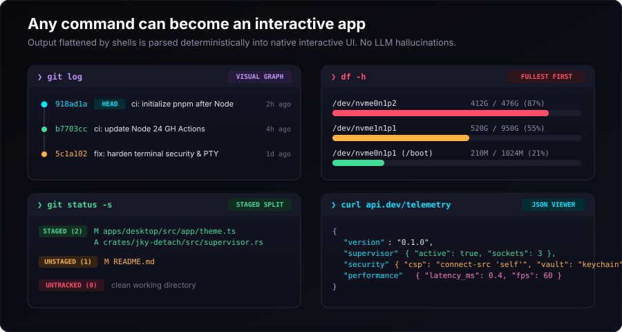
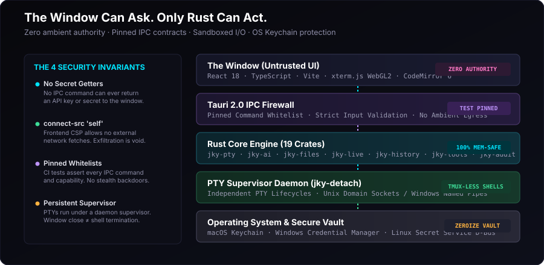
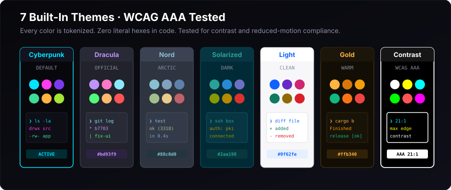

<div align="center">

# ⚡ JKY Terminal

<p align="center">
  <b>The local-first, persistent AI terminal.</b><br>
  A security-minded terminal that keeps your shells alive, turns trusted command output into useful views, and puts an approval-first assistant beside your work.
</p>

[](https://github.com/kartikeyajay2006/jky-terminal/actions/workflows/ci.yml)
[](https://github.com/kartikeyajay2006/jky-terminal/releases)
[](https://github.com/kartikeyajay2006/jky-terminal)
[](docs/SHOWCASE.md#4-zero-ambient-authority-security-model)
[](docs/SHOWCASE.md#3-seven-purpose-built-design-themes)
[](LICENSE)

<br>

<a href="docs/SHOWCASE.md">
  
</a>

<p align="center">
  <a href="#-quick-start">⚡ Quick Start</a> &nbsp;•&nbsp;
  <a href="#-interactive-showcase">✨ Interactive Showcase</a> &nbsp;•&nbsp;
  <a href="#-why-jky-terminal">⚔️ Why JKY Terminal</a> &nbsp;•&nbsp;
  <a href="#-the-ten-sections">▦ 10 Sections</a> &nbsp;•&nbsp;
  <a href="#-any-command-can-become-an-app">⚡ Command to App</a> &nbsp;•&nbsp;
  <a href="#-zero-ambient-authority-security">🛡️ Zero-Trust Security</a> &nbsp;•&nbsp;
  <a href="#-7-precision-crafted-themes">🎨 Themes</a> &nbsp;•&nbsp;
  <a href="#-installation">📦 Downloads</a> &nbsp;•&nbsp;
  <a href="#%EF%B8%8F-keyboard-shortcuts">⌨️ Shortcuts</a>
</p>

</div>

---

## ⚡ Quick Start

Experience the future of terminals in under two minutes:

```sh
# Clone and enter the repository
git clone https://github.com/kartikeyajay2006/jky-terminal.git
cd jky-terminal

# Enable corepack and install dependencies
corepack enable && pnpm install

# Launch the full desktop application with native Rust PTYs
pnpm dev:desktop
```

> **Testing UI only in a browser?** Run `pnpm dev` to launch Vite without recompiling the Rust backend.

---

## ✨ Interactive Showcase

> 📖 **Want the comprehensive visual walkthrough? Explore the full [JKY Terminal Showcase & Tour](docs/SHOWCASE.md).**

JKY Terminal rethinks every assumption of command-line tools:

- 🔄 **Shells Outlive The Window:** Background supervisor daemon (`jky-detach`) keeps long-running builds, compilation jobs, and servers alive across window closes and restarts. Rejoining a pane restores the missed buffer seamlessly.
- ⚡ **Every Command Can Become An App:** Recognizers parse structured output from `docker`, `git`, `df`, `ps`, and `ls` into interactive visual cards without LLM hallucinations.
- 🛡️ **Zero Ambient Authority:** Built on the principle that *the window can ask, but only Rust can act*. Frontend CSP strictly enforces `connect-src 'self'`.
- 🔐 **Zero Secret Exposure:** Your Anthropic/OpenAI API keys live directly in your native OS Keychain with zeroize memory protection. The webview can never read a secret.
- 🚀 **Blazing Fast Native Core:** 19 modular Rust crates driving WebGL-accelerated xterm.js rendering, instant split panes, and sub-millisecond latency.
- 🪶 **Featherweight Editor:** CodeMirror 6 loaded dynamically by chunk, adding a mere 33 kB to the entry bundle instead of a bloated 15 MB Monaco editor.

---

## ⚔️ Why JKY Terminal?

JKY is not trying to replace every terminal for every person. Its focus is a
local-first terminal workflow: persistent shells, deterministic command views,
and an assistant that asks before it acts. Native-first terminals remain the
better choice when maximum rendering performance or the broadest terminal
protocol support is the priority.

| Capability | **JKY Terminal** | Ghostty | Warp | Alacritty | WezTerm | VS Code Terminal |
|---|:---:|:---:|:---:|:---:|:---:|:---:|
| **tmux-less Shell Persistence** | ✅ **Built-in Daemon** | ❌ Requires external multiplexer | ⚠️ Product-managed workflows | ❌ Requires external multiplexer | ❌ Requires tmux or mux server | ❌ Session lost |
| **Command-to-App Parsers** | ✅ **Deterministic Rust** | ❌ Plain text | ⚠️ Cloud AI | ❌ Plain text | ❌ Plain text | ❌ Plain text |
| **Zero-Ambient-Authority CSP** | ✅ **`connect-src 'self'`** | N/A | ❌ Telemetry | N/A | N/A | ❌ Ambient Node |
| **Local-first default** | ✅ **MIT Open Source** | ✅ Free | ⚠️ Account and cloud features available | ✅ Free | ✅ Free | ✅ Free |
| **Integrated Lightweight Editor** | ✅ **CodeMirror 6 (<35kB)** | ❌ None | ❌ None | ❌ None | ❌ None | ⚠️ Full IDE |
| **Native Child Browser Webview** | ✅ **WebKitGTK / WebView2** | ❌ None | ❌ None | ❌ None | ❌ None | ⚠️ Simple Browser |
| **AI Assistant with Keychain Vault** | ✅ **OS Keychain + Tool Approvals** | ❌ None | ⚠️ Cloud Account | ❌ None | ❌ None | ⚠️ Extension Based |
| **Offline Dev Utilities (11 tools)** | ✅ **Built-in** | ❌ None | ❌ None | ❌ None | ❌ None | ⚠️ Extensions |
| **Subsequence History Matching** | ✅ **Logarithmic Ranking** | ❌ Basic | ⚠️ Account History | ❌ Basic | ❌ Basic | ❌ Basic |
| **Automated Test Coverage** | ✅ **3,318 Tests** | Proprietary CI | Closed Core | Unit Tests | Unit Tests | Massive Suite |

---

## ⚡ Any Command Can Become An App

Shells communicate over text pipes because historically that was all they could do. Tabular outputs like `df -h` or `docker ps` are structured datasets crushed into plain characters.

JKY Terminal reads that structure back. When command output matches a recognizable schema, a reactive GUI panel renders directly beneath the output:

<p align="center">
  <a href="docs/SHOWCASE.md#1-any-command-can-become-an-app">
    
  </a>
</p>

| Typed Command | Instant Reactive Transformation |
|---|---|
| `docker ps` | Running/stopped container cards, memory gauges, port mappings, one-click logs/exec |
| `git log` | Interactive commit timeline with branch topology, hashes, and humanized timestamps |
| `df -h` | Visual disk volume utilization bars sorted fullest first with warning thresholds |
| `git status -s` | Clean partition between staged and unstaged changes with file type chips |
| `ps aux` | Searchable process monitor with PID inspection and graceful stop signals |
| `ls -l` | Rich folder file list with permissions, sizes, and file kind badges |
| `mkdir <dir>` | Visual confirmation banner with directory jump shortcut |
| *arbitrary JSON* | Interactive tree viewer with syntax coloration and field extraction |

### The Three Inviolable Safety Guarantees
1. **Never Replaces Output:** Raw text stays untouched in the scrollback. App panels can be toggled or dismissed at will.
2. **Actions Only Type:** Clicking an action button (e.g. `docker stop`) types the command into your shell prompt buffer. Nothing executes until you physically press <kbd>Enter</kbd>.
3. **Pipes Decline:** A pipe (e.g. `docker ps | grep api`) tells the recognizer to decline instantly. Piped commands are never misidentified.

---

## 🛡️ Zero-Ambient-Authority Security

Most modern desktop apps bundle a webview and grant it broad native permissions. JKY Terminal rejects this entirely.

<p align="center">
  <a href="docs/SHOWCASE.md#4-zero-ambient-authority-security-model">
    
  </a>
</p>

### The Core Law: *The Window Can Ask. Only Rust Can Act.*

The webview has **zero ambient network authority**. Its Content Security Policy (CSP) declares `connect-src 'self'`. Even if a malicious terminal payload or compromised node package attempted exfiltration, the webview has nowhere to transmit.

Every capability is gated by automated CI assertions that inspect the source code directly:
- 🔒 **Pinned Command Whitelist:** A test asserts the exact list of allowed IPC commands. Any unauthorized command fails the build.
- 🔒 **No Secret Getters:** No IPC command exists that returns an API key or secret to the window. Keys reside in the native OS Keychain (macOS Keychain, Windows Credential Manager, Linux Secret Service over D-Bus with session encryption).
- 🔒 **Canonical Path Resolution:** File accesses are restricted to explicitly opened workspace folders, checked after symlink canonicalization to eliminate directory traversal (`../`).
- 🔒 **Audit Trail:** Privileged actions and process terminations are recorded in a local-only append audit log.

---

## 🎨 7 Precision-Crafted Themes

JKY Terminal ships with **seven production-grade themes**, each mathematically verified against WCAG AAA/AA contrast criteria. Every single color in the user interface is derived from design tokens; hardcoded hexes are rejected at lint time.

<p align="center">
  <a href="docs/SHOWCASE.md#3-seven-purpose-built-design-themes">
    
  </a>
</p>

1. **Cyberpunk (Default):** Synthwave dark ground (`#08080c`) with vibrant neon cyan (`#00e5ff`) and magenta (`#ff3cf0`) accents.
2. **Dracula:** Official midnight purple palette (`#282a36`) with soft lilac (`#bd93f9`) and pastel green (`#50fa7b`).
3. **Nord:** Elegant arctic darkness (`#2e3440`) with frost blues (`#88c0d0`, `#81a1c1`) and aurora green (`#a3be8c`).
4. **Solarized Dark:** Ethically tuned optical spectrum (`#002b36`) with rich teal (`#2aa198`) and warm amber (`#b58900`).
5. **Light:** Clean daytime aesthetic (`#ffffff`) with deep sapphire blue (`#0f62fe`) and balanced grey shadows.
6. **Gold:** High-warmth cockpit theme (`#120e06`) with radiant amber gold (`#ffb340`) and emerald highlights.
7. **High Contrast:** Pure black ground (`#000000`) and pure white glyphs (`#ffffff`) with an incredible **21:1 WCAG AAA** contrast ratio.

*Toggle themes instantly from **Settings → Themes** or via the command palette (<kbd>Ctrl</kbd>+<kbd>K</kbd>).*

---

## ▦ The Ten Sections

One cohesive desktop window holds everything you need for daily software engineering:

<p align="center">
  
</p>

| Section | Icon | What it Delivers |
|---|:---:|---|
| **Terminal** | `❯` | Real PTY with 2D geometric splits, WebGL2 acceleration, persistent background supervisors, and live command-to-app parsing. |
| **Editor** | `✎` | CodeMirror 6 multi-root editor. Supports code syntax, image previewing, and native canvas PDF rendering within strict CSP boundaries. |
| **Workspaces** | `▦` | Save and restore exact layouts, folder trees, and terminal tabs under friendly project names. |
| **Remote** | `⇄` | First-class SSH manager leveraging your native `~/.ssh/config` and system key agent. Never stores raw passwords. |
| **History** | `↺` | Subsequence fuzzy matching (`dkrps` finds `docker ps`) ranked by recency and logarithmic frequency. One-click forget. |
| **Assistant** | `✦` | Streaming AI assistant (Anthropic / OpenAI). Tools run in a controlled loop with explicit user approval cards for destructive operations. |
| **Dashboard** | `⌂` | Local-first personal workspace with Markdown notes, task boards, calendars, and reminders stored on disk. |
| **Developer** | `⌥` | 11 instant offline tools: JSON formatter, YAML viewer, Diff, Hash, JWT inspector, Regex tester with worker timeout, HTTP tester, System Monitor, and DNS. |
| **Apps** | `⊞` | GitHub pull requests, Gmail (read-only PKCE), native child browser webview (WebKitGTK/WebView2), Weather, News, and Map. |
| **Games** | `◈` | Keyboard-first arcade: Dino Run, Snake, Tic-Tac-Toe, and Flappy Bird, with local records and play statistics. |

→ **[Detailed architectural rationale for each section](docs/FEATURES.md)**

---

## ⌨️ Keyboard Shortcuts

Every shortcut is fully rebindable in **Settings → Keyboard** by simply pressing the keys you want.

| Shortcut | Action | Shortcut | Action |
|---|---|---|---|
| <kbd>Ctrl</kbd>+<kbd>K</kbd> | Open Command Palette | <kbd>Ctrl</kbd>+<kbd>B</kbd> | Toggle Sidebar Navigation Rail |
| <kbd>Ctrl</kbd>+<kbd>T</kbd> | New Terminal Tab | <kbd>Ctrl</kbd>+<kbd>Shift</kbd>+<kbd>T</kbd> | Split Terminal Pane Right |
| <kbd>Ctrl</kbd>+<kbd>W</kbd> | Close Current Tab | <kbd>Ctrl</kbd>+<kbd>Shift</kbd>+<kbd>D</kbd> | Split Terminal Pane Down |
| <kbd>Ctrl</kbd>+<kbd>F</kbd> | Find in Buffer | <kbd>Ctrl</kbd>+<kbd>Shift</kbd>+<kbd>W</kbd> | Close Current Pane |
| <kbd>Ctrl</kbd>+<kbd>Shift</kbd>+<kbd>←↑↓→</kbd> | Geometric Pane Navigation | <kbd>Ctrl</kbd>+<kbd>Drag</kbd> | Swap Pane Positions Seamlessly |

> *Note: <kbd>Ctrl</kbd> translates to <kbd>Cmd (⌘)</kbd> on macOS. The terminal preserves <kbd>Ctrl</kbd>+<kbd>C</kbd> and <kbd>Ctrl</kbd>+<kbd>D</kbd> unconditionally to guarantee shell control.*

---

## 📦 Installation

### Pre-Compiled Releases

Download signed, ready-to-run packages directly from [Releases](https://github.com/kartikeyajay2006/jky-terminal/releases):

| Operating System | Package Formats | Architecture |
|---|---|---|
| **Linux** | `.deb` · `.rpm` · `.AppImage` | x86_64 / arm64 |
| **macOS** | `.dmg` (Universal / Apple Silicon &amp; Intel) | Apple Silicon (M1–M4) / Intel |
| **Windows** | `.msi` (Installer) · `.exe` (Standalone) | x86_64 |

### Building From Source

#### 1. Install System Webview Dependencies (Linux only)
```sh
# Fedora / RHEL:
sudo dnf install webkit2gtk4.1-devel libsoup3-devel openssl-devel \
  curl wget file libappindicator-gtk3-devel librsvg2-devel

# Ubuntu / Debian:
sudo apt install libwebkit2gtk-4.1-dev libsoup-3.0-dev \
  libjavascriptcoregtk-4.1-dev build-essential libssl-dev \
  libayatana-appindicator3-dev librsvg2-dev
```

#### 2. Install & Run
```sh
corepack enable
pnpm install

# Start development desktop app
pnpm dev:desktop

# Run comprehensive workspace verification
pnpm run verify
cargo test --workspace
```

#### 3. Standalone Production Build
Building a standalone native executable requires Tauri's `custom-protocol` feature:
```sh
# Build the React frontend
pnpm --filter @jky/desktop build

# Compile release binary with custom protocol
cargo build --release -p jky-terminal --features tauri/custom-protocol
```

*(On Linux systems with busy desktop environments, you can raise your inotify watchers if needed via `sudo sysctl -w fs.inotify.max_user_instances=512`)*

---

## 🧪 Verified Engineering & CI

Every commit runs rigorous validation on **Linux, macOS, and Windows** with `fail-fast: false`:

```
┌─────────────────────────┬────────────────────────────────────────────────────────┐
│ Verification Suite      │ Scope & Assertions                                     │
├─────────────────────────┼────────────────────────────────────────────────────────┤
│ Frontend Test Suite     │ Typecheck, ESLint, 2,229 Vitest tests                  │
│ Native Rust Engine      │ cargo test --workspace (1,089 tests)                   │
│ Linter & Style Guard    │ cargo clippy --workspace --all-targets -- -D warnings  │
│ Security Assertions     │ Pinned IPC commands, CSP compliance, Keychain checks   │
│ Bundle Footprint Budget │ scan:bundle enforces max size limit on entry chunks    │
│ Binary Link Proof       │ Shipped executable links against real OS keychains     │
└─────────────────────────┴────────────────────────────────────────────────────────┘
```

---

## 🗺️ Roadmap & Honest Scope

We believe in complete engineering honesty. A README that only promises features is marketing fiction:

- ⏳ **YouTube in Apps:** Requires Google OAuth loopback (already architected for Gmail). Deliberately omits ad-stripping to comply with terms of service.
- 🔒 **Read-Only Gmail Scope:** Gmail integration is strictly bound to `gmail.readonly` (asserted by automated tests). Reading mail is useful; auto-sending from a terminal is dangerous.
- 🚀 **Database Cockpit:** Native PostgreSQL, SQLite, and Redis connection explorers scheduled for **v0.2**.
- 🔌 **Sandboxed Plugin Architecture:** WASM-based extension runtime scheduled for **v0.3**.
- 🏷️ **Code Signing:** Binaries are currently unsigned; automated code signing certificate integration is documented in [`docs/RELEASING.md`](docs/RELEASING.md).

---

## 📜 Contributing & Architecture Rules

We welcome issues, discussions, and contributions! Please review [`CONTRIBUTING.md`](CONTRIBUTING.md) before submitting pull requests.

Key Architectural Invariants:
1. **The Window Asks; Only Rust Acts:** All business logic lives in `crates/`. Frontend components call `src/platform/` adapters rather than calling Tauri directly.
2. **Zero Hardcoded Colors:** All UI styling must consume design tokens from `tokens.css` and `themes.css`.
3. **Commit Attribution:** All commits authored by `kartikeyajay2006 <kartikeyajay2006@gmail.com>`.

---

## 📄 License

Distributed under the **MIT License**. See [LICENSE](LICENSE) for details.

The core of JKY Terminal is free, open source, and built for developers everywhere.

<div align="center">
  <sub>Engineered with precision by <b><a href="https://github.com/kartikeyajay2006">kartikeyajay2006</a></b>.</sub>
</div>
