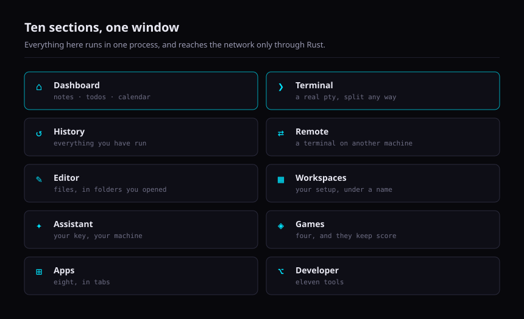
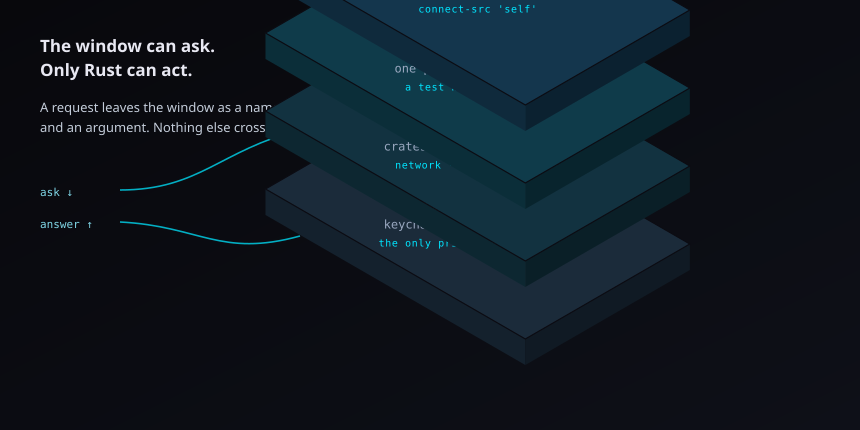

# JKY Terminal

**AI Terminal. Infinite Possibilities.**

A real terminal, an AI assistant, a local-first dashboard, eleven developer
tools and a small arcade — one fast desktop app, on Linux, macOS and Windows.
Built by [@kartikeyajay2006](https://github.com/kartikeyajay2006). MIT.

[](https://github.com/kartikeyajay2006/jky-terminal/actions/workflows/ci.yml)


---

<p align="center">
  
</p>

---

## The one rule

<p align="center">
  
</p>

The window has no ambient authority. Its CSP names no host but `'self'`, so a
compromised frontend has nowhere to send anything — every fetch, every secret,
every process is Rust's.

Three tests enforce it, and they read the source rather than trusting a
comment:

| Test | What it refuses |
|---|---|
| pinned command list | an IPC command nobody reviewed |
| no secret getter | any command that returns a key |
| `connect-src 'self'` | any host the window could reach |

---

## What is in it

| | Section | |
|---|---|---|
| ❯ | **Terminal** | A real pty. Scrollback survives a restart. A failed command offers AI help — and costs nothing until you accept |
| ✦ | **Assistant** | Your key, in the OS keychain. Tools are gated; destructive ones need a click |
| ⌂ | **Dashboard** | Notes, todos, calendar, reminders. On disk, yours, arrangeable |
| ⌥ | **Developer** | Eleven tools. No account, no key |
| ⊞ | **Apps** | Eight, in tabs: GitHub, Gmail, Browser, Weather, News, Map, Timer, Calculator |
| ◈ | **Games** | Four, with scores kept |

Both boards — Apps and Developer — are the same grid, and **Edit layout** on
either lets you drag, resize, pin, hide, duplicate and group the tiles.
Nothing is lost by accident: removing a group keeps its contents, and even
delete is undone by Restore.

---

## Developer tools

| | Tool | | | Tool |
|---|---|---|---|---|
| `{}` | **JSON** | | `⇄` | **HTTP** |
| `≡` | **YAML** | | `◫` | **System Monitor** |
| `±` | **Diff** | | `☰` | **Processes** |
| `#` | **Hash** | | `$` | **Environment** |
| `⊙` | **JWT** | | `◎` | **DNS** |
| `*` | **Regex** | | | |

Every one opens with what it is for, when you would reach for it, and worked
examples you can load. A test requires it, so a tool added later has to teach
itself too.

Four of them are defined by what they **refuse**:

- **JWT decodes and never verifies.** It has no key, so it must not imply a
  token is good — and `alg: none` is a real attack, where a decoder that
  implied validity would be at its most dangerous.
- **Environment cannot change a terminal already open.** Nothing outside a
  running process can, and "manage your environment variables" is the promise
  every tool like this makes and none keeps.
- **Ending a process says "asked it to stop".** A process may ignore the
  signal. It is the only thing here that changes the machine, so it asks
  first and goes in the audit log.
- **Regex runs in a worker so it can be killed.** `(a+)+$` against a run of
  a's takes longer than the universe, and a regular expression cannot be
  interrupted once started.

---

## Accounts

Two apps sign in, both through **your own browser**, never an embedded one.

| | How | What it can do |
|---|---|---|
| **GitHub** | device code, approved on github.com under your own 2FA | read repos, issues, PRs, notifications |
| **Gmail** | authorization code + PKCE, loopback redirect | read your inbox |

No token, code or verifier ever reaches the window. Gmail is `gmail.readonly`
and a test keeps `gmail.send` out; the list never fetches a message body, and
an opened one arrives as text — so nothing in a message can load an image and
report that you read it.

Google needs a client id of your own, and the panel walks you through it. None
ships, because a Google client belongs to whoever made it.

---

## Browser

Not an iframe — most of the web refuses to be one. Measured, not assumed:

| Site | Answer |
|---|---|
| GitHub, Jira | `X-Frame-Options: deny` |
| Gmail, Grafana | `DENY` |
| Slack, Notion, Figma, YouTube, Reddit | `SAMEORIGIN` |

So it is a **native child webview** drawn by whatever engine the OS ships —
WebKitGTK, WKWebView, WebView2. Nothing bundled. It cannot call a single Tauri
command, it keeps nothing, and it opens `http` and `https` only.

---

## Themes and motion

Seven themes. A literal hex in a component is a lint error, and a test
computes the WCAG contrast of every theme's text against its own ground.

Nine things move — cursor, panels, spinners, progress, typing, a status pulse,
tabs, notifications, a game starting. `prefers-reduced-motion` is honoured by
**one** rule for the whole app, and a test pins that: a per-rule guard is one
somebody eventually forgets.

---

## Getting it

### From a release

Installers for Linux (`.deb`, `.rpm`, `.AppImage`), macOS (`.dmg`, both
architectures) and Windows (`.msi`, `.exe`) are attached to each
[release](https://github.com/kartikeyajay2006/jky-terminal/releases).

Builds are currently **unsigned**, so macOS and Windows warn on first launch.
[`docs/RELEASING.md`](docs/RELEASING.md) explains what turning signing on
requires.

### From source

```sh
# Linux needs the webview headers first
sudo dnf install webkit2gtk4.1-devel libsoup3-devel openssl-devel \
  curl wget file libappindicator-gtk3-devel librsvg2-devel
# or: sudo apt install libwebkit2gtk-4.1-dev libsoup-3.0-dev \
#       libjavascriptcoregtk-4.1-dev build-essential libssl-dev \
#       libayatana-appindicator3-dev librsvg2-dev

corepack enable
pnpm install
pnpm dev:desktop      # the real app
pnpm dev              # UI only, in a browser, no Rust rebuild
```

---

## Working on it

```sh
pnpm run verify                 # typecheck, lint, test, build, credential scan
cargo test --workspace          # Rust
cargo clippy --workspace --all-targets -- -D warnings
```

**Building a binary that runs on its own** needs the `custom-protocol` feature,
not just `--release`. Tauri decides dev-versus-production from that feature and
not from the build profile — `let dev = !custom_protocol` — so a plain
`cargo build --release` still points at the dev server and opens a blank
window:

```sh
pnpm --filter @jky/desktop build                              # the frontend
cargo build --release -p jky-terminal --features tauri/custom-protocol
```

`pnpm dev:desktop` needs a file watcher for each of Vite and the Tauri CLI. On
Linux that is an inotify instance apiece, and the default
`fs.inotify.max_user_instances` of 128 is easy to exhaust with a desktop shell
running — the symptom is `Too many open files`. `sysctl -w
fs.inotify.max_user_instances=512` fixes it.

```
jky-terminal/
├─ apps/desktop/
│  ├─ src/                    React 18 + TypeScript + Vite
│  │  ├─ app/                 shell, rail, tabs, theme, stores
│  │  ├─ features/
│  │  │  ├─ terminal/         xterm.js + WebGL, find, links, scrollback
│  │  │  ├─ assistant/        streaming chat, tool cards, sessions
│  │  │  ├─ dashboard/        notes, todos, calendar, reminders
│  │  │  ├─ notifications/    banners and the notification centre
│  │  │  ├─ games/            grid engine + four games
│  │  │  ├─ apps/             registry and the eight apps
│  │  │  ├─ developer/        registry and the eleven tools
│  │  │  ├─ palette/          Ctrl+K
│  │  │  └─ settings/         themes, keys, command catalogue
│  │  ├─ components/          the shared board, tabs, spinner
│  │  ├─ lib/                 tile layout and board session, as plain data
│  │  ├─ platform/            the adapter — tauri.ts and web.ts
│  │  └─ styles/              tokens and seven themes
│  └─ src-tauri/              thin #[tauri::command] wrappers only
└─ crates/
   ├─ jky-secrets/            SecretStore + OS keychain
   ├─ jky-pty/                portable-pty, launchers, command catalogue
   ├─ jky-ai/                 AIProvider, Anthropic, tool sandbox
   ├─ jky-store/              collections + capped scrollback
   ├─ jky-apps/               weather, news, places, routes, github, gmail, browser
   ├─ jky-tools/              hashing, diffing, YAML
   ├─ jky-system/             processor, memory, disks, processes, DNS
   ├─ jky-settings/           preferences
   └─ jky-audit/              local-only audit log
```

**Two rules worth knowing before changing anything.** All real logic lives in
`crates/`, so it is testable with `cargo test` without launching a window —
`src-tauri/src/commands/` holds only thin wrappers. And every native
capability is reached through `src/platform/`; a component that calls
`invoke()` directly is a lint error, because that boundary is what lets the
whole UI run and be tested in a browser.

### CI

Every push runs, on **Linux, macOS and Windows** with `fail-fast: false`:

| Job | What it proves |
|---|---|
| Frontend | typecheck, lint, 1688 tests |
| Native ×3 | `cargo test`, `clippy -D warnings`, and the shippable binary **links** |
| Dependency audit | `pnpm audit` and `cargo audit`, failing on high or critical |
| Security assertions | the command surface, the CSP, and no key in the bundle |

Compiling the library is not proof of portability. Linking the real binary is
where a platform-specific keychain backend actually fails.

---

## What is not here yet

Stated plainly, because a README that only lists what works is a sales page.

- **YouTube.** It needs Google OAuth like Gmail does, and Gmail now has the
  loopback sign-in that makes that possible — so this is a matter of building
  it rather than of not being able to. What is not planned is stripping ads:
  it violates YouTube's terms, and this app ships under a real name.
- **Sending mail.** The scope is `gmail.readonly` and a test keeps
  `gmail.send` and `gmail.modify` out of it, so this is enforced rather than
  promised. Reading your mail is a terminal being useful; sending it is a
  terminal with your signature, and that is a different decision.
- **Signing and auto-update.** The release pipeline works; certificates and an
  updater keypair do not exist yet. See [`docs/RELEASING.md`](docs/RELEASING.md).
- **Editor tab.** Monaco is a multi-megabyte dependency and the bundle is
  already at its budget; the notes editor covers the common case for now.
- **Database tab.** v0.2.
- **Plugins.** v0.3.
- **Trending and Explore in the GitHub app.** GitHub publishes no API for
  either; every client that shows them scrapes the page. Left out rather than
  shipped as dead menu entries.

---

## Licence

MIT — see [LICENSE](LICENSE). The core stays free and open, always.
