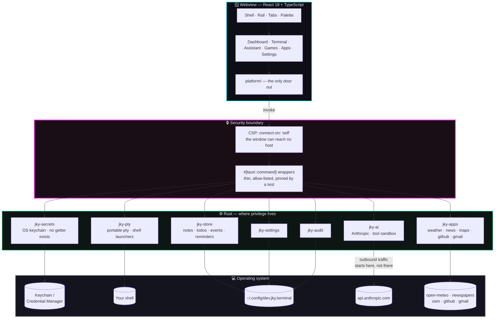
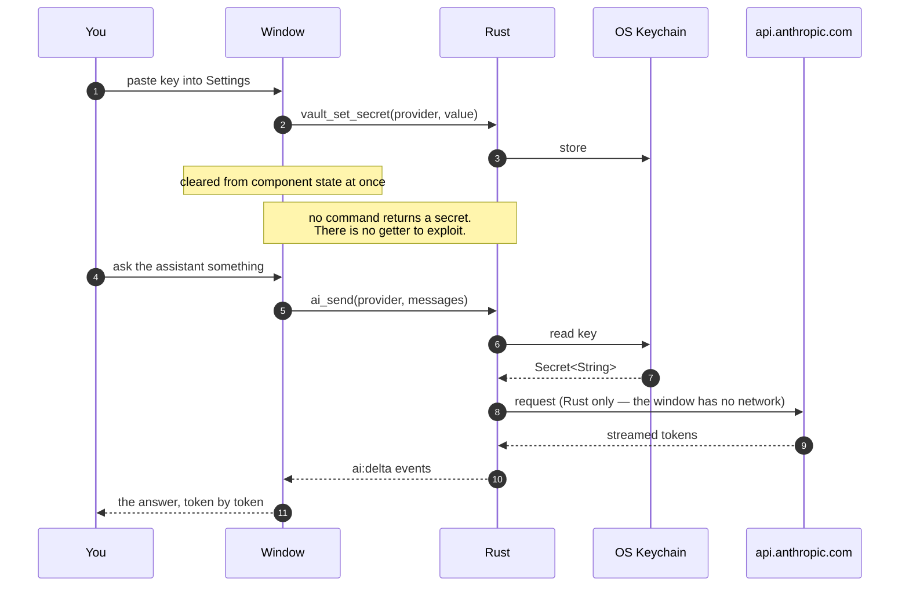
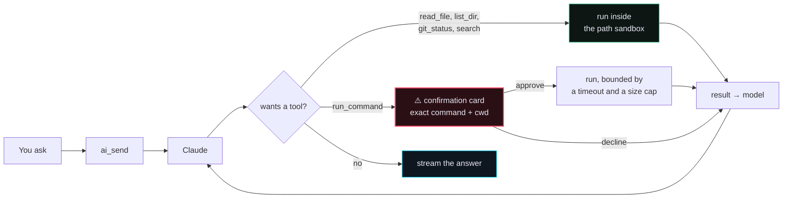

# JKY Terminal

**AI Terminal. Infinite Possibilities.**

A real terminal, an AI assistant, a local-first dashboard and a small arcade,
in one fast desktop app. Built by
[@kartikeyajay2006](https://github.com/kartikeyajay2006). MIT licensed.

[](https://github.com/kartikeyajay2006/jky-terminal/actions/workflows/ci.yml)


---

## What it is

```
┌──────────────────────────────────────────────────────────────────────────┐
│  JKY Terminal                                                    ─  □  × │
├────────────┬─────────────────────────────────────────────────────────────┤
│            │  Terminal 1  ×    + New terminal                       🔔   │
│  ⌂ Dashbo… ├─────────────────────────────────────────────────────────────┤
│  ❯ Termin… │   ██  ██  ██  ██   ██                                       │
│  ✦ Assist… │    ██ ██  ██ ██     ██                                      │
│  ◈ Games   │     ████  ████  ████                                        │
│            │                                                             │
│            │   AI Terminal. Infinite Possibilities.              v0.1.0  │
│            │   Ctrl+K palette   Ctrl+T new   Ctrl+W close   Ctrl+F find  │
│            │                                                             │
│            │   [you@machine]~%                                           │
│  ⚙ Settin… │                                                             │
├────────────┴─────────────────────────────────────────────────────────────┤
│ ● native   shell bash                              theme  Cyberpunk  ▾   │
└──────────────────────────────────────────────────────────────────────────┘
```

Six places to be, reachable from the rail or from `Ctrl+K`:

| | Section | What it holds |
|---|---|---|
| ⌂ | **Dashboard** | Notes, todos, a calendar with events, daily reminders |
| ❯ | **Terminal** | Real PTY shells in tabs, with find, links and history |
| ✦ | **Assistant** | Streaming chat that can read your project and run commands |
| ◈ | **Games** | An arcade: Dino Run, Snake, Tic Tac Toe, Flappy Bird |
| ⊞ | **Apps** | Fourteen, in tabs: GitHub, Gmail, Browser, Weather, News, Map, Timer, Calculator, and six developer tools |
| ⚙ | **Settings** | Themes, API keys, and the shell commands it installs |

---

## How it is put together

The rule that shapes everything: **the window can ask, only Rust can act.**



### Why the boundary is drawn there

An API key is typed into the window exactly once and then never again:



Six tests fail the build if that ever stops being true: no command may be
shaped like a secret getter, the exposed command list is pinned by name, the
CSP's `connect-src` may name no host but `'self'`, its `frame-src` may name
only the embed endpoints the Apps section is allowed to render, no capability
may be scoped by window, and none may name the browser's webview.

The last three are worth separating. `frame-src` lets the window *display*
another origin's document, while same-origin policy still stops this app's
JavaScript from reading into it. And a capability scoped by **window** is
granted to every webview in that window — Tauri's own schema says so — which
would have handed IPC to a page the Browser app loaded from the internet.
Scoping by **webview** is what keeps that from happening.

---

## What is built

### 🖥 Terminal

Real PTY shells — `vim`, `htop`, `ssh` and a Python REPL all behave.

- **Tabs** that survive a restart, with `Ctrl+T` / `Ctrl+W` / `Ctrl+1–9`
- **Find** with `Ctrl+F`, match counts and themed highlighting
- **Scrollback** restored when you reopen the app, capped at 256 KiB a tab
- **Clickable URLs**, opened by the OS — never by the webview
- **Copy on select**, `Ctrl+Shift+C` / `Ctrl+Shift+V`, right-click menu

It installs its own shell commands:

| Command | What it does |
|---|---|
| `jky-terminal` | Reprint the banner |
| `jky ask <question>` | Send a question to the Assistant without leaving the shell |
| `jky commands` | List every command |
| `jky games [1-4]` | Show the games with their records, or open one |
| `jky notes [n]` | List your notes, or read one |
| `jky reminders [n]` | The daily checklist |
| `jky todos [n]` | Everything on the list |

`jky ask` and `jky games 2` work by emitting an OSC escape sequence that rides
the pty like any other output — no socket, no port, no knowledge of where the
app is.

#### When a command fails

The shell reports a non-zero exit through its own prompt hook, and an offer
appears under the command: **Explain**, **Fix**, **Show commands**, **Ignore**
— by button or by the number beside each one.

**Nothing is sent until you choose.** The offer is drawn from what the
terminal already knows, which is what lets it appear under every failure
without costing anything. Pressing a button builds one bounded request — the
command, the exit code, and the tail of the output, capped — asks for a short
answer, and stops reading once the answer is long enough, which is the only
way to actually stop paying for one. It is a single question with no tools, no
history and no conversation state, so a suggestion in the terminal can never
run anything and never collides with the Assistant panel.

With no API key and no local runtime, it says so once instead of offering four
buttons that all fail the same way. Ollama counts: it needs no key, and its
OpenAI-compatible endpoint is served by the adapter that already exists.

Bash and zsh are hooked, by their own mechanisms — `PROMPT_COMMAND` for one,
startup files that hand straight back to yours for the other. Any other shell
is left completely alone, and the feature is simply absent there.

### ✦ Assistant

Streaming chat over the Anthropic Messages API, with tools:



Conversations persist, are searchable, and can be stopped mid-answer.
Every state-mutating call is gated; there is no "always allow" opt-in,
because that toggle is where irreversible mistakes come from.

### ⌂ Dashboard

Notes, todos, a calendar with coloured events, and daily reminders — all
local-first, all surviving restart. **Nothing is ever pruned, capped or
expired**: a note you wrote in March is not less yours in August.

Due events, due reminders and open todos surface as **notifications**: a
heads-up banner slides in and retires after eight seconds, leaving the row in
the centre behind the bell.

**Edit board** rearranges the overview the same way the Apps grid is
rearranged: drag cards into a new order, resize them (small, medium, large),
hide the ones you do not want. The calendar starts as the tall one because it
is the only card that is never empty — dates exist whether or not anything has
been written yet — but that is a starting size, not a rule.

Restore stays offered whenever anything is hidden, in or out of edit mode. A
board you can empty, whose way back is only inside a mode you would have to
guess at, is one you would clear browser storage to fix.

### ◈ Games

An arcade drawn as character grids, so it looks like the terminal it lives in.

| | Game | Keys | Keeps |
|---|---|---|---|
| 🦖 | **Dino Run** | `SPACE` jump · `↓` duck · `P` pause | high score |
| 🐍 | **Snake** | arrows or `WASD` · `SPACE` pause | high score |
| ⨯○ | **Tic Tac Toe** | `1`–`9` · `ENTER` new game | X/O/draw tally |
| 🐦 | **Flappy Bird** | `SPACE` flap · `P` pause | high score |

All three action games accelerate, have a 3-2-1-GO countdown, particles,
screen shake, and a CRT screen with scanlines and phosphor bloom. Every ramp
has a cap — past it the gap between seeing an obstacle and needing to have
already reacted is shorter than human reaction time.

### ⊞ Apps

Fourteen apps, several open at once in tabs. They stay mounted while you switch,
so a timer keeps counting while you read the news and a half-typed sum is
still there when you come back. `Ctrl+Shift+A` moves between them.

| | App | What it is |
|---|---|---|
| ◐ | **GitHub** | A dashboard: your repositories with their files, commits and branches; issues; pull requests; notifications; a contribution graph |
| ✉ | **Gmail** | Your inbox, read here. Read-only — it cannot send, delete or label anything |
| 🌐 | **Browser** | Private browsing in this window, on the webview your OS already ships |
| ☀ | **Weather** | Now and three days ahead, anywhere. No key, no account |
| 📰 | **News** | Front pages from The Hindu, Times of India, Indian Express, BBC World and Hacker News |
| 🗺 | **Map** | OpenStreetMap, with road distance and driving time between two places |
| ⏱ | **Timer** | Counts by the clock, so a backgrounded window does not lose time |
| 🖩 | **Calculator** | A real parser — not `eval` — with history you can click back into |

The grid is yours to arrange. **Edit layout** turns every tile into something
you can drag between groups, resize (small, medium, large), pin to the top of
its group, hide, duplicate into another group, or remove — and groups
themselves can be added, renamed and deleted. It is a mode rather than a
permanent state: outside it a tile is a button that opens an app, because a
grid where every tile also carries six controls is a grid you cannot use for
the thing it is for.

Nothing is lost by accident. Removing a group keeps its apps, hiding is
reversible, and even remove is undone by **Restore** — a launcher you can
permanently break by mis-clicking is worse than one you cannot rearrange at
all. The arrangement is stored, and reconciled against the registry every time
it loads: apps added in a later version are placed, apps that no longer exist
are dropped, and a stored layout that is not one falls back to the default
rather than opening to an empty screen you could not fix from inside the app.

By default the grid is in two groups — what needs nothing, and what signs in to an
account of yours — because that is the one thing worth knowing before you
click a tile, and it is already a field on the registry record rather than a
label someone has to keep in step. Both counts in the header are derived from
that list for the same reason: it used to read "no account needed", which
stopped being true the moment GitHub arrived and stayed on screen through
Gmail.

Each app carries its own colour, and it is the same colour on its tile, its
tab, and the panel it opens. Colour is wayfinding here: you can tell where you
are without reading — which is why the eighth app needed an eighth colour
rather than a shared one. It was picked by measurement: mapping each theme's
hue space, checking candidates in CIE Lab against every colour that theme
already defines, and keeping the one whose worst separation across all seven
themes was widest. That is 30 ΔE, wider than several pairs those themes
already ship, at no worse than 4.63:1 against any ground.

#### GitHub

Sign-in is the **device authorization grant**. A short code appears, you enter
it on github.com, and your own two-factor settings decide what approving it
takes — a push to GitHub Mobile, a one-time code, a security key. This app
never sees your password.

Two things never reach the window. The **device code** — the credential that
redeems the token — stays in Rust for the whole flow; `connect_poll` takes no
arguments at all, because the window has nothing the exchange needs. The
**access token** goes straight to the OS keychain, and the window is told two
booleans: configured, connected.

Scopes are pinned by a test: `repo read:org notifications`. Nothing that
writes, nothing administrative, no `delete_repo`.

An OAuth app ships with the build, so a new install signs in immediately
without registering anything. A device-flow client id is public by design and
has no secret beside it — which is why committing one is safe, and a test pins
its shape so nothing secret-looking can be slipped in next to it.

#### Developer tools

Six, in a group of their own, and every one a function of what you paste into
it: no account, no key, no network, nothing kept.

| | Tool | What it does |
|---|---|---|
| `{}` | **JSON** | Formats and minifies as you type, and says which line and column stopped it |
| `≡` | **YAML** | Tidies YAML and converts it to JSON and back |
| `±` | **Diff** | Compares two texts line by line, with both sets of line numbers |
| `#` | **Hash** | MD5, SHA-1, SHA-256 and SHA-512 at once |
| `⊙` | **JWT** | Reads what is inside a token — and never claims one is valid |
| `*` | **Regex** | Tries a pattern against text, off the main thread |

That list is short on purpose. A Kubernetes or database tile would need a
config file or a password, which is a different kind of promise, and a test
enforces that a tool never asks for an account.

Three of them are Rust — hashing, diffing and YAML each need a parser or an
algorithm someone else wrote, and those are audited with the rest of the tree.
The other three are TypeScript, because `JSON.parse`, `atob` and `RegExp` are
already in the window and a round trip would cost a frame to buy nothing.

Four things worth knowing:

- **The JSON tool finds the error position itself.** Engines will not reliably
  say — V8 gives `at position 12 (line 3 column 8)` for some failures and a
  snippet with no position for others — so the document is bisected. The
  obvious predicate for that is wrong: given `{`, V8 says *"Expected property
  name or '}'"*, which reads like a syntax error and is nothing of the sort.
  What separates a truncated document from a broken one is *where* it stopped.
- **It warns when reformatting would change a number.** `JSON.parse` rounds
  anything past 2^53, so a formatter that round-trips through it can hand back
  a different id while claiming to have only reindented.
- **The JWT tool decodes and never verifies.** That is the safety property,
  not a limitation: it has no key, so it must not imply a token is good — and
  `alg: none` is a real attack, where a decoder that implied validity would be
  at its most dangerous.
- **The regex tester runs in a worker so it can be killed.** `(a+)+$` against a
  run of a's takes longer than the universe, and a regular expression cannot
  be interrupted once started. Terminating the thread is the only way to stop
  one, and on the main thread there is no thread to terminate.

#### Gmail

Read-only, and that is the design rather than a limitation waiting to be
lifted. The scope is `gmail.readonly` and nothing else, so there is no send,
no delete and no label change — and the consent screen Google shows you says
exactly that.

**The list fetches no message bodies.** It needs three headers and the snippet
Gmail already sends, so `format=metadata` is all it asks for — the contents of
a mailbox stay in the mailbox. Opening one message fetches that message, and
only that one.

**What arrives is text, never markup.** When a message carries both a plain
and an HTML part the plain one is used; when it carries only HTML, Rust turns
it into text before it leaves the backend. That is not tidiness. Rendering a
stranger's markup would load their images, and a tracking pixel is the whole
reason mail readers ask before doing that — so nothing here can request one,
because the tag is gone before the text reaches the window. Scripts go the
same way, and the body is put in a `<pre>`, never into `innerHTML`.

Sign-in is the **authorization-code flow with PKCE**, in your own browser.
Not by preference: Google has answered OAuth requests from embedded webviews
with `disallowed_useragent` since July 2023, so a sign-in inside this window
is not possible and is not attempted. Rust opens a socket on `127.0.0.1`, your
browser redirects back to it, and the socket closes. It serves exactly one
request — a doorbell, not a web server.

Nothing from that flow reaches the window: not the verifier, not the `state`,
not the code, not the access token, not the refresh token. The panel calls
`connect` and is told an email address.

Unlike GitHub, **no client id ships with the app**, and the panel walks you
through making one. A Google client belongs to a project and a consent screen
that someone owns; shipping one would put every install of JKY Terminal in a
stranger's audit log. You need a project with the Gmail API enabled and an
OAuth client of type **Desktop app** — a Web client will not work, because it
wants a redirect address this app does not have. Copy **both** the Client ID and the
Client secret that Google then shows you.

That second one is a wart worth naming. The OAuth spec calls an installed app
a *public client* and PKCE exists precisely so one needs no secret — but
Google's token endpoint refuses the exchange without a `client_secret` anyway,
answering `invalid_request: client_secret is missing`, while its own
documentation says the value is not treated as a secret for this client type
because anyone can read one out of a program they downloaded. PKCE is what
actually protects the exchange here; the secret is Google's paperwork. It goes
to the OS keychain regardless, and no command returns it.

Access tokens last an hour, which is shorter than this app stays open, so a
401 refreshes once and retries rather than telling you to sign in again when
nothing had gone wrong.

#### Browser

Not an iframe, because most of the web refuses to be one — measured, not
assumed:

| Site | Answer |
|---|---|
| GitHub, Jira | `X-Frame-Options: deny` |
| Gmail, Grafana | `DENY` |
| Slack, Notion, Figma, YouTube, Reddit | `SAMEORIGIN` |

Framing rules govern nested browsing contexts only, so this is a **native child
webview** — a top-level one — drawn by whichever engine the OS already ships:
WebKitGTK on Linux, WKWebView on macOS, WebView2 on Windows. Nothing is
bundled, so it costs no download size and no memory beyond the page on screen.

- **It cannot call into the app.** Its webview is labelled `browser` and no
  capability names that label. Two tests pin it.
- **It keeps nothing.** Incognito: cookies, storage and history live in memory
  and are gone when it closes.
- **It only opens the web.** `http` and `https`; every other scheme refused —
  `file://` above all, which would make the address bar a reader for the disk.
- Searches go to DuckDuckGo, and the user agent is deliberately ordinary,
  because one nobody else sends is a fingerprint.

#### What the others need

Nothing. Weather, News, Map, Timer and Calculator ask for no account and no
key. Weather and News fetch through Rust like everything else — the window can
reach no host — so neither needed a CSP change. Map did: it renders another
origin's document, and `frame-src` names exactly one host for it.

### ✨ Motion

Nine places move, and they are all named in one file — `src/styles/motion.css`
— because the failure mode with motion is never one animation, it is the ninth
that nobody weighed against the other eight.

| | Where |
|---|---|
| Cursor blink | the terminal caret |
| Panel transition | a section rising into place |
| Loading spinner | anywhere the app is waiting on something |
| Progress | an indeterminate bar while a suggestion is being fetched |
| Terminal typing | the answer under a failed command, typed rather than pasted |
| Status pulse | the dot beside System status, so a frozen poll and a quiet machine do not look alike |
| Tab transition | the underline growing from the middle |
| Notification slide | a banner arriving from the edge it lives on |
| Game start | the screen taking its place |

Two rules hold. Motion says something or it does not happen: a panel rising
says where it came from, a spinner says the app is still working, a banner
sliding says it arrived. And it is quick — the longest is a third of a second,
because a transition you have time to notice is one you resent by the
fiftieth.

`prefers-reduced-motion` is honoured by **one** rule for the whole app, not one
per animation, and a test pins that — a per-rule guard is a guard somebody
eventually forgets. It shortens motion rather than removing it, because a
zero-length animation never fires `animationend` and anything waiting on one
would wait for ever.

### 🎨 Seven themes

Cyberpunk, Dracula, Nord, Solarized, Light, Gold, High Contrast. Themes are
token sets; a literal hex value in a component is a lint error, and a test
computes the WCAG contrast ratio of every theme's text against its own ground.

---

## Getting it

### From a release

Installers for Linux (`.deb`, `.rpm`, `.AppImage`), macOS (`.dmg`, both
architectures) and Windows (`.msi`, `.exe`) are attached to each
[release](https://github.com/kartikeyajay2006/jky-terminal/releases).

Builds are currently **unsigned**, so macOS and Windows warn on first launch.
[`docs/RELEASING.md`](docs/RELEASING.md) explains what turning signing on
requires.

### From source

```sh
# Linux needs the webview headers first
sudo dnf install webkit2gtk4.1-devel libsoup3-devel openssl-devel \
  curl wget file libappindicator-gtk3-devel librsvg2-devel
# or: sudo apt install libwebkit2gtk-4.1-dev libsoup-3.0-dev \
#       libjavascriptcoregtk-4.1-dev build-essential libssl-dev \
#       libayatana-appindicator3-dev librsvg2-dev

corepack enable
pnpm install
pnpm dev:desktop      # the real app
pnpm dev              # UI only, in a browser, no Rust rebuild
```

---

## Working on it

```sh
pnpm run verify                 # typecheck, lint, test, build, credential scan
cargo test --workspace          # Rust
cargo clippy --workspace --all-targets -- -D warnings
```

**Building a binary that runs on its own** needs the `custom-protocol` feature,
not just `--release`. Tauri decides dev-versus-production from that feature and
not from the build profile — `let dev = !custom_protocol` — so a plain
`cargo build --release` still points at the dev server and opens a blank
window:

```sh
pnpm --filter @jky/desktop build                              # the frontend
cargo build --release -p jky-terminal --features tauri/custom-protocol
```

`pnpm dev:desktop` needs a file watcher for each of Vite and the Tauri CLI. On
Linux that is an inotify instance apiece, and the default
`fs.inotify.max_user_instances` of 128 is easy to exhaust with a desktop shell
running — the symptom is `Too many open files`. `sysctl -w
fs.inotify.max_user_instances=512` fixes it.

```
jky-terminal/
├─ apps/desktop/
│  ├─ src/                    React 18 + TypeScript + Vite
│  │  ├─ app/                 shell, rail, tabs, theme, stores
│  │  ├─ features/
│  │  │  ├─ terminal/         xterm.js + WebGL, find, links, scrollback
│  │  │  ├─ assistant/        streaming chat, tool cards, sessions
│  │  │  ├─ dashboard/        notes, todos, calendar, reminders
│  │  │  ├─ notifications/    banners and the notification centre
│  │  │  ├─ games/            grid engine + four games
│  │  │  ├─ apps/             registry, tabs, switcher, and the eight apps
│  │  │  ├─ palette/          Ctrl+K
│  │  │  └─ settings/         themes, keys, command catalogue
│  │  ├─ platform/            the adapter — tauri.ts and web.ts
│  │  └─ styles/              tokens and seven themes
│  └─ src-tauri/              thin #[tauri::command] wrappers only
└─ crates/
   ├─ jky-secrets/            SecretStore + OS keychain
   ├─ jky-pty/                portable-pty, launchers, command catalogue
   ├─ jky-ai/                 AIProvider, Anthropic, tool sandbox
   ├─ jky-store/              collections + capped scrollback
   ├─ jky-apps/               weather, news, places, routes, github, gmail, browser
   ├─ jky-tools/              hashing, diffing, YAML
   ├─ jky-settings/           preferences
   └─ jky-audit/              local-only audit log
```

**Two rules worth knowing before changing anything.** All real logic lives in
`crates/`, so it is testable with `cargo test` without launching a window —
`src-tauri/src/commands/` holds only thin wrappers. And every native
capability is reached through `src/platform/`; a component that calls
`invoke()` directly is a lint error, because that boundary is what lets the
whole UI run and be tested in a browser.

### CI

Every push runs, on **Linux, macOS and Windows** with `fail-fast: false`:

| Job | What it proves |
|---|---|
| Frontend | typecheck, lint, 1371 tests |
| Native ×3 | `cargo test`, `clippy -D warnings`, and the shippable binary **links** |
| Dependency audit | `pnpm audit` and `cargo audit`, failing on high or critical |
| Security assertions | the command surface, the CSP, and no key in the bundle |

Compiling the library is not proof of portability. Linking the real binary is
where a platform-specific keychain backend actually fails.

---

## What is not here yet

Stated plainly, because a README that only lists what works is a sales page.

- **YouTube.** It needs Google OAuth like Gmail does, and Gmail now has the
  loopback sign-in that makes that possible — so this is a matter of building
  it rather than of not being able to. What is not planned is stripping ads:
  it violates YouTube's terms, and this app ships under a real name.
- **Sending mail.** The scope is `gmail.readonly` and a test keeps
  `gmail.send` and `gmail.modify` out of it, so this is enforced rather than
  promised. Reading your mail is a terminal being useful; sending it is a
  terminal with your signature, and that is a different decision.
- **Signing and auto-update.** The release pipeline works; certificates and an
  updater keypair do not exist yet. See [`docs/RELEASING.md`](docs/RELEASING.md).
- **Editor tab.** Monaco is a multi-megabyte dependency and the bundle is
  already at its budget; the notes editor covers the common case for now.
- **Database tab.** v0.2.
- **Plugins.** v0.3.
- **Trending and Explore in the GitHub app.** GitHub publishes no API for
  either; every client that shows them scrapes the page. Left out rather than
  shipped as dead menu entries.

---

## Licence

MIT — see [LICENSE](LICENSE). The core stays free and open, always.
