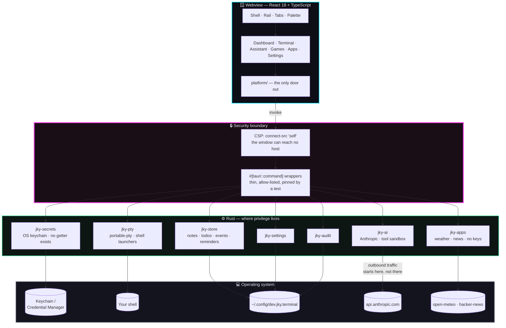
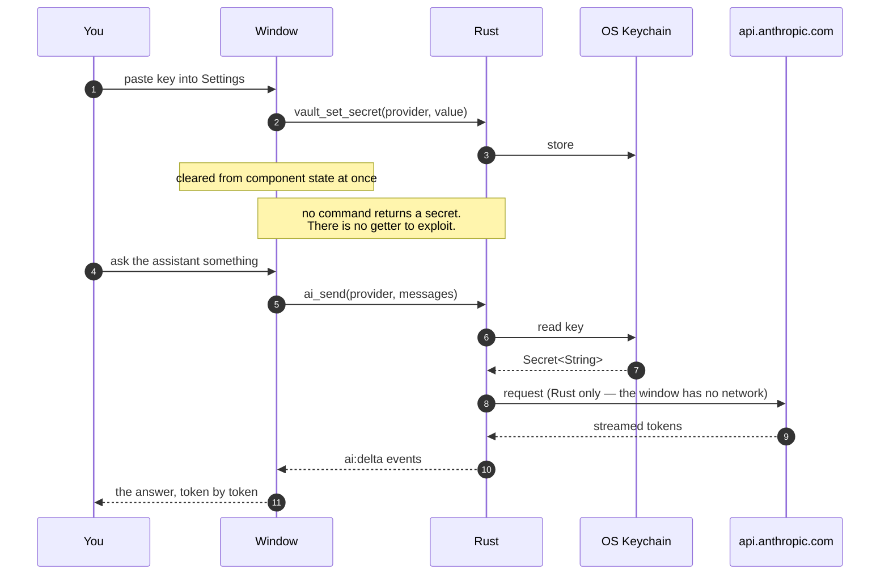
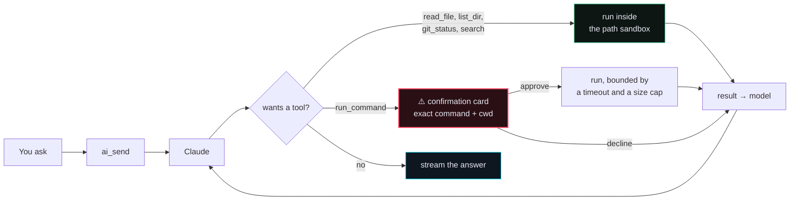

# JKY Terminal

**AI Terminal. Infinite Possibilities.**

A real terminal, an AI assistant, a local-first dashboard and a small arcade,
in one fast desktop app. Built by
[@kartikeyajay2006](https://github.com/kartikeyajay2006). MIT licensed.

[](https://github.com/kartikeyajay2006/jky-terminal/actions/workflows/ci.yml)


---

## What it is

```
┌──────────────────────────────────────────────────────────────────────────┐
│  JKY Terminal                                                    ─  □  × │
├────────────┬─────────────────────────────────────────────────────────────┤
│            │  Terminal 1  ×    + New terminal                       🔔   │
│  ⌂ Dashbo… ├─────────────────────────────────────────────────────────────┤
│  ❯ Termin… │   ██  ██  ██  ██   ██                                       │
│  ✦ Assist… │    ██ ██  ██ ██     ██                                      │
│  ◈ Games   │     ████  ████  ████                                        │
│            │                                                             │
│            │   AI Terminal. Infinite Possibilities.              v0.1.0  │
│            │   Ctrl+K palette   Ctrl+T new   Ctrl+W close   Ctrl+F find  │
│            │                                                             │
│            │   [you@machine]~%                                           │
│  ⚙ Settin… │                                                             │
├────────────┴─────────────────────────────────────────────────────────────┤
│ ● native   shell bash                              theme  Cyberpunk  ▾   │
└──────────────────────────────────────────────────────────────────────────┘
```

Six places to be, reachable from the rail or from `Ctrl+K`:

| | Section | What it holds |
|---|---|---|
| ⌂ | **Dashboard** | Notes, todos, a calendar with events, daily reminders |
| ❯ | **Terminal** | Real PTY shells in tabs, with find, links and history |
| ✦ | **Assistant** | Streaming chat that can read your project and run commands |
| ◈ | **Games** | An arcade: Dino Run, Snake, Tic Tac Toe, Flappy Bird |
| ⊞ | **Apps** | Calculator, Timer, Weather, News, Map — each opening in this window |
| ⚙ | **Settings** | Themes, API keys, and the shell commands it installs |

---

## How it is put together

The rule that shapes everything: **the window can ask, only Rust can act.**



### Why the boundary is drawn there

An API key is typed into the window exactly once and then never again:



Four tests fail the build if that ever stops being true: no command may be
shaped like a secret getter, the exposed command list is pinned by name, the
CSP's `connect-src` may name no host but `'self'`, and its `frame-src` may name
only the embed endpoints the Apps section is allowed to render. The last two
are different permissions: `frame-src` lets the window *display* another
origin's document, while same-origin policy still stops this app's JavaScript
from reading into it or reaching that host.

---

## What is built

### 🖥 Terminal

Real PTY shells — `vim`, `htop`, `ssh` and a Python REPL all behave.

- **Tabs** that survive a restart, with `Ctrl+T` / `Ctrl+W` / `Ctrl+1–9`
- **Find** with `Ctrl+F`, match counts and themed highlighting
- **Scrollback** restored when you reopen the app, capped at 256 KiB a tab
- **Clickable URLs**, opened by the OS — never by the webview
- **Copy on select**, `Ctrl+Shift+C` / `Ctrl+Shift+V`, right-click menu

It installs its own shell commands:

| Command | What it does |
|---|---|
| `jky-terminal` | Reprint the banner |
| `jky ask <question>` | Send a question to the Assistant without leaving the shell |
| `jky commands` | List every command |
| `jky games [1-4]` | Show the games with their records, or open one |
| `jky notes [n]` | List your notes, or read one |
| `jky reminders [n]` | The daily checklist |
| `jky todos [n]` | Everything on the list |

`jky ask` and `jky games 2` work by emitting an OSC escape sequence that rides
the pty like any other output — no socket, no port, no knowledge of where the
app is.

### ✦ Assistant

Streaming chat over the Anthropic Messages API, with tools:



Conversations persist, are searchable, and can be stopped mid-answer.
Every state-mutating call is gated; there is no "always allow" opt-in,
because that toggle is where irreversible mistakes come from.

### ⌂ Dashboard

Notes, todos, a calendar with coloured events, and daily reminders — all
local-first, all surviving restart. **Nothing is ever pruned, capped or
expired**: a note you wrote in March is not less yours in August.

Due events, due reminders and open todos surface as **notifications**: a
heads-up banner slides in and retires after eight seconds, leaving the row in
the centre behind the bell.

### ◈ Games

An arcade drawn as character grids, so it looks like the terminal it lives in.

| | Game | Keys | Keeps |
|---|---|---|---|
| 🦖 | **Dino Run** | `SPACE` jump · `↓` duck · `P` pause | high score |
| 🐍 | **Snake** | arrows or `WASD` · `SPACE` pause | high score |
| ⨯○ | **Tic Tac Toe** | `1`–`9` · `ENTER` new game | X/O/draw tally |
| 🐦 | **Flappy Bird** | `SPACE` flap · `P` pause | high score |

All three action games accelerate, have a 3-2-1-GO countdown, particles,
screen shake, and a CRT screen with scanlines and phosphor bloom. Every ramp
has a cap — past it the gap between seeing an obstacle and needing to have
already reacted is shorter than human reaction time.

### ⊞ Apps

Five apps, each opening in this window rather than handing you to a browser.
`Ctrl+Shift+A` switches between them without going back to the grid.

| | App | What it is |
|---|---|---|
| 🖩 | **Calculator** | A real parser — not `eval` — with history you can click back into |
| ⏱ | **Timer** | Counts by the clock, so a backgrounded window does not lose time |
| ☀ | **Weather** | Now and three days ahead, anywhere. No key, no account |
| 📰 | **News** | The Hacker News front page, with the site each link goes to |
| 🗺 | **Map** | OpenStreetMap, drawn inside the window |

Weather and News fetch through Rust like everything else — the window can
reach no host — so neither needed a CSP change. Map did: it renders another
origin's document, and `frame-src` names exactly one host for it.

**Why only five.** Most of the web refuses to be embedded. Measured directly:
GitHub and Jira send `X-Frame-Options: deny`; Gmail and Grafana `DENY`; Slack,
Notion, Figma, YouTube, Reddit and OpenStreetMap's main site all `SAMEORIGIN`.
Purpose-built embed endpoints are the exception, which is what Map uses. The
apps that need an account — GitHub, Reddit, YouTube — are next, and each needs
its own OAuth app registered; a Google login cannot authenticate GitHub or
Reddit, because those run their own authorization servers.

### 🎨 Seven themes

Cyberpunk, Dracula, Nord, Solarized, Light, Gold, High Contrast. Themes are
token sets; a literal hex value in a component is a lint error, and a test
computes the WCAG contrast ratio of every theme's text against its own ground.

---

## Getting it

### From a release

Installers for Linux (`.deb`, `.rpm`, `.AppImage`), macOS (`.dmg`, both
architectures) and Windows (`.msi`, `.exe`) are attached to each
[release](https://github.com/kartikeyajay2006/jky-terminal/releases).

Builds are currently **unsigned**, so macOS and Windows warn on first launch.
[`docs/RELEASING.md`](docs/RELEASING.md) explains what turning signing on
requires.

### From source

```sh
# Linux needs the webview headers first
sudo dnf install webkit2gtk4.1-devel libsoup3-devel openssl-devel \
  curl wget file libappindicator-gtk3-devel librsvg2-devel
# or: sudo apt install libwebkit2gtk-4.1-dev libsoup-3.0-dev \
#       libjavascriptcoregtk-4.1-dev build-essential libssl-dev \
#       libayatana-appindicator3-dev librsvg2-dev

corepack enable
pnpm install
pnpm dev:desktop      # the real app
pnpm dev              # UI only, in a browser, no Rust rebuild
```

---

## Working on it

```sh
pnpm run verify                 # typecheck, lint, test, build, credential scan
cargo test --workspace          # Rust
cargo clippy --workspace --all-targets -- -D warnings
```

```
jky-terminal/
├─ apps/desktop/
│  ├─ src/                    React 18 + TypeScript + Vite
│  │  ├─ app/                 shell, rail, tabs, theme, stores
│  │  ├─ features/
│  │  │  ├─ terminal/         xterm.js + WebGL, find, links, scrollback
│  │  │  ├─ assistant/        streaming chat, tool cards, sessions
│  │  │  ├─ dashboard/        notes, todos, calendar, reminders
│  │  │  ├─ notifications/    banners and the notification centre
│  │  │  ├─ games/            grid engine + four games
│  │  │  ├─ apps/             registry, switcher, and the five apps
│  │  │  ├─ palette/          Ctrl+K
│  │  │  └─ settings/         themes, keys, command catalogue
│  │  ├─ platform/            the adapter — tauri.ts and web.ts
│  │  └─ styles/              tokens and seven themes
│  └─ src-tauri/              thin #[tauri::command] wrappers only
└─ crates/
   ├─ jky-secrets/            SecretStore + OS keychain
   ├─ jky-pty/                portable-pty, launchers, command catalogue
   ├─ jky-ai/                 AIProvider, Anthropic, tool sandbox
   ├─ jky-store/              collections + capped scrollback
   ├─ jky-apps/               weather + news: fetch, parse, no keys
   ├─ jky-settings/           preferences
   └─ jky-audit/              local-only audit log
```

**Two rules worth knowing before changing anything.** All real logic lives in
`crates/`, so it is testable with `cargo test` without launching a window —
`src-tauri/src/commands/` holds only thin wrappers. And every native
capability is reached through `src/platform/`; a component that calls
`invoke()` directly is a lint error, because that boundary is what lets the
whole UI run and be tested in a browser.

### CI

Every push runs, on **Linux, macOS and Windows** with `fail-fast: false`:

| Job | What it proves |
|---|---|
| Frontend | typecheck, lint, 1240 tests |
| Native ×3 | `cargo test`, `clippy -D warnings`, and the shippable binary **links** |
| Dependency audit | `pnpm audit` and `cargo audit`, failing on high or critical |
| Security assertions | the command surface, the CSP, and no key in the bundle |

Compiling the library is not proof of portability. Linking the real binary is
where a platform-specific keychain backend actually fails.

---

## What is not here yet

Stated plainly, because a README that only lists what works is a sales page.

- **Signing and auto-update.** The release pipeline works; certificates and an
  updater keypair do not exist yet. See [`docs/RELEASING.md`](docs/RELEASING.md).
- **The signed-in apps.** The Apps section ships the five that need no
  account. GitHub, Reddit and YouTube need their own OAuth apps registered
  first — a Google login cannot authenticate GitHub or Reddit, which run their
  own authorization servers.
- **A Browser app.** Arbitrary pages cannot be framed: GitHub and Jira send
  `X-Frame-Options: deny`, and Slack, Notion, Figma, YouTube and Reddit all
  send `SAMEORIGIN`. A real browser needs a native webview docked in the
  window, which is behind Tauri's `unstable` flag today.
- **Editor tab.** Monaco is a multi-megabyte dependency and the bundle is
  already at its budget; the notes editor covers the common case for now.
- **Browser and Database tabs.** v0.2.
- **Plugins.** v0.3.

---

## Licence

MIT — see [LICENSE](LICENSE). The core stays free and open, always.
