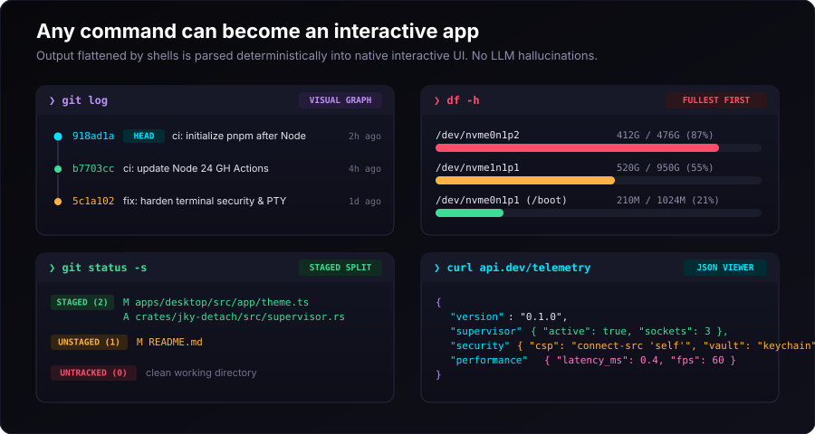
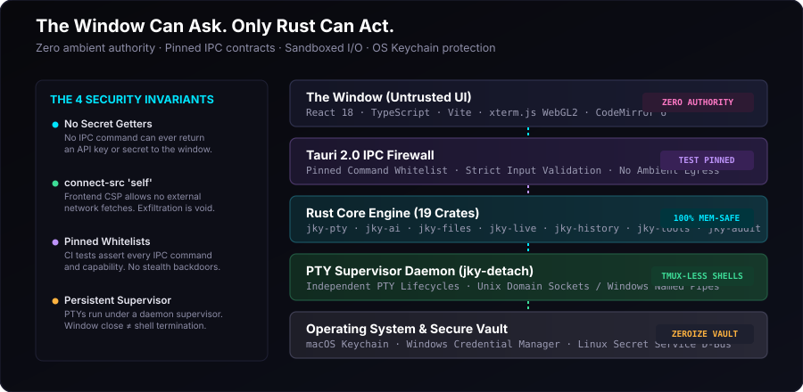

<div align="center">

# ⚡ JKY Terminal

<p align="center">
  <b>The local-first, persistent AI terminal.</b><br>
  A security-minded terminal that keeps your shells alive, turns trusted command output into useful views, and puts an approval-first assistant beside your work.
</p>

[](https://github.com/kartikeyajay2006/jky-terminal/actions/workflows/ci.yml)
[](https://github.com/kartikeyajay2006/jky-terminal/releases)
[](https://github.com/kartikeyajay2006/jky-terminal)
[](docs/SHOWCASE.md#4-zero-ambient-authority-security-model)
[](#-seven-themes-one-set-of-tokens)
[](LICENSE)

<br>

<a href="docs/SHOWCASE.md">
  
</a>

<p align="center">
  <a href="#-quick-start">⚡ Quick Start</a> &nbsp;•&nbsp;
  <a href="#-interactive-showcase">✨ Interactive Showcase</a> &nbsp;•&nbsp;
  <a href="#-documentation">📚 Documentation</a> &nbsp;•&nbsp;
  <a href="#%EF%B8%8F-how-jky-compares--honestly">⚖️ Honest Comparison</a> &nbsp;•&nbsp;
  <a href="#-the-ten-sections">▦ 10 Sections</a> &nbsp;•&nbsp;
  <a href="#-any-command-can-become-an-app">⚡ Command to App</a> &nbsp;•&nbsp;
  <a href="#-zero-ambient-authority-security">🛡️ Zero-Trust Security</a> &nbsp;•&nbsp;
  <a href="#-seven-themes-one-set-of-tokens">🎨 Themes</a> &nbsp;•&nbsp;
  <a href="#-installation">📦 Downloads</a> &nbsp;•&nbsp;
  <a href="#%EF%B8%8F-keyboard-shortcuts">⌨️ Shortcuts</a>
</p>

</div>

---

## ⚡ Quick Start

Experience the future of terminals in under two minutes:

```sh
# Clone and enter the repository
git clone https://github.com/kartikeyajay2006/jky-terminal.git
cd jky-terminal

# Enable corepack and install dependencies
corepack enable && pnpm install

# Launch the full desktop application with native Rust PTYs
pnpm dev:desktop
```

> **Testing UI only in a browser?** Run `pnpm dev` to launch Vite without recompiling the Rust backend.

---

## ✨ Interactive Showcase

> 📖 **Want the comprehensive visual walkthrough? Explore the full [JKY Terminal Showcase & Tour](docs/SHOWCASE.md).**

## 📚 Documentation

Beautiful product visuals are useful; dependable operating guidance is essential. The new documentation hub is written around the actual application, with clear boundaries between current capabilities and planned work.

<p align="center">
  <a href="docs/README.md"></a>
</p>

| Read | What you will learn |
|---|---|
| [Documentation home](docs/README.md) | A guided map of every user and maintainer guide. |
| [Getting started](docs/getting-started.md) | Source setup, first launch, safe first-session checks, and troubleshooting. |
| [Terminal guide](docs/terminal-guide.md) | Tabs, panes, persistent sessions, remote work, history, and command views. |
| [Workspaces and editor](docs/workspaces-and-editor.md) | Project boundaries, safe file editing, and restoration habits. |
| [Assistant and approvals](docs/assistant-and-approvals.md) | Provider context, visible approvals, and practical AI safety. |
| [Security and privacy](docs/security-and-privacy.md) | Native boundaries, secrets, files, audit records, and known limits. |
| [Operations and releases](docs/operations-and-releases.md) | CI, validation, packaging, signing status, and release smoke tests. |

The [product roadmap](docs/product-roadmap.md) explains what is genuinely current, what needs hardening next, and what is deliberately planned rather than promised.

JKY Terminal rethinks every assumption of command-line tools:

- 🔄 **Shells Outlive The Window:** Background supervisor daemon (`jky-detach`) keeps long-running builds, compilation jobs, and servers alive across window closes and restarts. Rejoining a pane restores the missed buffer seamlessly.
- ⚡ **Every Command Can Become An App:** Recognizers parse structured output from `docker`, `git`, `df`, `ps`, and `ls` into interactive visual cards without LLM hallucinations.
- 🛡️ **Zero Ambient Authority:** Built on the principle that *the window can ask, but only Rust can act*. Frontend CSP strictly enforces `connect-src 'self'`.
- 🔐 **Zero Secret Exposure:** Your Anthropic/OpenAI API keys live directly in your native OS Keychain with zeroize memory protection. The webview can never read a secret.
- 🦀 **Rust Does The Real Work:** 19 focused Rust crates own the PTYs, files, keys, history and audit log behind a thin IPC layer; the terminal itself renders through xterm.js with WebGL2.
- 🪶 **Featherweight Editor:** CodeMirror 6 loaded dynamically by chunk, adding a mere 33 kB to the entry bundle instead of a bloated 15 MB Monaco editor.

---

## ⚖️ How JKY Compares — Honestly

Every terminal below is excellent at something, and most of them are far more mature than JKY.
This table is here to help you choose, not to win. Facts about other projects were checked against
their own docs in **October 2026**. If one is wrong or out of date,
[open an issue](https://github.com/kartikeyajay2006/jky-terminal/issues) and it will be fixed.

**Legend:** 🟢 built in &nbsp;·&nbsp; 🟡 partly, or with setup / an add-on &nbsp;·&nbsp; ⚪ not offered (often by design)

| | **JKY** | Ghostty | Warp | Wave | WezTerm | Alacritty | VS Code |
|---|:-:|:-:|:-:|:-:|:-:|:-:|:-:|
| Tabs and splits | 🟢 | 🟢 | 🟢 | 🟢 | 🟢 | ⚪ | 🟢 |
| Local shells survive quitting | 🟢 | ⚪ | ⚪ | 🟡 SSH | 🟡 mux | ⚪ | 🟡 reload |
| Native GPU renderer | 🟡 webview | 🟢 | 🟢 | 🟡 webview | 🟢 | 🟢 | 🟡 webview |
| Inline images | ⚪ | 🟢 | — | — | 🟢 | ⚪ | 🟡 |
| Command output as views | 🟢 panels | ⚪ | 🟡 blocks | 🟡 previews | ⚪ | ⚪ | 🟡 marks |
| AI assistant | 🟢 | ⚪ | 🟢 | 🟢 | ⚪ | ⚪ | 🟢 |
| Built-in editor | 🟢 | ⚪ | 🟢 | 🟢 | ⚪ | ⚪ | 🟢 |
| Built-in browser | 🟢 | ⚪ | ⚪ | 🟢 | ⚪ | ⚪ | 🟡 |
| Scripting / plugins | ⚪ | ⚪ | 🟡 | 🟡 | 🟢 Lua | ⚪ | 🟢 |
| Signed installers today | ⚪ | 🟢 | 🟢 | 🟢 | 🟢 | 🟢 | 🟢 |
| Platforms | Lin · Mac · Win | Mac · Lin | Mac · Lin · Win | Mac · Lin · Win | Lin · Mac · Win | Lin · Mac · Win | Lin · Mac · Win |
| License | MIT | MIT | AGPL-3.0 | Apache-2.0 | MIT | Apache-2.0 | MIT source |
| Maturity | **v0.1**, one maintainer | 1.x | company | company | mature | mature | Microsoft |

<sub>— means not verified for this table, so left blank rather than guessed. Every cell is explained,
with sources, in the [full comparison](docs/comparison.md).</sub>

<table>
<tr>
<td width="50%" valign="top">

#### ✅ Where JKY is different

- **Shells outlive the window** — no tmux to learn. Reopen the app and each pane shows what its
  shell printed while you were away.
- **Output becomes panels** — eight deterministic parsers, no model, and the raw text always stays.
- **The assistant has to ask** — every command it proposes waits for you; destructive ones need
  typed confirmation. Works with your own key or a **local Ollama** model.
- **The window has no network** — `connect-src 'self'`; keys live in the OS keychain.

</td>
<td width="50%" valign="top">

#### ⚠️ Where JKY is behind today

- **No published release yet** — build from source; draft installers are unsigned.
- **Rendering runs in a webview** — native GPU terminals will win on raw throughput. No benchmarks
  are published yet.
- **No inline images, scripting or plugins.**
- **Three AI back-ends wired** — Anthropic, OpenAI and Ollama. Six more can store a key but have
  no adapter yet.
- **Young** — expect rough edges, and please file issues.

</td>
</tr>
</table>

**Choose something else if** you want the fastest, most complete native terminal
([Ghostty](https://ghostty.org), [WezTerm](https://wezterm.org), [Alacritty](https://alacritty.org)),
deep scripting ([WezTerm](https://wezterm.org)), polished AI agents and team features
([Warp](https://www.warp.dev)), or JKY's all-in-one idea in a more mature app today
([Wave Terminal](https://www.waveterm.dev)). **Choose JKY** if you want persistent shells,
structured command views and an approval-first assistant in a small, local-first Tauri app — and
you're happy to run v0.1 software.

→ **[Read the full, sourced comparison](docs/comparison.md)**

---

## ⚡ Any Command Can Become An App

Shells communicate over text pipes because historically that was all they could do. Tabular outputs like `df -h` or `docker ps` are structured datasets crushed into plain characters.

JKY Terminal reads that structure back. When command output matches a recognizable schema, a reactive GUI panel renders directly beneath the output:

<p align="center">
  <a href="docs/SHOWCASE.md#1-any-command-can-become-an-app">
    
  </a>
</p>

| Typed Command | Instant Reactive Transformation |
|---|---|
| `docker ps` | Running/stopped container cards, memory gauges, port mappings, one-click logs/exec |
| `git log` | Interactive commit timeline with branch topology, hashes, and humanized timestamps |
| `df -h` | Visual disk volume utilization bars sorted fullest first with warning thresholds |
| `git status -s` | Clean partition between staged and unstaged changes with file type chips |
| `ps aux` | Searchable process monitor with PID inspection and graceful stop signals |
| `ls -l` | Rich folder file list with permissions, sizes, and file kind badges |
| `mkdir <dir>` | Visual confirmation banner with directory jump shortcut |
| *arbitrary JSON* | Interactive tree viewer with syntax coloration and field extraction |

### The Three Inviolable Safety Guarantees
1. **Never Replaces Output:** Raw text stays untouched in the scrollback. App panels can be toggled or dismissed at will.
2. **Actions Only Type:** Clicking an action button (e.g. `docker stop`) types the command into your shell prompt buffer. Nothing executes until you physically press <kbd>Enter</kbd>.
3. **Pipes Decline:** A pipe (e.g. `docker ps | grep api`) tells the recognizer to decline instantly. Piped commands are never misidentified.

---

## 🛡️ Zero-Ambient-Authority Security

Most modern desktop apps bundle a webview and grant it broad native permissions. JKY Terminal rejects this entirely.

<p align="center">
  <a href="docs/SHOWCASE.md#4-zero-ambient-authority-security-model">
    
  </a>
</p>

### The Core Law: *The Window Can Ask. Only Rust Can Act.*

The webview has **zero ambient network authority**. Its Content Security Policy (CSP) declares `connect-src 'self'`. Even if a malicious terminal payload or compromised node package attempted exfiltration, the webview has nowhere to transmit.

Every capability is gated by automated CI assertions that inspect the source code directly:
- 🔒 **Pinned Command Whitelist:** A test asserts the exact list of allowed IPC commands. Any unauthorized command fails the build.
- 🔒 **No Secret Getters:** No IPC command exists that returns an API key or secret to the window. Keys reside in the native OS Keychain (macOS Keychain, Windows Credential Manager, Linux Secret Service over D-Bus with session encryption).
- 🔒 **Canonical Path Resolution:** File accesses are restricted to explicitly opened workspace folders, checked after symlink canonicalization to eliminate directory traversal (`../`).
- 🔒 **Audit Trail:** Privileged actions and process terminations are recorded in a local-only append audit log.

---

## 🎨 Seven Themes, One Set of Tokens

<p align="center">
  
</p>

Every colour in JKY is a **design token**. A theme is nothing more than a different set of values for the
same colour tokens, which is why the whole window above changes at once rather than piece by piece. A
literal hex value in a component is a lint error, and a test computes the WCAG contrast of every theme's
text against its own ground — all seven clear **AAA (7 : 1)** with room to spare.

| Theme | Character | Ground | Accent | Second accent | Text on ground |
|---|---|:-:|:-:|:-:|:-:|
| **Cyberpunk** | default · dark · neon kept for what is active |  |  |  | **16.4 : 1** |
| **Dracula** | dark · the Dracula palette |  |  |  | **14.8 : 1** |
| **Nord** | dark · arctic blues, low glare |  |  |  | **10.8 : 1** |
| **Solarized** | dark · the Solarized palette |  |  |  | **12.3 : 1** |
| **Light** | light · crisp daylight |  |  |  | **16.8 : 1** |
| **Gold** | light · warm parchment, amber to bronze |  |  |  | **14.0 : 1** |
| **High Contrast** | WCAG AAA · loud borders, no shadows |  |  |  | **21.0 : 1** |

<sub>Ratios are WCAG 2 contrast of <code>--text</code> on <code>--ground</code>, computed from
<a href="apps/desktop/src/styles/themes.css"><code>themes.css</code></a>. The animation uses those exact values.</sub>

**Switch themes** from **Settings → Appearance** (the command palette, <kbd>Ctrl</kbd>+<kbd>K</kbd>, jumps
there), or from any terminal: `jky theme dracula`. Motion follows your system: `prefers-reduced-motion` is honoured by a
single rule for the whole app, and a test pins it.

---

## ▦ The Ten Sections

One cohesive desktop window holds everything you need for daily software engineering:

<p align="center">
  
</p>

| Section | Icon | What it Delivers |
|---|:---:|---|
| **Terminal** | `❯` | Real PTY with 2D geometric splits, WebGL2 acceleration, persistent background supervisors, and live command-to-app parsing. |
| **Editor** | `✎` | CodeMirror 6 multi-root editor. Supports code syntax, image previewing, and native canvas PDF rendering within strict CSP boundaries. |
| **Workspaces** | `▦` | Save and restore exact layouts, folder trees, and terminal tabs under friendly project names. |
| **Remote** | `⇄` | First-class SSH manager leveraging your native `~/.ssh/config` and system key agent. Never stores raw passwords. |
| **History** | `↺` | Subsequence fuzzy matching (`dkrps` finds `docker ps`) ranked by recency and logarithmic frequency. One-click forget. |
| **Assistant** | `✦` | Streaming assistant on Anthropic, OpenAI, or a local Ollama model. Read-only tools run freely; every command it proposes waits for your approval, and destructive ones need typed confirmation. |
| **Dashboard** | `⌂` | Local-first personal workspace with Markdown notes, task boards, calendars, and reminders stored on disk. |
| **Developer** | `⌥` | 12 tools: JSON, YAML, Diff, Hash, JWT (decodes, never verifies), Regex (in a killable worker), HTTP, System Monitor, Processes, Ports, Environment and DNS. HTTP and DNS go through Rust; the rest run locally. |
| **Apps** | `⊞` | GitHub (device-code sign-in), Gmail (read-only, PKCE), a native browser webview (WebKitGTK / WKWebView / WebView2), Weather, News, Map, Calculator and Timer. |
| **Games** | `◈` | Keyboard-first arcade: Dino Run, Snake, Tic-Tac-Toe, Flappy Bird and 2048, with local records and play statistics. |

→ **[Detailed architectural rationale for each section](docs/FEATURES.md)**

---

## ⌨️ Keyboard Shortcuts

All sixteen actions are rebindable in **Settings → Keyboard** by pressing the keys you want. Every binding needs a modifier, and <kbd>Ctrl</kbd>+<kbd>C</kbd> / <kbd>Ctrl</kbd>+<kbd>D</kbd> can never be taken from the shell.

| Shortcut | Action | Shortcut | Action |
|---|---|---|---|
| <kbd>Ctrl</kbd>+<kbd>K</kbd> | Command palette | <kbd>Ctrl</kbd>+<kbd>B</kbd> | Show or hide the sidebar |
| <kbd>Ctrl</kbd>+<kbd>T</kbd> | New terminal tab | <kbd>Ctrl</kbd>+<kbd>Shift</kbd>+<kbd>B</kbd> | Focus mode |
| <kbd>Ctrl</kbd>+<kbd>W</kbd> | Close tab | <kbd>Ctrl</kbd>+<kbd>Tab</kbd> | Next tab |
| <kbd>Ctrl</kbd>+<kbd>1</kbd>…<kbd>9</kbd> | Jump to a tab | <kbd>Ctrl</kbd>+<kbd>F</kbd> | Find in terminal |
| <kbd>Ctrl</kbd>+<kbd>Shift</kbd>+<kbd>T</kbd> | Split right | <kbd>Ctrl</kbd>+<kbd>Shift</kbd>+<kbd>C</kbd> | Copy |
| <kbd>Ctrl</kbd>+<kbd>Shift</kbd>+<kbd>D</kbd> | Split down | <kbd>Ctrl</kbd>+<kbd>Shift</kbd>+<kbd>V</kbd> | Paste |
| <kbd>Ctrl</kbd>+<kbd>Shift</kbd>+<kbd>W</kbd> | Close pane | <kbd>Ctrl</kbd>+<kbd>Shift</kbd>+<kbd>←↑↓→</kbd> | Move between panes |
| <kbd>Ctrl</kbd>+drag a pane | Swap two panes | Double-click a divider | Even the split |

> *Note: <kbd>Ctrl</kbd> translates to <kbd>Cmd (⌘)</kbd> on macOS. The terminal preserves <kbd>Ctrl</kbd>+<kbd>C</kbd> and <kbd>Ctrl</kbd>+<kbd>D</kbd> unconditionally to guarantee shell control.*

---

## 📦 Installation

### Packaged Releases

> [!IMPORTANT]
> **No public release has been published yet.** Today, build from source (below) — it takes a few
> minutes the first time. The tag-driven release workflow already produces draft installers for every
> platform; they are **unsigned** until signing certificates are configured, so macOS and Windows will
> warn on first launch. See [Operations and releases](docs/operations-and-releases.md).

| Operating System | What the release workflow builds | Architecture |
|---|---|---|
| **Linux** | `.deb` · `.rpm` · `.AppImage` | x86_64 |
| **macOS** | `.dmg` and `.app.tar.gz`, built separately for each chip | Apple Silicon · Intel |
| **Windows** | `.msi` · NSIS `.exe` (per-user, no admin needed) | x86_64 |

### Building From Source

#### 1. Install System Webview Dependencies (Linux only)
```sh
# Fedora / RHEL:
sudo dnf install webkit2gtk4.1-devel libsoup3-devel openssl-devel \
  curl wget file libappindicator-gtk3-devel librsvg2-devel

# Ubuntu / Debian:
sudo apt install libwebkit2gtk-4.1-dev libsoup-3.0-dev \
  libjavascriptcoregtk-4.1-dev build-essential libssl-dev \
  libayatana-appindicator3-dev librsvg2-dev
```

#### 2. Install & Run
```sh
corepack enable
pnpm install

# Start development desktop app
pnpm dev:desktop

# Run comprehensive workspace verification
pnpm run verify
cargo test --workspace
```

#### 3. Standalone Production Build
Building a standalone native executable requires Tauri's `custom-protocol` feature:
```sh
# Build the React frontend
pnpm --filter @jky/desktop build

# Compile release binary with custom protocol
cargo build --release -p jky-terminal --features tauri/custom-protocol
```

*(On Linux systems with busy desktop environments, you can raise your inotify watchers if needed via `sudo sysctl -w fs.inotify.max_user_instances=512`)*

---

## 🧪 Verified Engineering & CI

Every push runs validation on **Linux, macOS, and Windows** with `fail-fast: false`:

```
┌─────────────────────────┬────────────────────────────────────────────────────────┐
│ Verification Suite      │ Scope & Assertions                                     │
├─────────────────────────┼────────────────────────────────────────────────────────┤
│ Frontend Test Suite     │ Typecheck, ESLint, 2,267 Vitest tests                  │
│ Native Rust Engine      │ cargo test --workspace (1,097 tests)                   │
│ Linter & Style Guard    │ cargo clippy --workspace --all-targets -- -D warnings  │
│ Security Assertions     │ Pinned IPC commands, CSP compliance, Keychain checks   │
│ Bundle Footprint Budget │ scan:bundle enforces max size limit on entry chunks    │
│ Binary Link Proof       │ Shipped executable links against real OS keychains     │
└─────────────────────────┴────────────────────────────────────────────────────────┘
```

---

## 🗺️ Roadmap & Honest Scope

We believe documentation should make the product easier to trust, not merely easier to market. JKY already has a substantial terminal, workspace, assistant, remote, editor, and developer-tool foundation. The work that still matters most is proving the core under real load, testing real desktop workflows end-to-end, and shipping verifiable releases.

| Area | Honest status | What must happen next |
|---|---|---|
| Terminal reliability | Current core product | Publish performance budgets and add native E2E coverage for interactive shells, resize, persistence, Unicode, and high output. |
| Gmail and account integrations | Deliberately limited | Gmail remains read-only; every future provider needs least-privilege scopes and a documented data boundary. |
| Database cockpit | Planned | PostgreSQL, SQLite, Redis, and other data explorers need a purpose-built, safe design before being advertised as part of the terminal. |
| Plugin SDK | Planned | A public extension system needs sandboxing, visible permissions, compatibility guarantees, and supply-chain governance. |
| Signed distribution and updates | In progress | Packages are currently unsigned. Complete Windows signing, macOS notarisation, signed update metadata, rollback policy, and package provenance. |

Read the full [product roadmap and scope](docs/product-roadmap.md) for the priorities, explicit non-promises, and the concrete definition of a world-class JKY Terminal.

---

## 📜 Contributing & Architecture Rules

We welcome issues, discussions, and contributions! Please review [`CONTRIBUTING.md`](CONTRIBUTING.md) before submitting pull requests.

Key Architectural Invariants:
1. **The Window Asks; Only Rust Acts:** All business logic lives in `crates/`. Frontend components call `src/platform/` adapters rather than calling Tauri directly.
2. **Zero Hardcoded Colors:** All UI styling must consume design tokens from `tokens.css` and `themes.css`.
3. **Commit Attribution:** All commits authored by `kartikeyajay2006 <kartikeyajay2006@gmail.com>`.

---

## 📄 License

Distributed under the **MIT License**. See [LICENSE](LICENSE) for details.

The core of JKY Terminal is free, open source, and built for developers everywhere.

<div align="center">
  <sub>Engineered with precision by <b><a href="https://github.com/kartikeyajay2006">kartikeyajay2006</a></b>.</sub>
</div>
