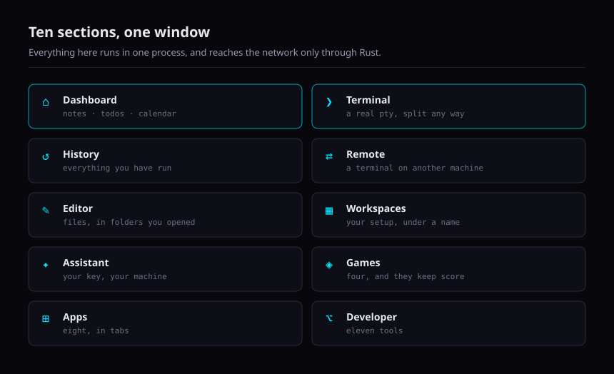
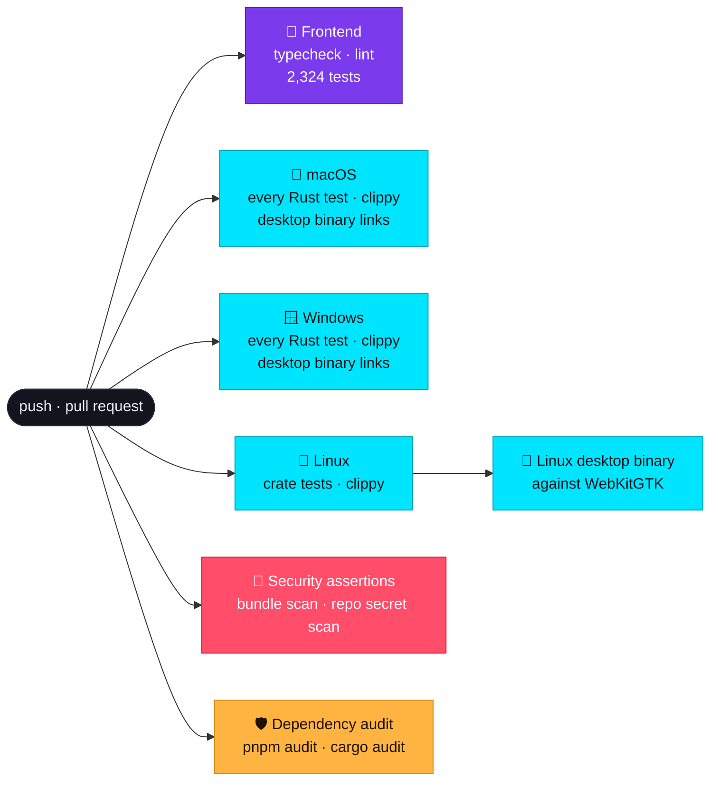

<div align="center">

# ⚡ JKY Terminal

<p align="center">
  <b>The local-first terminal that keeps your shells alive, reads your output, and asks before it acts.</b><br>
  Built on a Rust core and your system's own webview. Open source, no account, no telemetry.
</p>

[](https://github.com/kartikeyajay2006/jky-terminal/actions/workflows/ci.yml)
[](docs/getting-started.md)
[](docs/operations-and-releases.md#the-verification-ladder)
[](docs/security-and-privacy.md)
[](#-seven-themes-one-set-of-tokens)
[](LICENSE)

<br>

<a href="docs/README.md">
  
</a>

<p align="center">
  <a href="#-quick-start">⚡ Quick Start</a> &nbsp;•&nbsp;
  <a href="#-why-jky">✨ Why JKY</a> &nbsp;•&nbsp;
  <a href="#-documentation">📚 Docs</a> &nbsp;•&nbsp;
  <a href="#%EF%B8%8F-how-jky-compares--honestly">⚖️ Honest Comparison</a> &nbsp;•&nbsp;
  <a href="#-any-command-can-become-an-app">⚡ Command to App</a> &nbsp;•&nbsp;
  <a href="#%EF%B8%8F-zero-ambient-authority-security">🛡️ Security</a> &nbsp;•&nbsp;
  <a href="#-seven-themes-one-set-of-tokens">🎨 Themes</a> &nbsp;•&nbsp;
  <a href="#-the-ten-sections">▦ 10 Sections</a> &nbsp;•&nbsp;
  <a href="#%EF%B8%8F-keyboard-shortcuts">⌨️ Shortcuts</a> &nbsp;•&nbsp;
  <a href="#-installation">📦 Install</a>
</p>

</div>

---

## ⚡ Quick Start

Four commands, once [the prerequisites](docs/getting-started.md#1-prerequisites) are installed:

```sh
git clone https://github.com/kartikeyajay2006/jky-terminal.git
cd jky-terminal
corepack enable && pnpm install
pnpm dev:desktop          # the real desktop app, with native shells
```

The first build compiles the Rust core and takes a few minutes; later launches take seconds.
`pnpm dev` starts only the interface in a browser, for UI work. The
[Getting started guide](docs/getting-started.md) walks through a safe first session.

---

## ✨ Why JKY

<table>
<tr>
<td width="33%" valign="top">

### 🔄 Shells outlive the window

Close the app mid-build and the build keeps going. Each pane's shell is held by a small supervisor;
reopen JKY and the pane rejoins it, showing what it printed while you were away. No tmux to learn.

<sub>→ [How it works](docs/terminal-guide.md#shells-that-outlive-the-window)</sub>

</td>
<td width="33%" valign="top">

### ⚡ Output becomes a panel

`git status`, `git log`, `docker ps`, `df`, `ps`, `ls`, `mkdir` and JSON get a structured panel
**beneath** the raw text — eight deterministic parsers, no model. Buttons only *type* commands.

<sub>→ [Command panels](docs/terminal-guide.md#every-command-can-become-a-panel)</sub>

</td>
<td width="33%" valign="top">

### ✦ The assistant has to ask

Reading the project is free; **every command waits for your approval** — with what it deletes, writes
and reaches spelled out, and a dry run to try first — and destructive ones must be typed back. Your own Anthropic or OpenAI key — or a local Ollama model, fully offline.

<sub>→ [Assistant & approvals](docs/assistant-and-approvals.md)</sub>

</td>
</tr>
<tr>
<td width="33%" valign="top">

### 🛡️ The window has no network

`connect-src 'self'`. Keys live in the OS keychain; no command can return one. All 121 IPC commands
are pinned by name in a test that CI runs on every push.

<sub>→ [Security & privacy](docs/security-and-privacy.md)</sub>

</td>
<td width="33%" valign="top">

### 🧰 One window, optional extras

A CodeMirror editor, workspaces and Git worktrees, SSH hosts, twelve developer tools, eight apps, a
dashboard — each loaded only when opened.

<sub>→ [Apps, tools & games](docs/apps-and-tools.md)</sub>

</td>
<td width="33%" valign="top">

### 🦀 Rust does the real work

Twenty-two focused crates own PTYs, files, keys, history and the audit log. The interface asks through a
thin IPC layer and renders with xterm.js and WebGL2.

<sub>→ [Architecture](docs/architecture.md)</sub>

</td>
</tr>
</table>

---

## 📚 Documentation

<p align="center">
  <a href="docs/README.md"></a>
</p>

Every shortcut, file name, limit and command in the docs was checked against the code — and every place
JKY falls short is written down next to what it does well.

<table>
<tr>
<td width="33%" valign="top">

**🚀 Use it**

- [Getting started](docs/getting-started.md)
- [Terminal guide](docs/terminal-guide.md)
- [Shells & the `jky` command](docs/shell-integration.md)
- [Keyboard & settings](docs/keyboard-and-settings.md)
- [Workspaces & editor](docs/workspaces-and-editor.md)
- [Apps, tools & games](docs/apps-and-tools.md)

</td>
<td width="33%" valign="top">

**🛡️ Trust it**

- [Assistant & approvals](docs/assistant-and-approvals.md)
- [Security & privacy](docs/security-and-privacy.md)
- [How JKY compares](docs/comparison.md)
- [Product roadmap](docs/product-roadmap.md)
- [Questions & answers](docs/faq.md)
- [Glossary](docs/glossary.md)

</td>
<td width="33%" valign="top">

**🛠️ Build it**

- [Architecture](docs/architecture.md)
- [Troubleshooting](docs/troubleshooting.md)
- [Operations & releases](docs/operations-and-releases.md)
- [Releasing](docs/RELEASING.md)
- [Features in full](docs/FEATURES.md)
- [Visual showcase](docs/SHOWCASE.md)

</td>
</tr>
</table>

<p align="center"><a href="docs/README.md"><b>→ Open the documentation home</b></a></p>

---

## ⚖️ How JKY Compares — Honestly

Every terminal below is excellent at something, and most of them are far more mature than JKY.
This table is here to help you choose, not to win. Facts about other projects were checked against
their own docs in **October 2026**. If one is wrong or out of date,
[open an issue](https://github.com/kartikeyajay2006/jky-terminal/issues) and it will be fixed.

**Legend:** 🟢 built in &nbsp;·&nbsp; 🟡 partly, or with setup / an add-on &nbsp;·&nbsp; ⚪ not offered (often by design)

| | **JKY** | Ghostty | Warp | Wave | WezTerm | Alacritty | VS Code |
|---|:-:|:-:|:-:|:-:|:-:|:-:|:-:|
| Tabs and splits | 🟢 | 🟢 | 🟢 | 🟢 | 🟢 | ⚪ | 🟢 |
| Local shells survive quitting | 🟢 | ⚪ | ⚪ | 🟡 SSH | 🟡 mux | ⚪ | 🟡 reload |
| Native GPU renderer | 🟡 webview | 🟢 | 🟢 | 🟡 webview | 🟢 | 🟢 | 🟡 webview |
| Inline images | 🟡 Sixel, iTerm2 | 🟢 | — | — | 🟢 | ⚪ | 🟡 |
| Command output as views | 🟢 panels | ⚪ | 🟡 blocks | 🟡 previews | ⚪ | ⚪ | 🟡 marks |
| AI assistant | 🟢 | ⚪ | 🟢 | 🟢 | ⚪ | ⚪ | 🟢 |
| Built-in editor | 🟢 | ⚪ | 🟢 | 🟢 | ⚪ | ⚪ | 🟢 |
| Built-in browser | 🟢 | ⚪ | ⚪ | 🟢 | ⚪ | ⚪ | 🟡 |
| Scripting / plugins | ⚪ | ⚪ | 🟡 | 🟡 | 🟢 Lua | ⚪ | 🟢 |
| Signed installers today | ⚪ | 🟢 | 🟢 | 🟢 | 🟢 | 🟢 | 🟢 |
| Platforms | Lin · Mac · Win | Mac · Lin | Mac · Lin · Win | Mac · Lin · Win | Lin · Mac · Win | Lin · Mac · Win | Lin · Mac · Win |
| License | MIT | MIT | AGPL-3.0 | Apache-2.0 | MIT | Apache-2.0 | MIT source |
| Maturity | **v0.1**, one maintainer | 1.x | company | company | mature | mature | Microsoft |

<sub>— means not verified for this table, so left blank rather than guessed. Every cell is explained,
with sources, in the [full comparison](docs/comparison.md).</sub>

<table>
<tr>
<td width="50%" valign="top">

#### ✅ Where JKY is different

- **Shells outlive the window** — no tmux to learn. Reopen the app and each pane shows what its
  shell printed while you were away.
- **Output becomes panels** — eight deterministic parsers, no model, and the raw text always stays.
- **The assistant has to ask** — every command it proposes waits for you; destructive ones need
  typed confirmation. Works with your own key or a **local Ollama** model.
- **The window has no network** — `connect-src 'self'`; keys live in the OS keychain.

</td>
<td width="50%" valign="top">

#### ⚠️ Where JKY is behind today

- **No published release yet** — build from source; draft installers are unsigned.
- **Rendering runs in a webview** — native GPU terminals will win on raw throughput. The
  [benchmarks](docs/benchmarks.md) stop at the window; frame timing is not measured yet.
- **No Kitty graphics protocol, scripting or plugins.** Sixel and iTerm2 images do render.
- **Three AI back-ends wired** — Anthropic, OpenAI and Ollama. Six more can store a key but have
  no adapter yet.
- **Young** — expect rough edges, and please file issues.

</td>
</tr>
</table>

**Choose something else if** you want the fastest, most complete native terminal
([Ghostty](https://ghostty.org), [WezTerm](https://wezterm.org), [Alacritty](https://alacritty.org)),
deep scripting ([WezTerm](https://wezterm.org)), polished AI agents and team features
([Warp](https://www.warp.dev)), or JKY's all-in-one idea in a more mature app today
([Wave Terminal](https://www.waveterm.dev)). **Choose JKY** if you want persistent shells,
structured command views and an approval-first assistant in a small, local-first Tauri app — and
you're happy to run v0.1 software.

→ **[Read the full, sourced comparison](docs/comparison.md)**

---

## ⚡ Any Command Can Become An App

Shells communicate over text pipes because historically that was all they could do. Tabular outputs like `df -h` or `docker ps` are structured datasets crushed into plain characters.

JKY Terminal reads that structure back. When command output matches a recognizable schema, a reactive GUI panel renders directly beneath the output:

<p align="center">
  <a href="docs/terminal-guide.md#every-command-can-become-a-panel">
    
  </a>
</p>

| You type | You also get, beneath the raw output |
|---|---|
| `git status -s` | Staged and unstaged, kept apart, with file-kind chips |
| `git log` | A commit timeline |
| `docker ps` | Container cards, running and stopped — can stay **live** |
| `df -h` | Disk bars, fullest first — can stay **live** |
| `ps aux` | A searchable process table — can stay **live** |
| `ls -l` | A listing with kinds, sizes and dates |
| `mkdir <dir>` | The confirmation `mkdir` never prints, with a way to jump in |
| anything that prints **JSON** | A collapsible tree |

**No model is involved** — these are parsers, checked against real recorded `zsh` and `bash` sessions. A
live panel re-runs one of three fixed commands itself, with no shell in between, so a refresh button can
never become a way to run arbitrary commands.

### The Three Inviolable Safety Guarantees
1. **Never Replaces Output:** Raw text stays untouched in the scrollback. App panels can be toggled or dismissed at will.
2. **Actions Only Type:** Clicking an action button (e.g. `docker stop`) types the command into your shell prompt buffer. Nothing executes until you physically press <kbd>Enter</kbd>.
3. **Pipes Decline:** A pipe (e.g. `docker ps | grep api`) tells the recognizer to decline instantly. Piped commands are never misidentified.

---

## 🛡️ Zero-Ambient-Authority Security

Most modern desktop apps bundle a webview and grant it broad native permissions. JKY Terminal rejects this entirely.

<p align="center">
  <a href="docs/security-and-privacy.md">
    
  </a>
</p>

### The Core Law: *The Window Can Ask. Only Rust Can Act.*

The webview has **zero ambient network authority**. Its Content Security Policy (CSP) declares `connect-src 'self'`. Even if a malicious terminal payload or compromised node package attempted exfiltration, the webview has nowhere to transmit.

Every capability is gated by automated CI assertions that inspect the source code directly:
- 🔒 **Pinned Command Whitelist:** A test asserts the exact list of allowed IPC commands. Any unauthorized command fails the build.
- 🔒 **No Secret Getters:** No IPC command exists that returns an API key or secret to the window. Keys reside in the native OS Keychain (macOS Keychain, Windows Credential Manager, Linux Secret Service over D-Bus with session encryption).
- 🔒 **Race-Free Folder Boundary:** The editor and the assistant open files *beneath* a handle to the folder you chose, so `../`, symlinks out, and a directory swapped mid-operation are all refused by the same system call that opens the file.
- 🔒 **Secrets Redacted on the Way Out:** Recognisable keys and tokens are replaced in Rust before they reach history, saved scrollback or an AI provider — and chips above the message box show exactly what a message takes with it.
- 🔒 **Tamper-Evident Audit Trail:** Privileged actions are recorded in a local append-only log whose every record is chained with a keychain-held HMAC key. `jky audit` reports any record that was altered, removed, reordered or inserted.

---

## 🎨 Seven Themes, One Set of Tokens

<p align="center">
  
</p>

Every colour in JKY is a **design token**. A theme is nothing more than a different set of values for the
same colour tokens, which is why the whole window above changes at once rather than piece by piece. A
literal hex value in a component is a lint error, and a test computes the WCAG contrast of every theme's
text against its own ground — all seven clear **AAA (7 : 1)** with room to spare.

| Theme | Character | Ground | Accent | Second accent | Text on ground |
|---|---|:-:|:-:|:-:|:-:|
| **Cyberpunk** | default · dark · neon kept for what is active |  |  |  | **16.4 : 1** |
| **Dracula** | dark · the Dracula palette |  |  |  | **14.8 : 1** |
| **Nord** | dark · arctic blues, low glare |  |  |  | **10.8 : 1** |
| **Solarized** | dark · the Solarized palette |  |  |  | **12.3 : 1** |
| **Light** | light · crisp daylight |  |  |  | **16.8 : 1** |
| **Gold** | light · warm parchment, amber to bronze |  |  |  | **14.0 : 1** |
| **High Contrast** | WCAG AAA · loud borders, no shadows |  |  |  | **21.0 : 1** |

<sub>Ratios are WCAG 2 contrast of <code>--text</code> on <code>--ground</code>, computed from
<a href="apps/desktop/src/styles/themes.css"><code>themes.css</code></a>. The animation uses those exact values.</sub>

**Switch themes** from **Settings → Appearance** (the command palette, <kbd>Ctrl</kbd>+<kbd>K</kbd>, jumps
there), or from any terminal: `jky theme dracula`. Motion follows your system: `prefers-reduced-motion` is honoured by a
single rule for the whole app, and a test pins it.

---

## ▦ The Ten Sections

One cohesive desktop window holds everything you need for daily software engineering:

<p align="center">
  
</p>

| Section | Icon | What it Delivers |
|---|:---:|---|
| **Terminal** | `❯` | Real PTY with 2D geometric splits, WebGL2 acceleration, persistent background supervisors, and live command-to-app parsing. |
| **Editor** | `✎` | CodeMirror 6 multi-root editor. Supports code syntax, image previewing, and native canvas PDF rendering within strict CSP boundaries. |
| **Workspaces** | `▦` | Named setups — editor folders, where terminals start and how many, and an SSH host — switched in one step. Plus Git worktrees, created and opened as workspaces. |
| **Remote** | `⇄` | First-class SSH manager leveraging your native `~/.ssh/config` and system key agent. Never stores raw passwords. |
| **History** | `↺` | Subsequence fuzzy matching (`dkrps` finds `docker ps`) ranked by recency and logarithmic frequency — and **Work Memory**: search inside what every run printed, with its branch, commit, duration, pins and notes. |
| **Assistant** | `✦` | Streaming assistant on Anthropic, OpenAI, or a local Ollama model. Read-only tools run freely; every command it proposes waits for your approval, and destructive ones need typed confirmation. |
| **Dashboard** | `⌂` | Notes, todos, a calendar and daily reminders, stored locally — and scriptable from any shell with `jky note`, `jky todo` and `jky reminder`. |
| **Developer** | `⌥` | 12 tools: JSON, YAML, Diff, Hash, JWT (decodes, never verifies), Regex (in a killable worker), HTTP, System Monitor, Processes, Ports, Environment and DNS. HTTP and DNS go through Rust; the rest run locally. |
| **Apps** | `⊞` | GitHub (device-code sign-in), Gmail (read-only, PKCE), a native browser webview (WebKitGTK / WKWebView / WebView2), Weather, News, Map, Calculator and Timer. |
| **Games** | `◈` | Keyboard-first arcade: Dino Run, Snake, Tic-Tac-Toe, Flappy Bird and 2048, with local records and play statistics. |

→ **[Every section in depth](docs/README.md)** &nbsp;·&nbsp; **[The reasoning behind each design decision](docs/FEATURES.md)**

---

## ⌨️ Keyboard Shortcuts

All sixteen actions are rebindable in **Settings → Keyboard** by pressing the keys you want. Every binding needs a modifier, and <kbd>Ctrl</kbd>+<kbd>C</kbd> / <kbd>Ctrl</kbd>+<kbd>D</kbd> can never be taken from the shell.

| Shortcut | Action | Shortcut | Action |
|---|---|---|---|
| <kbd>Ctrl</kbd>+<kbd>K</kbd> | Command palette | <kbd>Ctrl</kbd>+<kbd>B</kbd> | Show or hide the sidebar |
| <kbd>Ctrl</kbd>+<kbd>T</kbd> | New terminal tab | <kbd>Ctrl</kbd>+<kbd>Shift</kbd>+<kbd>B</kbd> | Focus mode |
| <kbd>Ctrl</kbd>+<kbd>W</kbd> | Close tab | <kbd>Ctrl</kbd>+<kbd>Tab</kbd> | Next tab |
| <kbd>Ctrl</kbd>+<kbd>1</kbd>…<kbd>9</kbd> | Jump to a tab | <kbd>Ctrl</kbd>+<kbd>F</kbd> | Find in terminal |
| <kbd>Ctrl</kbd>+<kbd>Shift</kbd>+<kbd>T</kbd> | Split right | <kbd>Ctrl</kbd>+<kbd>Shift</kbd>+<kbd>C</kbd> | Copy |
| <kbd>Ctrl</kbd>+<kbd>Shift</kbd>+<kbd>D</kbd> | Split down | <kbd>Ctrl</kbd>+<kbd>Shift</kbd>+<kbd>V</kbd> | Paste |
| <kbd>Ctrl</kbd>+<kbd>Shift</kbd>+<kbd>W</kbd> | Close pane | <kbd>Ctrl</kbd>+<kbd>Shift</kbd>+<kbd>←↑↓→</kbd> | Move between panes |
| <kbd>Ctrl</kbd>+drag a pane | Swap two panes | Double-click a divider | Even the split |

> *Note: <kbd>Ctrl</kbd> translates to <kbd>Cmd (⌘)</kbd> on macOS. The terminal preserves <kbd>Ctrl</kbd>+<kbd>C</kbd> and <kbd>Ctrl</kbd>+<kbd>D</kbd> unconditionally to guarantee shell control.*

---

## 📦 Installation

### Packaged Releases

> [!IMPORTANT]
> **No public release has been published yet.** Today, build from source (below) — it takes a few
> minutes the first time. The tag-driven release workflow already produces draft installers for every
> platform; they are **unsigned** until signing certificates are configured, so macOS and Windows will
> warn on first launch. See [Operations and releases](docs/operations-and-releases.md).

| Operating System | What the release workflow builds | Architecture |
|---|---|---|
| **Linux** | `.deb` · `.rpm` · `.AppImage` | x86_64 |
| **macOS** | `.dmg` and `.app.tar.gz`, built separately for each chip | Apple Silicon · Intel |
| **Windows** | `.msi` · NSIS `.exe` (per-user, no admin needed) | x86_64 |

### Building From Source

#### 1. Install System Dependencies

You need Node.js 22+, Rust stable and Git everywhere. Then, per platform:

```sh
# Ubuntu / Debian — the same packages CI installs
sudo apt install libwebkit2gtk-4.1-dev libsoup-3.0-dev \
  libjavascriptcoregtk-4.1-dev build-essential curl wget file \
  libssl-dev libayatana-appindicator3-dev librsvg2-dev \
  libdbus-1-dev pkg-config

# Fedora / RHEL
sudo dnf install webkit2gtk4.1-devel libsoup3-devel openssl-devel \
  curl wget file libappindicator-gtk3-devel librsvg2-devel \
  dbus-devel pkgconf-pkg-config

# macOS
xcode-select --install

# Windows: Microsoft C++ Build Tools ("Desktop development with C++");
# WebView2 already ships with Windows 10 and 11.
```

#### 2. Install & Run
```sh
corepack enable
pnpm install

# Start development desktop app
pnpm dev:desktop

# Run comprehensive workspace verification
pnpm run verify
cargo test --workspace
```

#### 3. Standalone Production Build
Building a standalone native executable requires Tauri's `custom-protocol` feature:
```sh
# Build the React frontend
pnpm --filter @jky/desktop build

# Compile release binary with custom protocol
cargo build --release -p jky-terminal --features tauri/custom-protocol
```

*(On Linux systems with busy desktop environments, you can raise your inotify watchers if needed via `sudo sysctl -w fs.inotify.max_user_instances=512`)*

---

## 🧪 Verified Engineering & CI

Every push runs validation on **Linux, macOS and Windows** with `fail-fast: false`, so one platform
failing never hides another:


```mermaid
flowchart LR
    P([push · pull request]):::ink --> FE & MAC & WIN & LIN & SEC & AUD
    FE["🧪 Frontend<br/>typecheck · lint<br/>2,324 tests"]:::violet
    MAC["🍎 macOS<br/>every Rust test · clippy<br/>desktop binary links"]:::cyan
    WIN["🪟 Windows<br/>every Rust test · clippy<br/>desktop binary links"]:::cyan
    LIN["🐧 Linux<br/>crate tests · clippy"]:::cyan --> LDB["🐧 Linux desktop binary<br/>against WebKitGTK"]:::cyan
    SEC["🔐 Security assertions<br/>bundle scan · repo secret scan"]:::red
    AUD["🛡️ Dependency audit<br/>pnpm audit · cargo audit"]:::amber

    classDef ink fill:#14141f,stroke:#2a2a3c,color:#e8e8f2
    classDef cyan fill:#00e5ff,stroke:#00a3b5,color:#06141a
    classDef amber fill:#ffb340,stroke:#d18a12,color:#1f1300
    classDef violet fill:#7c3aed,stroke:#5b21b6,color:#ffffff
    classDef red fill:#ff4d6a,stroke:#d91f3d,color:#ffffff
```

| Check | What it guarantees |
|---|---|
| **Security tests** | The IPC command list, the CSP and the window's capabilities are pinned; no command returns a secret. |
| **Lint rules** | No component calls Tauri directly; no component contains a literal colour. |
| **Theme test** | Every theme's text meets WCAG contrast on its own ground. |
| **`scan:bundle`** | No credential-shaped string ships, and the entry bundle stays within its budget. |
| **Repository secret scan** | No API key for any supported provider is committed outside `docs/`. |
| **Binary link proof** | The real desktop binary links on each OS — where keychain and webview bindings actually fail. |

---

## 🗺️ Roadmap & Honest Scope

We believe documentation should make the product easier to trust, not merely easier to market. JKY already has a substantial terminal, workspace, assistant, remote, editor, and developer-tool foundation. The work that still matters most is proving the core under real load, testing real desktop workflows end-to-end, and shipping verifiable releases.

| Area | Honest status | What must happen next |
|---|---|---|
| Terminal reliability | Current core product | End-to-end tests already drive real shells and supervisors — typing, resize, Ctrl+C, paste, Unicode, persistence, high output — and [benchmarks](docs/benchmarks.md) below the window are published and reproducible. Still to do: window start-up and frame timing, and approval flows through the real window. |
| Gmail and account integrations | Deliberately limited | Gmail remains read-only; every future provider needs least-privilege scopes and a documented data boundary. |
| Database cockpit | Planned | PostgreSQL, SQLite, Redis, and other data explorers need a purpose-built, safe design before being advertised as part of the terminal. |
| Plugin SDK | Planned | A public extension system needs sandboxing, visible permissions, compatibility guarantees, and supply-chain governance. |
| Signed distribution and updates | In progress | Every release already carries checksums, an SBOM and build-provenance attestations. Packages are still unsigned: Windows signing, macOS notarisation, signed update metadata and a rollback policy remain. |

Read the full [product roadmap and scope](docs/product-roadmap.md) for the priorities, explicit non-promises, and the concrete definition of a world-class JKY Terminal.

---

## 📜 Contributing & Architecture Rules

We welcome issues, discussions, and contributions! Please review [`CONTRIBUTING.md`](CONTRIBUTING.md) before submitting pull requests.

Key Architectural Invariants:
1. **The Window Asks; Only Rust Acts:** All business logic lives in `crates/`. Frontend components call `src/platform/` adapters rather than calling Tauri directly.
2. **Zero Hardcoded Colors:** All UI styling must consume design tokens from `tokens.css` and `themes.css`.
3. **Commit Attribution:** All commits authored by `kartikeyajay2006 <kartikeyajay2006@gmail.com>`.

---

## 📄 License

Distributed under the **MIT License**. See [LICENSE](LICENSE) for details.

The core of JKY Terminal is free, open source, and built for developers everywhere.

<div align="center">
  <sub>Engineered with precision by <b><a href="https://github.com/kartikeyajay2006">kartikeyajay2006</a></b>.</sub>
</div>
