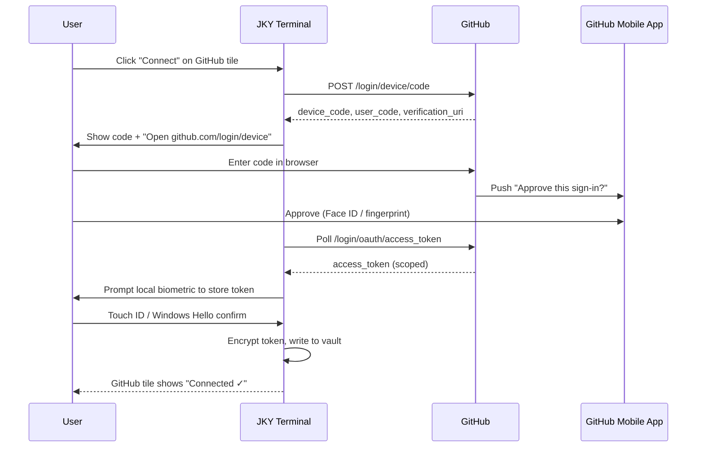

# 🚀 JKY Terminal — Product Roadmap

**"AI Terminal. Infinite Possibilities." — built to be the best terminal on the planet, and free for everyone to use.**

Owner / Maintainer: [@kartikeyajay2006](https://github.com/kartikeyajay2006)
Status: 🟡 Planning complete → Phase 0 starting
Target: Public v1.0 launch in ~9 weeks

---

## 1. Vision

JKY Terminal is not "a terminal with an AI plugin bolted on." It is an **AI-native command center**: a terminal, an AI assistant, a dashboard, and an integration hub for GitHub/Cloud/DevOps tools, fused into one fast, beautiful, secure desktop app — inspired by the reference concept below.

Reference concept captured for this roadmap (workspace sidebar, tabbed terminal/editor/AI/browser/database panes, AI assistant chat with actionable results, live system monitor, calendar + notes + reminders dashboard, quick commands bar, integrations hub with GitHub/Gmail/Calendar/Drive/Slack/Notion/AWS/Docker/Kubernetes, Pro plan, Cyberpunk theme, zsh shell, live connection + system uptime status bar).

### North Star Principles

1. **Feels alive** — 60fps everywhere, GPU-accelerated terminal rendering, no jank, no spinners on the happy path.
2. **AI-native, not AI-bolted-on** — natural language is a first-class input method next to raw shell commands.
3. **Secure by default** — every integration login is validated like a real mobile-grade auth flow (device approval, passkeys, no plaintext tokens ever touch disk).
4. **Free and open for everyone** — MIT-licensed core, no paywall on the essentials; Pro is optional, not required.
5. **Extensible** — anyone can ship a plugin/theme without forking the app.
6. **Cross-platform parity** — macOS, Windows, Linux all get the same feature set on day one.

---

## 2. Tech Stack Decision Record

| Layer | Choice | Why |
|---|---|---|
| Desktop shell | **Tauri v2 (Rust)** | Native performance, ~10x smaller binary than Electron, memory-safe, best-in-class OS-level security sandboxing — required for "mobile-grade" auth/secrets work in Phase 8–9. |
| Frontend framework | **React 18 + TypeScript + Vite** | Fast HMR, huge ecosystem, easiest to hire/onboard contributors into. |
| Terminal renderer | **xterm.js + WebGL addon**, backed by a Rust **portable-pty** bridge exposed as Tauri commands | GPU-accelerated glyph rendering, real PTY behavior (job control, resizing, signals) instead of shelling out. |
| State management | **Zustand** (UI/app state) + **TanStack Query** (async/server state) | Minimal boilerplate, fine-grained reactivity, good DevTools. |
| Styling / design system | **Tailwind CSS + Radix UI primitives + Framer Motion** | Utility-first speed, accessible unstyled primitives, physics-based motion for the "wow" feel. |
| AI engine | Provider-agnostic `ai-core` package. **Default provider: Anthropic Claude (Sonnet 5 / Opus 5)** via the Messages API, with pluggable adapters for OpenAI, local models via Ollama, etc. | Best coding/agentic model family today; pluggable so the community isn't locked in. |
| Local persistence | **SQLite via `sqlx`** (notes, reminders, history, workspace state) | Zero-ops, embedded, fast full-text search via FTS5. |
| Secrets / tokens | **OS keychain (`keyring` crate)** + an app-level encrypted vault (XChaCha20-Poly1305 via `libsodium`) | Tokens never touch plaintext disk; vault unlocks with OS biometric (Touch ID / Windows Hello / Linux Secret Service). |
| Auth flows | **OAuth 2.0 Device Authorization Grant (RFC 8628)** for GitHub/Google/Slack/etc. + **WebAuthn/passkeys** for the app's own login + **TOTP** fallback | Mirrors how `gh auth login` and mobile-app push approvals work — see §5 deep dive. |
| Plugin system | **WASM sandboxed plugins** (via `wasmtime`) for logic + a typed JS/TS **Plugin SDK** for UI panels | Untrusted third-party code runs sandboxed; matches "everyone can use/extend it." |
| CI/CD | **GitHub Actions** + `tauri-action` for signed multi-platform builds + Tauri auto-updater | One push → signed builds for macOS/Windows/Linux. |
| Testing | **Vitest + React Testing Library** (frontend), **`cargo test`** (Rust), **Playwright** (E2E), **axe-core** (a11y) | Full pyramid coverage before every merge to `main`. |
| Monorepo tooling | **pnpm workspaces + Turborepo** | Fast incremental builds/caching across packages. |

---

## 3. Repository Layout (target state after Phase 1)

```
jky-terminal/
├─ apps/
│  └─ desktop/                 # Tauri app (the shippable product)
│     ├─ src/                  # React frontend
│     └─ src-tauri/            # Rust backend (PTY, auth, vault, fs, sysinfo)
├─ packages/
│  ├─ ui/                      # Design system: tokens, components, themes
│  ├─ ai-core/                 # Provider-agnostic AI assistant engine
│  ├─ pty-bridge/               # Rust crate: PTY spawn/resize/IO over Tauri IPC
│  ├─ integrations/            # OAuth/device-flow connectors (GitHub, Google, Slack, AWS, Docker, K8s, Notion)
│  ├─ plugin-sdk/               # Public TypeScript SDK + WASM host for 3rd-party plugins
│  └─ config/                   # Shared eslint/tsconfig/tailwind config
├─ docs/                        # Docusaurus documentation site (Phase 13)
├─ .github/
│  ├─ workflows/                # CI: lint, test, build, release
│  └─ ISSUE_TEMPLATE/
├─ ROADMAP.md                   # ← this file
├─ CONTRIBUTING.md
├─ LICENSE
└─ README.md
```

---

## 4. Timeline Overview

Start date: **2026-08-26**. ~9 weeks to public v1.0, then continuous post-launch iteration.

| Phase | Name | Duration | Target Dates |
|---|---|---|---|
| 0 | Vision, Brand & Product Spec | 2 days | Aug 26 – Aug 27 |
| 1 | Architecture & Monorepo Foundation | 3 days | Aug 28 – Aug 30 |
| 2 | Core Terminal Engine | 5 days | Aug 31 – Sep 4 |
| 3 | Design System & App Shell (UI/UX) | 4 days | Sep 5 – Sep 8 |
| 4 | Workspace: Tabs, Panels, Command Palette | 3 days | Sep 9 – Sep 11 |
| 5 | AI Assistant Engine | 5 days | Sep 12 – Sep 16 |
| 6 | Command Intelligence (NL → shell) | 3 days | Sep 17 – Sep 19 |
| 7 | Dashboard: Monitors, Calendar, Notes, Reminders | 4 days | Sep 20 – Sep 23 |
| 8 | Integrations Hub + Mobile-Grade Auth | 6 days | Sep 24 – Sep 29 |
| 9 | Security, Sandbox & Secrets Vault | 4 days | Sep 30 – Oct 3 |
| 10 | Plugin/Extension SDK & Marketplace | 5 days | Oct 4 – Oct 8 |
| 11 | Performance, Packaging & Auto-Update | 4 days | Oct 9 – Oct 12 |
| 12 | Testing, QA, Accessibility, i18n | 4 days | Oct 13 – Oct 16 |
| 13 | Docs Site, Website & Brand Assets | 3 days | Oct 17 – Oct 19 |
| 14 | Monetization: Pro Plan & Billing | 3 days | Oct 20 – Oct 22 |
| 15 | Open-Source Community Setup & Launch | 4 days | Oct 23 – Oct 26 |
| 16 | Post-Launch: Growth & v1.1 | Ongoing | Oct 27 → |

Each phase below is broken into a task checklist. Track them as GitHub Issues linked to a **GitHub Project board** with columns `Backlog → In Progress → Review → Done`, one issue per checklist item, labelled by phase (`phase-0`, `phase-1`, …).

---

## Phase 0 — Vision, Brand & Product Spec (Aug 26–27)

**Goal:** Lock the product spec so every later phase builds against a fixed target instead of shifting requirements.

- [ ] Write `docs/spec/product-spec.md`: full feature list extracted from the reference concept (workspace sidebar, tab types, AI assistant, dashboard widgets, integrations, status bar, Pro plan)
- [ ] Define the 5 tab types for v1: Terminal, Editor, AI Assistant, Browser, Database
- [ ] Define the dashboard widget set for v1: Calendar, Notes, Reminders, System Monitor (CPU/RAM/Disk/Network), Quick Search, Integrations grid
- [ ] Finalize product name/wordmark: **JKY Terminal**, tagline "AI Terminal. Infinite Possibilities."
- [ ] Design brand identity: logo (the "A"-triangle-circuit mark style from the reference, adapted to a "J" monogram), color system (neon cyan `#00E5FF` / magenta `#FF3CF0` / violet `#7C3AED` on near-black `#0A0A0F`), typography (UI: Inter/Geist; monospace: JetBrains Mono / Berkeley Mono)
- [ ] Define the 6 launch themes: Cyberpunk (default, shown in reference), Dracula, Solarized, Nord, Light, High-Contrast (a11y)
- [ ] Write non-goals for v1 (explicitly out of scope: mobile app, browser-extension sync, self-hosted team server — revisit post-launch)
- [ ] Create the GitHub Project board with all 16 phases as milestones

**Definition of Done:** `product-spec.md` merged to `main`, milestones + labels created in the GitHub repo.

---

## Phase 1 — Architecture & Monorepo Foundation (Aug 28–30)

**Goal:** A running "hello world" Tauri + React app with the monorepo wired up, CI green.

- [ ] `pnpm init` + Turborepo config (`turbo.json`) at repo root
- [ ] Scaffold `apps/desktop` with `create-tauri-app` (React + TypeScript + Vite template)
- [ ] Scaffold empty `packages/ui`, `packages/ai-core`, `packages/pty-bridge`, `packages/integrations`, `packages/plugin-sdk`, `packages/config` with `package.json` + `tsconfig.json` each, wired via pnpm workspace `link:` deps
- [ ] Shared ESLint + Prettier + `tsconfig.base.json` in `packages/config`, consumed by every package
- [ ] Set up Rust workspace `Cargo.toml` at `apps/desktop/src-tauri` referencing `pty-bridge` as a path dependency
- [ ] `.github/workflows/ci.yml`: on every PR — `pnpm install`, `turbo lint`, `turbo test`, `cargo test`, `cargo clippy -- -D warnings`
- [ ] `.github/workflows/release.yml` skeleton (build step no-ops for now, filled in Phase 11)
- [ ] Husky + `lint-staged` pre-commit hook: lint + format staged files
- [ ] Conventional Commits enforced via `commitlint` in a commit-msg hook
- [ ] Write `CONTRIBUTING.md`: branch naming (`feat/…`, `fix/…`), commit convention, how to run locally, how to open a PR
- [ ] Verify `pnpm tauri dev` opens a blank window on macOS/Windows/Linux CI runners

**Definition of Done:** CI pipeline green on a trivial PR; `pnpm tauri dev` launches an empty window on all 3 OSes.

---

## Phase 2 — Core Terminal Engine (Aug 31 – Sep 4)

**Goal:** A real, fast, correct terminal — this is the product's foundation; nothing else matters if this feels wrong.

- [ ] Rust `pty-bridge` crate: spawn shell (`$SHELL` on Unix, PowerShell/cmd on Windows) via `portable-pty`, expose `spawn`, `write`, `resize`, `kill` as Tauri commands
- [ ] Stream PTY output to the frontend via Tauri's event system (`emit("pty:data", …)`) with backpressure handling for high-throughput output (e.g. `yes`, `cat` on a big file)
- [ ] Frontend `TerminalView` component wrapping `xterm.js` + `@xterm/addon-webgl` + `@xterm/addon-fit` + `@xterm/addon-search` + `@xterm/addon-web-links`
- [ ] Wire keystrokes → `pty:write`, PTY output → `xterm.write()`, window resize → `pty:resize` (ResizeObserver-driven)
- [ ] Multiple concurrent terminal sessions (one PTY per tab), session registry keyed by UUID in Zustand store
- [ ] Shell detection + selector: zsh, bash, fish, PowerShell, cmd — persisted per-workspace
- [ ] Scrollback buffer persistence (last N lines) to SQLite so reopening a tab restores recent history
- [ ] Terminal search (⌘/Ctrl+F within a pane, powered by the search addon)
- [ ] Copy-on-select + paste, right-click context menu (Copy/Paste/Clear/Search)
- [ ] Signal handling: Ctrl+C (SIGINT), Ctrl+D (EOF), Ctrl+Z (SIGTSTP) correctness tests
- [ ] Unicode/emoji/wide-character rendering correctness tests (CJK, combining characters)
- [ ] Benchmark: sustained output throughput (e.g. `yes | head -100000`) renders without dropped frames — target 60fps

**Definition of Done:** Can run `htop`, `vim`, `ssh`, and a Python REPL correctly inside a tab, resize the window without corruption, and open 10 concurrent tabs without perceptible lag.

---

## Phase 3 — Design System & App Shell (UI/UX) (Sep 5–8)

**Goal:** The visual "wow" — this is the phase that makes people say "whoa" on first launch.

- [ ] `packages/ui` design tokens: color scales, spacing scale (4px base), radii, shadows, motion durations/easings — exported as CSS variables + Tailwind theme extension
- [ ] Implement the **Cyberpunk** theme pixel-matching the reference: near-black background, neon cyan/magenta accents, glowing borders on focused panels, subtle scanline/grid texture on the hero terminal
- [ ] Theme engine: runtime theme switching with no flash-of-unstyled-content, themes are just JSON token sets — enables community themes later (Phase 10)
- [ ] App shell layout: left icon rail (Workspace section: Dashboard/Projects/Files/GitHub/Docker/Databases/Cloud/Settings; Tools section: Google Search/Calendar/Notes/Reminders/Email/Meetings/AI Assistant/Terminal History; Shortcuts section) — collapsible, keyboard-toggleable
- [ ] Top bar: global "Type naturally, AI will handle the rest…" omnibox (⌘K), notification bell, settings gear, live date/time with popover mini-calendar (month grid + today's agenda, matches reference)
- [ ] Bottom status bar: connection status dot ("Connected"/"Live"), active shell name, current theme, system uptime, app version, fullscreen toggle
- [ ] Micro-interactions with Framer Motion: panel mount/unmount transitions, button press feedback, tab switch slide, AI "thinking" pulsing indicator, toast notifications
- [ ] Glassmorphism panel style (backdrop-blur + translucent borders) for floating panels (calendar popover, notifications, quick search)
- [ ] Responsive layout rules for window widths from 900px (compact, icon rail collapses to icons-only) up to ultrawide (dashboard grid gains a 3rd column)
- [ ] Storybook (or Ladle) set up in `packages/ui` documenting every component in isolation, all themes
- [ ] Visual regression testing via Playwright screenshot snapshots for the core shell components

**Definition of Done:** Storybook deployed to a preview URL in CI; app shell renders pixel-close to the reference image in Cyberpunk theme; theme switch is instant and flicker-free.

---

## Phase 4 — Workspace: Tabs, Panels, Command Palette (Sep 9–11)

**Goal:** Multi-tool workspace like the reference: Terminal / Editor / AI Assistant / Browser / Database tabs, each with keyboard shortcuts (⌘1…⌘5), plus a global command palette.

- [ ] Generic `<Tab>` abstraction: each tab has a type (`terminal | editor | ai | browser | database`), title, icon, keyboard shortcut, and independently persisted state
- [ ] Tab bar: drag-to-reorder, close (⌘W), new tab (+ button and ⌘T with a type picker), pinned tabs
- [ ] **Editor tab**: embed Monaco Editor with syntax highlighting for 20+ languages, file tree, save/diff, git gutter indicators
- [ ] **Browser tab**: embedded webview (Tauri's WebView) with URL bar, back/forward, useful for viewing local dev servers / docs without leaving the terminal
- [ ] **Database tab**: connect to Postgres/MySQL/SQLite/Redis, schema browser, query editor with syntax highlighting + result grid
- [ ] Global command palette (⌘K): fuzzy search across commands, files, recent terminal history, AI queries, and app settings — one unified input, exactly like the reference's omnibox
- [ ] Quick Commands bar (pill buttons under the terminal: `git status`, `docker ps`, `npm run dev`, etc.) — user-customizable, persisted per workspace
- [ ] Workspace persistence: closing and reopening the app restores exact tab layout, working directories, and split-pane arrangement
- [ ] Split panes: horizontal/vertical splits within a tab (like tmux/iTerm panes), keyboard-driven navigation between splits

**Definition of Done:** User can open Terminal + Editor + AI Assistant simultaneously, switch with ⌘1/⌘2/⌘3, and the layout survives an app restart.

---

## Phase 5 — AI Assistant Engine (Sep 12–16)

**Goal:** The AI Assistant panel from the reference: a real chat interface that can read project context and take actionable steps (not just answer questions).

- [ ] `packages/ai-core`: provider-agnostic interface `AIProvider { streamChat(), listModels(), supportsTools() }`
- [ ] Anthropic adapter as the **default provider** (Claude Sonnet 5 as default model, Opus 5 available for "deep think" mode) using the Messages API with streaming
- [ ] Secondary adapters: OpenAI-compatible endpoint adapter, local model adapter (Ollama) — selectable in Settings, so the assistant works even fully offline
- [ ] Tool-use framework: AI can call defined tools — `read_file`, `list_dir`, `run_command` (with explicit user confirmation gate), `git_status`, `search_codebase`, `check_deployment_status` — mirroring the reference's "Analyzed your project structure / Found 3 open issues / Deployment status: operational" behavior
- [ ] Streaming chat UI: token-by-token render, "Thinking…" indicator with animated dots, tool-call cards showing what the AI is doing step-by-step (checkbox-style status list, matching the reference layout exactly)
- [ ] Context awareness: assistant automatically has access to current working directory, git branch/status, open files, and recent terminal output (opt-in, shown transparently to the user what context was sent)
- [ ] Conversation memory: per-workspace chat history persisted to SQLite, searchable, exportable as Markdown
- [ ] Inline terminal AI: `Ctrl+Shift+A` inside any terminal pane turns the current input into a natural-language box that translates to a shell command inline (ghost-text suggestion, Tab to accept)
- [ ] Safety gate: any tool call that mutates state (running a shell command, writing a file, deleting anything) requires an explicit one-click confirm, with a "always allow this command pattern" opt-in per workspace
- [ ] Cost/usage meter in Settings showing token usage per session (relevant once Pro plan/BYO-key model lands in Phase 14)

**Definition of Done:** From the AI panel, user can ask "what changed since my last commit and are there any failing tests" and get a real, tool-backed answer with clickable results, matching the interaction quality shown in the reference image.

---

## Phase 6 — Command Intelligence: Natural Language → Shell (Sep 17–19)

**Goal:** The omnibox promise "Type naturally, AI will handle the rest" — blur the line between typing English and typing shell.

- [ ] Omnibox intent router: detect whether input is a raw shell command, a natural-language request, or an app action (e.g. "open settings") — route accordingly
- [ ] NL → shell command translation with a preview-before-run step (never auto-executes silently)
- [ ] Command history search with AI ranking (fuzzy + semantic — "that docker command from yesterday" finds it even without exact keyword match)
- [ ] Inline error explainer: when a command exits non-zero, an "Explain this error" button appears next to the output, one click gets a diagnosis + suggested fix from the AI
- [ ] Autocomplete engine: shell-aware completions (flags, paths, git branches, npm scripts, docker containers) merged with AI-suggested completions, ranked together
- [ ] "Terminal History" tool panel (left rail item from the reference): searchable, filterable log of all commands run across all sessions, with AI-generated one-line summaries for long-running commands

**Definition of Done:** Typing "find all TODO comments modified in the last week" in the omnibox produces a correct `git`/`grep` pipeline, shown for approval before running.

---

## Phase 7 — Dashboard: Monitors, Calendar, Notes, Reminders (Sep 20–23)

**Goal:** The right-hand dashboard column from the reference — calendar, notes, reminders — plus the live system monitor strip.

- [ ] System monitor strip: CPU/RAM/Disk/Network live sparkline graphs, sampled via Rust `sysinfo` crate every 1s, pushed to frontend over a Tauri event stream
- [ ] Calendar widget: month grid matching the reference (today highlighted, dots for days with events), day agenda list, "+ Add Task" quick-add
- [ ] Calendar backend: local-first (SQLite) event store; optional two-way sync with Google Calendar once Phase 8 OAuth lands
- [ ] Notes widget: quick-capture note card (title + bullet preview as in reference), full note editor (Markdown, backed by the Editor tab's Monaco instance), tagging + search
- [ ] Reminders widget: checkbox list with due time + bell icon, native OS notification fired at due time (via Tauri notification plugin), snooze/complete actions
- [ ] Quick Search widget: Google search box (reference shows this) opening results in the Browser tab, plus local "search everything" (files, notes, history) fallback
- [ ] Dashboard is itself draggable/reorderable (widgets can be rearranged, hidden, or resized) and persisted per user
- [ ] "Notifications" bell in the top bar aggregates: reminder due, AI task complete, integration events (new GitHub issue assigned, CI failed), deploy status changes

**Definition of Done:** Dashboard matches the reference layout functionally (live monitors + calendar + notes + reminders), all data survives app restart, native OS notifications fire correctly on all 3 platforms.

---

## Phase 8 — Integrations Hub + Mobile-Grade Auth (Sep 24–29) 🔐

**Goal:** The Integrations grid from the reference (GitHub, Gmail, Calendar, Drive, Slack, Notion, AWS, Docker, Kubernetes, +More) — and specifically, **connecting GitHub (and every other integration) must go through a real, mobile-authentication-grade validation flow**, not a bare pasted token.

### 8.1 — Auth Architecture

- [ ] Implement **OAuth 2.0 Device Authorization Grant (RFC 8628)** as the connection flow for every integration that supports it (GitHub, Google, Slack): app requests a device code, shows a short user-code + "Open github.com/login/device" button, polls for completion — this is exactly how `gh auth login` and smart-TV apps authenticate, and for GitHub specifically it triggers **GitHub's own mobile app push-approval** when the user has it installed, giving genuine phone-based 2FA validation for free
- [ ] For providers without device flow (AWS, Notion, Docker Hub, Kubernetes contexts): implement the **Authorization Code + PKCE** flow in a system-native webview popup (never an embedded credential-harvesting form)
- [ ] Post-OAuth hardening step: after any integration connects, **require a WebAuthn/passkey or platform biometric confirmation** (Touch ID / Windows Hello / Linux Secret Service prompt) before the token is written to the vault — this is the "validate like mobile authentication" requirement: connecting an account is a two-factor event, not a one-click paste
- [ ] "Authorized Devices & Sessions" settings panel: every device/session that has ever unlocked the vault is listed with last-seen IP/location/time, with a one-click "Revoke" — mirrors GitHub's/Google's own account security pages
- [ ] Token storage: all OAuth tokens encrypted at rest in the local vault (XChaCha20-Poly1305), vault master key derived from OS keychain + biometric unlock, **never written to disk in plaintext, never logged**
- [ ] Automatic token refresh with silent re-auth; on refresh failure, integration tile shows a "Reconnect" state rather than failing silently
- [ ] Scope minimization: each integration requests the smallest OAuth scope set needed for its listed features (e.g. GitHub: `repo`, `read:org`, `workflow` only — no `admin:*` by default), scopes shown to the user before they approve

### 8.2 — Integration Connectors

- [ ] **GitHub**: repos, issues, PRs, Actions status, notifications — surfaced in the AI Assistant's context (matches reference: "Found 3 open issues on GitHub") and in a dedicated GitHub panel (left rail)
- [ ] **Docker**: local daemon connection (no OAuth needed, just socket permission check) — container list/start/stop/logs in a Docker panel, `docker ps` quick command wired live
- [ ] **Kubernetes**: kubeconfig context switcher, pod/deployment status grid, `kubectl get pods` quick command wired live
- [ ] **AWS**: SSO/device-flow login where available, else scoped IAM credentials via the vault, `aws s3 ls` quick command wired live, S3/EC2 status widgets
- [ ] **Gmail / Google Calendar / Google Drive**: OAuth (PKCE), read-only by default; Calendar two-way sync feeds Phase 7's calendar widget; Drive surfaces recent files in Quick Search
- [ ] **Slack**: OAuth, post to channel / read mentions, surfaced as notifications
- [ ] **Notion**: OAuth, note sync target/source for the Notes widget
- [ ] Integrations grid UI (bottom-right of dashboard in the reference) with connect/disconnect state per tile, "Manage" link to a full integrations settings page

**Definition of Done:** Connecting GitHub triggers a device-code + mobile-app push approval (or biometric fallback), token never touches plaintext disk, and a revoked device instantly loses access on next API call. This flow is demoed and documented in `docs/security/auth-flow.md`.

### 8.3 — Auth Flow (reference diagram for implementers)



---

## Phase 9 — Security, Sandbox & Secrets Vault (Sep 30 – Oct 3)

**Goal:** Everything Phase 8 assumed actually exists and is audited.

- [ ] Formal threat model doc (`docs/security/threat-model.md`): what a malicious plugin, a malicious repo's `.jkyrc`, or a network MITM could attempt, and the mitigation for each
- [ ] Tauri capability/permission manifest locked down: renderer process gets **zero** direct filesystem/network access — everything goes through explicit, allow-listed Rust commands
- [ ] Command execution audit log: every shell command and AI tool call is logged (locally only) with timestamp + outcome, viewable/exportable in Settings
- [ ] Rate limiting + confirmation friction scaling: destructive-looking commands (`rm -rf`, `git push --force`, `DROP TABLE`) get an extra typed-confirmation step regardless of source (human or AI-suggested)
- [ ] Dependency security: `cargo audit` + `pnpm audit` wired into CI, fails build on high/critical CVEs
- [ ] Secrets scanning pre-commit hook (detect accidental token/key commits in the repo itself)
- [ ] External security review pass (self-review checklist first; invite community review post-launch via a `SECURITY.md` responsible-disclosure policy)
- [ ] `SECURITY.md` with disclosure email + expected response time

**Definition of Done:** `SECURITY.md` published, CI blocks on critical CVEs, threat model doc merged, no plaintext secret ever appears in logs (grep-audited).

---

## Phase 10 — Plugin/Extension SDK & Marketplace (Oct 4–8)

**Goal:** "Everyone can use it" extends to "everyone can extend it."

- [ ] `packages/plugin-sdk`: typed TS API surface — `registerPanel()`, `registerCommand()`, `registerTheme()`, `registerQuickCommand()`, `onEvent()`
- [ ] WASM sandbox host (`wasmtime`) for plugin logic that needs to run outside the JS thread — capability-scoped (a plugin declares what it needs: `fs:read:~/project`, `network:api.example.com`), user approves scopes on install
- [ ] Plugin manifest spec (`jky-plugin.json`): name, version, permissions, entry points
- [ ] Local plugin dev workflow: `jky plugin create`, `jky plugin dev` (hot-reload), `jky plugin publish`
- [ ] In-app Plugin/Theme marketplace panel: browse, install, rate, one-click enable/disable
- [ ] Ship 3 first-party example plugins to prove the SDK: a Jira integration, a custom prompt-toolkit theme, a "pomodoro timer" dashboard widget
- [ ] Community theme submission flow (PR-based initially, marketplace UI reads from a signed community registry repo)

**Definition of Done:** A third-party developer with zero context can follow `docs/plugins/getting-started.md` and ship a working panel plugin in under 30 minutes.

---

## Phase 11 — Performance, Packaging & Auto-Update (Oct 9–12)

**Goal:** Ship-quality binaries, fast on real hardware, that update themselves.

- [ ] Startup performance budget: cold start to interactive terminal **< 300ms** on M-series Mac / mid-range PC; profile with Tauri's built-in tracing + Chrome DevTools
- [ ] Bundle size budget: installer **< 25MB** per platform (Tauri's native-webview approach makes this realistic vs Electron's ~150MB+)
- [ ] Memory budget: idle app **< 150MB** RSS with 5 open tabs
- [ ] Code-signing + notarization: macOS (Developer ID + notarize), Windows (Authenticode), Linux (GPG-signed AppImage/`.deb`/`.rpm`)
- [ ] `tauri-action` release workflow: tag push → build all 3 platforms → attach signed artifacts to a GitHub Release
- [ ] Tauri auto-updater wired to a signed update manifest hosted alongside releases; in-app "Update available" toast with changelog preview
- [ ] Crash reporter (opt-in, privacy-respecting — no PII) so real-world crashes surface fast post-launch

**Definition of Done:** A tagged release produces signed, notarized installers for macOS/Windows/Linux automatically, and a running v0.x instance can self-update to the new tag.

---

## Phase 12 — Testing, QA, Accessibility, i18n (Oct 13–16)

**Goal:** "Next level" isn't just visual — it has to work for everyone, including keyboard-only and screen-reader users, in more than one language.

- [ ] Unit test coverage target: **80%+** on `packages/ai-core`, `packages/integrations`, `packages/pty-bridge` (Rust) logic
- [ ] E2E test suite (Playwright): app launch → connect GitHub (mocked device flow) → run a command → ask the AI a question → verify dashboard updates
- [ ] Accessibility pass: full keyboard navigation (no mouse-only paths), visible focus rings, ARIA labels on all icon-only buttons, `axe-core` CI check with zero violations, dedicated High-Contrast theme validated against WCAG AA
- [ ] Screen reader smoke test (VoiceOver + NVDA) on the core flows: opening a tab, running a command, reading AI responses
- [ ] i18n scaffolding (`react-i18next` or similar): all UI strings extracted to translation files; ship with English at launch, structure ready for community-contributed locales
- [ ] Cross-platform QA matrix run manually before each release candidate: macOS (Intel + Apple Silicon), Windows 10/11, Ubuntu/Fedora
- [ ] Load testing: 20+ concurrent terminal tabs, large file editing (50k+ lines) in the Editor tab, large `SELECT *` in the Database tab — no UI freeze

**Definition of Done:** CI enforces coverage + a11y gates on every PR; RC build passes the manual cross-platform matrix with zero P0/P1 bugs.

---

## Phase 13 — Docs Site, Website & Brand Assets (Oct 17–19)

**Goal:** People need to discover, understand, and trust the project before they install it.

- [ ] Marketing landing page (own repo or `apps/website`): hero matching the product's actual UI (real screenshots/GIFs, not mockups), feature grid, download buttons per OS
- [ ] Docs site (Docusaurus) in `docs/`: Getting Started, Terminal Guide, AI Assistant Guide, Integrations Guide (with the auth-flow explainer from §8.3), Plugin SDK reference, FAQ
- [ ] Recorded demo GIFs/video for: first-launch experience, AI assistant fixing a bug, connecting GitHub via device flow, installing a community theme
- [ ] Full brand kit: logo variants (light/dark/monochrome), social preview image (`og:image`), favicon set, color/typography guide as a public `BRAND.md`
- [ ] `README.md` rewritten for launch: badges (build status, license, downloads), feature highlights with GIFs, quick install, links to docs/roadmap/contributing

**Definition of Done:** Docs site deployed and linked from the README; landing page live; every claim on the landing page is backed by a real screenshot of the actual app.

---

## Phase 14 — Monetization: Pro Plan & Billing (Oct 20–22)

**Goal:** Reference shows a "Pro Plan / 75%" usage indicator — sustainable funding without gatekeeping the core product.

- [ ] Define the Free vs Pro split explicitly: **Free = full terminal, full AI assistant with bring-your-own-API-key, all integrations, all plugins, all themes** (nothing core is paywalled). **Pro = hosted AI credits (no BYO-key needed), cloud workspace sync across devices, priority support**
- [ ] Billing integration (Stripe): subscription checkout, usage-based AI credit metering, in-app usage meter matching the reference's progress bar
- [ ] Account system: lightweight (email + passkey, no password) — only required for Pro/cloud-sync features, fully optional otherwise
- [ ] Graceful degrade: Pro subscription lapse → falls back to BYO-key free tier, never locks the user out of local data

**Definition of Done:** A user can subscribe, see live usage against their plan limit, and cancel/downgrade without losing any local data or functionality beyond the hosted-AI convenience.

---

## Phase 15 — Open-Source Community Setup & Launch (Oct 23–26)

**Goal:** Go live so "everyone can use it" actually happens.

- [ ] `LICENSE`: MIT (maximizes adoption/contribution — core promise of "everyone can use it")
- [ ] `CODE_OF_CONDUCT.md` (Contributor Covenant)
- [ ] GitHub issue templates (bug report, feature request, plugin submission) + PR template with a checklist (tests added, docs updated, changelog entry)
- [ ] `CHANGELOG.md` following Keep a Changelog format, auto-generated release notes from Conventional Commits
- [ ] Community spaces: GitHub Discussions enabled (Q&A, Show & Tell for plugins/themes), Discord server linked from README
- [ ] "Good first issue" labels seeded on ~15 real, scoped starter issues to invite contributors
- [ ] Launch checklist: Product Hunt post, Hacker News "Show HN" post, relevant subreddit posts (r/programming, r/commandline), Twitter/X thread with the demo GIFs
- [ ] Tag `v1.0.0`, cut signed release builds (Phase 11 pipeline), publish to GitHub Releases + landing page download buttons go live

**Definition of Done:** `v1.0.0` is public, installable on all 3 platforms, with community channels open and a real starter-issue backlog for outside contributors.

---

## Phase 16 — Post-Launch: Growth & v1.1 (Oct 27 → ongoing)

**Goal:** Launch is day one, not day zero.

- [ ] Weekly triage of issues/Discussions; public roadmap board kept current
- [ ] Telemetry-informed iteration (opt-in, aggregate only): which panels/integrations get used, where users drop off in onboarding
- [ ] v1.1 candidates to evaluate from real usage: mobile companion app for push-approval (closing the loop on §8's auth flow with JKY's *own* mobile push, not just GitHub's), team/cloud workspace sync, SSH remote-session support, tmux-style session persistence across restarts
- [ ] Quarterly security review + dependency upgrade sweep

---

## 5. Contribution & Attribution

- All work on this roadmap is authored and pushed by **[@kartikeyajay2006](https://github.com/kartikeyajay2006)**.
- External contributors: see `CONTRIBUTING.md` — every merged PR gets full GitHub contributor credit; no CLA required for the MIT-licensed core.
- Progress tracking: one GitHub Issue per checklist item above, grouped into per-phase Milestones, visualized on the repo's Project board.

## 6. License

MIT — see `LICENSE`. The core product stays free and open for everyone, always.
