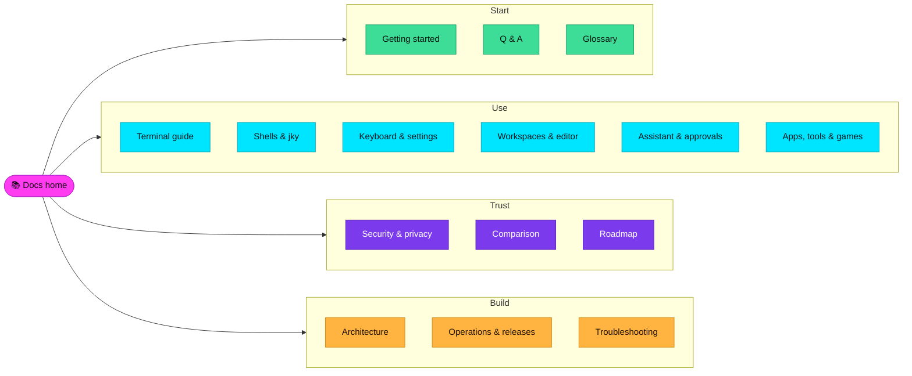
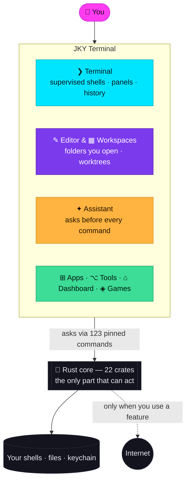

# JKY Terminal documentation

  

  
  
  
  

Welcome. These guides describe JKY Terminal as it actually is — every command, limit, file name and
shortcut on these pages was checked against the code. Where something is planned rather than shipped,
it says so. Where JKY is behind another terminal, it says that too.

> [!TIP]
> **New here?** Start with [Getting started](getting-started.md), then skim the
> [Terminal guide](terminal-guide.md). Ten minutes covers what most people use every day.

---

## Choose your path

<table>
<tr>
<td width="33%" valign="top">

### 🚀 I want to try it

1. [Getting started](getting-started.md) — install, launch, first ten minutes
2. [Terminal guide](terminal-guide.md) — tabs, panes, persistence, panels
3. [Keyboard & settings](keyboard-and-settings.md) — every shortcut
4. [Questions & answers](faq.md)

</td>
<td width="33%" valign="top">

### 🛡️ I want to trust it

1. [Security & privacy](security-and-privacy.md) — the boundary, as tests
2. [Assistant & approvals](assistant-and-approvals.md) — what the AI can and cannot do
3. [How JKY compares](comparison.md) — honestly, with sources
4. [Product roadmap](product-roadmap.md) — what is not promised

</td>
<td width="33%" valign="top">

### 🛠️ I want to build it

1. [Architecture](architecture.md) — layers, crates, rules
2. [Operations & releases](operations-and-releases.md) — CI, packaging, signing
3. [Benchmarks](benchmarks.md) — measured, reproducible, and what is not measured
4. [Releasing](RELEASING.md) — the exact release steps
5. [Contributing](../CONTRIBUTING.md)

</td>
</tr>
</table>

---

## Every guide

| | Guide | Read it to learn |
|:-:|---|---|
| 🚀 | **[Getting started](getting-started.md)** | Prerequisites per OS, install and launch, the first window, a safe first session, ten things to try, where your data lives. |
| ❯ | **[Terminal guide](terminal-guide.md)** | Tabs and geometric panes, shells that outlive the window, command panels and live panels, command blocks, completions, history, remote terminals, focus mode, compatibility. |
| 🐚 | **[Shells & the `jky` command](shell-integration.md)** | How bash, zsh, fish, Nushell and PowerShell are hooked without touching your dotfiles, and every `jky` command. |
| ⌨️ | **[Keyboard & settings](keyboard-and-settings.md)** | All sixteen actions, the two rules that protect your shell, `keymap.json`, the palette, every Settings panel. |
| ▦ | **[Workspaces & editor](workspaces-and-editor.md)** | Workspaces, Git worktrees, the CodeMirror editor, the folder boundary, never losing unsaved work. |
| ✦ | **[Assistant & approvals](assistant-and-approvals.md)** | Providers and models, the project folder, tools, approval cards, risk labels, what leaves your machine, limits. |
| ⊞ | **[Apps, tools & games](apps-and-tools.md)** | Twelve developer tools, eight apps, the dashboard, capture, and five games. |
| 🛡️ | **[Security & privacy](security-and-privacy.md)** | The boundary and the tests that enforce it, secrets, every network contact, files, untrusted output, the audit log, the limits. |
| 🏗️ | **[Architecture](architecture.md)** | Three layers, twenty-two crates, the IPC layer, the platform adapter, processes at runtime. |
| 🩺 | **[Troubleshooting](troubleshooting.md)** | Symptoms, causes and fixes — build, display, shells, persistence, keyboard, assistant, remote, apps. |
| 💬 | **[Questions & answers](faq.md)** | Short, direct answers to the questions people ask first. |
| 📖 | **[Glossary](glossary.md)** | Every term these docs use, defined once. |
| ⚖️ | **[How JKY compares](comparison.md)** | Seven terminals, thirteen capabilities, sources linked — and where JKY is behind. |
| 📦 | **[Operations & releases](operations-and-releases.md)** | The verification ladder, what CI proves, cutting a release, signing status, the smoke test. |
| ⏱️ | **[Benchmarks](benchmarks.md)** | First output, keystroke round trip, throughput, held-shell cost — reproducible with one command, and what is not measured yet. |
| 🗺️ | **[Product roadmap](product-roadmap.md)** | Now, next, later — and what is explicitly not promised. |
| 🔬 | **[Features in full](FEATURES.md)** | The reasoning behind each feature's awkward decisions. |
| ✨ | **[Showcase](SHOWCASE.md)** | The visual tour. |
| 🏷️ | **[Releasing](RELEASING.md)** | Tags, artefacts, signing secrets, the updater decision. |

---

## How to read status in these docs

| Mark | Means |
|---|---|
| 🟢 **Current** | In the checked-in app and part of the intended product. |
| 🟡 **Partial** | Works with a stated limitation — the limitation is written next to it. |
| ⚪ **Planned** | A direction, not a release promise. Not available today. |
| 🔴 **Not configured** | Possible, but switched off — for example, release signing. |
| **Local** | The data stays on your machine unless you deliberately send it somewhere. |
| **Approval required** | You see the exact action before native code performs it. |

When these docs and the app disagree, the app and its tests are the source of truth — please
[open an issue](https://github.com/kartikeyajay2006/jky-terminal/issues) so the docs can be fixed.
Product copy is never a security guarantee by itself; [Security & privacy](security-and-privacy.md)
explains the real boundary and its limits.

---

## JKY in one picture

---

## Need a fast answer?

| I want to… | Go to |
|---|---|
| Just run it | [Getting started → Install and launch](getting-started.md#2-install-and-launch) |
| Keep a build running after I close the window | [Shells that outlive the window](terminal-guide.md#shells-that-outlive-the-window) |
| Know what the AI can see and do | [Assistant → At a glance](assistant-and-approvals.md#at-a-glance) |
| Use AI fully offline | [Providers and models](assistant-and-approvals.md#providers-and-models) — choose Ollama |
| Know everything that touches the internet | [Every way JKY talks to the network](security-and-privacy.md#every-way-jky-talks-to-the-network) |
| Rebind a shortcut | [Rebinding a shortcut](keyboard-and-settings.md#rebinding-a-shortcut) |
| Fix "no panels / no history" | [Troubleshooting → Shells](troubleshooting.md#shells-and-integration) |
| Decide between JKY and another terminal | [How JKY compares](comparison.md) |
| Cut a release | [Operations → Cutting a release](operations-and-releases.md#cutting-a-release) |

---

  Maintained with the code by <a href="https://github.com/kartikeyajay2006">kartikeyajay2006</a>.
  Last reviewed against <code>main</code> in October 2026.

