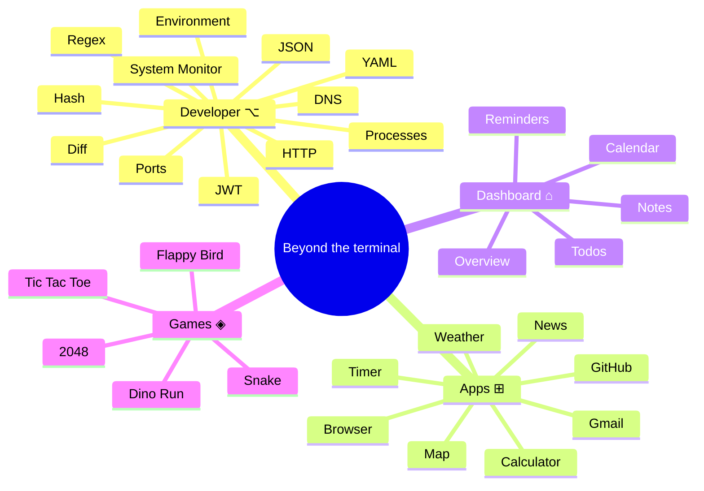
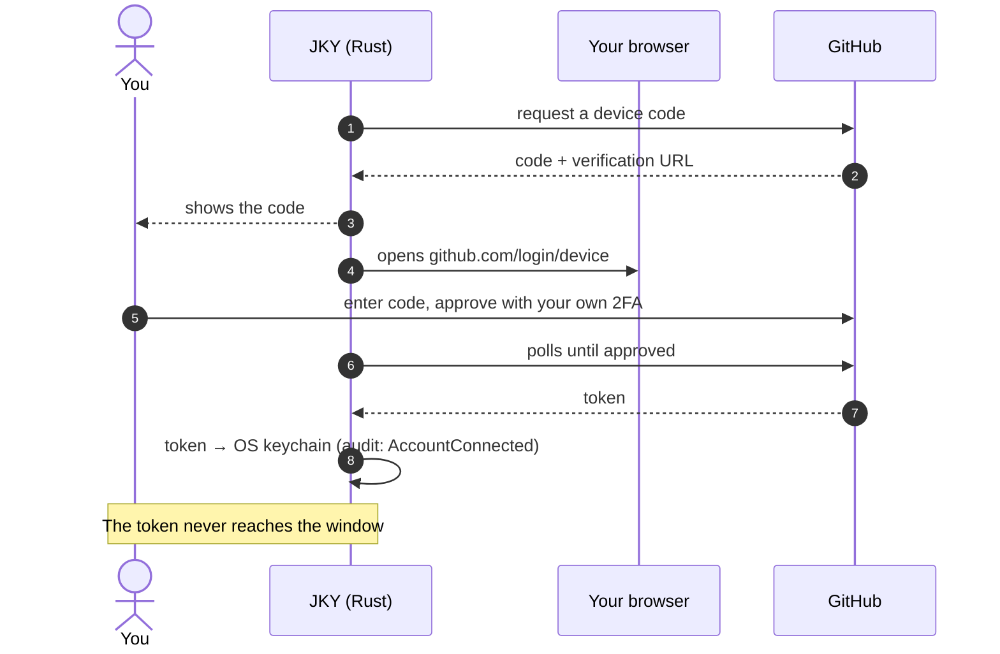

# Apps, tools & games

  

  
  
  
  

Everything on this page is **optional**. The terminal is the product; these are the things people kept
leaving the terminal to do — format some JSON, find what is on port 3000, check a pull request, write a
todo — brought into the same window, under the same rules: Rust does the work, the window only asks,
and nothing reaches the network unless you use it.

**On this page:** [Developer tools](#developer-tools) · [Apps](#apps) · [Dashboard](#dashboard) ·
[Notifications](#notifications-and-reminders) · [Capture](#capture) · [Games](#games) ·
[Loading and size](#loading-and-size)

---

## Developer tools

Open **Developer** (`⌥`), use <kbd>Ctrl</kbd>+<kbd>K</kbd> → `Developer Tools · JWT`, or run
`jky open developer`. **Every tool opens with what it is for, when you would reach for it, and worked
examples you can load** — a test requires it, so a tool added later has to teach itself too.

| | Tool | What it does | Runs |
|:-:|---|---|---|
| `{}` | **JSON** | Formats and checks; says which line and column stopped it. | Locally |
| `≡` | **YAML** | Tidies it, and converts to JSON and back. | Locally |
| `±` | **Diff** | Compares two texts line by line, with both line numbers. | Locally |
| `#` | **Hash** | MD5, SHA-1, SHA-256 and SHA-512, all at once. | Locally |
| `⊙` | **JWT** | Shows what is inside a token. **Never claims one is valid.** | Locally |
| `*` | **Regex** | Tries a pattern against text, off the main thread. | Locally, in a worker |
| `⇄` | **HTTP** | Sends a request and shows the whole reply: status, headers, timing. | Rust → the URL you enter |
| `◫` | **System Monitor** | Processor, memory, disks and uptime, live. | Rust, reading the machine |
| `☰` | **Processes** | What is running, what it costs, what it was started with. | Rust, reading the machine |
| `⇄` | **Ports** | What is listening, what holds it, and whether the network can see it. | Rust, reading the machine |
| `$` | **Environment** | What a new terminal inherits. **Secrets hidden until you ask.** | Rust, reading the environment |
| `◎` | **DNS** | Where a name points from this machine, and how long it took. | Rust → your system resolver |

### Four tools defined by what they refuse

> [!NOTE]
> **JWT decodes and never verifies.** It holds no key, so it must not imply a token is good — and
> `alg: none` is a real attack, the moment a decoder implying validity would be most dangerous.

> [!NOTE]
> **Regex runs in a worker so it can be killed.** `(a+)+$` against a long run of `a`s takes longer than
> the universe, and a regular expression cannot be interrupted once started. A worker can.

> [!NOTE]
> **Environment cannot change a terminal that is already open.** Nothing outside a running process can.
> "Manage your environment variables" is a promise every tool like this makes and none can keep.

> [!WARNING]
> **Ending a process says "asked it to stop."** A process may ignore the signal. It is the only tool here
> that changes the machine, so it asks first and writes to the audit log.

### Bounds

| Tool | Bound |
|---|---|
| HTTP | 1 MB request body, 1 MB response body |
| JSON search | 256 KB |
| Regex | 1,000 matches shown |
| Processes | 250 listed |
| Ports | 300 listed |

---

## Apps

Open **Apps** (`⊞`). Apps that fetch do it in Rust; the window never gets a network connection.

| App | What it does | Account | Contacts |
|---|---|---|---|
| **GitHub** | Your repositories, issues, pull requests and notifications. | Device code, approved on github.com with your 2FA | `github.com`, `api.github.com` |
| **Gmail** | Read your inbox. **Read-only** — nothing can be sent or deleted. | PKCE in your own browser; needs your own Google client id (the panel walks you through it) | Google OAuth and Gmail API |
| **Browser** | Private browsing in a native child webview. Nothing is kept when you leave. | — | Sites you open |
| **Weather** | Now and the days ahead, anywhere. | None | Open-Meteo |
| **News** | Front pages from real papers — BBC, Hacker News, The Hindu, The Indian Express, Times of India. | None | Their RSS feeds |
| **Map** | Look anywhere up, drawn by OpenStreetMap inside the window, with driving routes. | None | OpenStreetMap, OSRM |
| **Calculator** | Arithmetic with the keyboard, history kept. | — | Nothing |
| **Timer** | A countdown that keeps time by the clock, not by the frame. | — | Nothing |

### Accounts, carefully

- Sign-in always happens in **your browser**, never an embedded one.
- Tokens, codes and verifiers go to the **OS keychain** and never reach the window.
- **Gmail** asks for `gmail.readonly` — a test keeps `gmail.send` out. The list never fetches message
  bodies, and an opened message arrives as text, so nothing in it can load a tracking image.
- **GitHub** asks for `repo read:org notifications`. JKY only reads, but note that GitHub's `repo` scope —
  the narrowest that can read private repositories — also permits writes.
- Disconnecting deletes the token and writes `AccountDisconnected` to the audit log.

### Why the Browser is a native webview

Measured, not assumed: GitHub and Jira answer `X-Frame-Options: deny`; Gmail and Grafana `DENY`; Slack,
Notion, Figma, YouTube and Reddit `SAMEORIGIN`. Most of the web refuses to be an iframe. So the Browser
is a native child webview, drawn by whatever engine your OS ships — WebKitGTK, WKWebView or WebView2 —
with **no access to any JKY command**, `http`/`https` only, and nothing kept.

---

## Dashboard

Open **Dashboard** (`⌂`). Everything is stored locally in plain JSON.

| Panel | Holds | From the shell |
|---|---|---|
| ◆ **Overview** | What is coming up, at a glance | — |
| ▤ **Notes** | Titled notes you can append to | `jky notes`, `jky note new <title>`, `jky note write <n> <text>` |
| ☑ **Todos** | A list; ticked items stay until you remove them | `jky todos`, `jky todo add <text>`, `jky todo done <n>` |
| ▦ **Calendar** | Events with dates and times | — |
| ◔ **Reminders** | **Daily** reminders at a time of day | `jky reminders`, `jky reminder add 09:30 standup` |

Writing from the shell **appends, never replaces**: a command that silently discarded a note's body
the moment you added a line would be a trap. The palette can create notes, todos and reminders too.

---

## Notifications and reminders

The **bell** in the top-right corner holds notifications. A reminder that comes due shows a banner (at
most three at once) and lands in the tray. Ticking a reminder off with `jky reminder done <n>` or from
the Dashboard dismisses it for today; it returns tomorrow.

---

## Capture

The **camera** beside the bell photographs the whole window — rail, status bar, tabs and whatever is
open — then asks what to do with it:

- **Save** writes `jky-terminal-2026-09-09-014210.png` (the date and time) to your Downloads folder and
  tells you where it went.
- **Copy** puts it on the clipboard and leaves no file behind.

The picture is taken when you press the button and the choice is offered afterwards, so the popover is
never in the shot.

**How it works on all three platforms.** Tauri has no cross-platform way to photograph a webview, and
screen-capture crates document window capture as unreliable on Wayland. So the window renders a
picture *of itself*: the page is serialised into an SVG `foreignObject`, drawn to a canvas, and the live
canvases — the terminals — are composited back on top. Rust still performs every effect: it chooses the
path and owns the clipboard, so the window gains no filesystem capability. Every capture is written to
the audit log. Captures are capped at 64 MB.

> [!NOTE]
> On Wayland a clipboard is served by a live process, so a copied capture lasts as long as JKY runs.
> That is true of every Wayland app; a clipboard manager solves it.

---

## Games

Open **Games** (`◈`), choose from the palette (`Play Snake`), or run `jky games`. All five are
keyboard-first and keep local records and play statistics.

| # | Game | Keys | |
|:-:|---|---|---|
| 1 | **Dino Run** | <kbd>Space</kbd> · <kbd>↓</kbd> | Jump the cactuses. It only gets faster. |
| 2 | **Snake** | <kbd>↑</kbd><kbd>↓</kbd><kbd>←</kbd><kbd>→</kbd> · <kbd>Space</kbd> | Eat, grow, and try not to corner yourself. |
| 3 | **Tic Tac Toe** | <kbd>1</kbd>–<kbd>9</kbd> · <kbd>Enter</kbd> | Two players, one keyboard. |
| 4 | **Flappy Bird** | <kbd>Space</kbd> | Mind the gap. The gap gets smaller. |
| 5 | **2048** | <kbd>↑</kbd><kbd>↓</kbd><kbd>←</kbd><kbd>→</kbd> · <kbd>W</kbd><kbd>A</kbd><kbd>S</kbd><kbd>D</kbd> | Slide, merge, and build the 2048 tile. |

`jky games <n>` opens games 1–4 from a terminal in the current build; open 2048 from the Games section.

---

## Loading and size

None of this costs anything until you open it. The Editor, Apps, Dashboard and the PDF renderer are
separate chunks, fetched the first time they are used, so the entry bundle — what everyone downloads
before the first terminal appears — stays inside its enforced budget. `pnpm run scan:bundle` fails the
build if it grows past that budget.

---

  <a href="security-and-privacy.md">← Security & privacy</a> &nbsp;·&nbsp;
  <a href="README.md">Documentation home</a> &nbsp;·&nbsp;
  <a href="architecture.md">Next: Architecture →</a>

