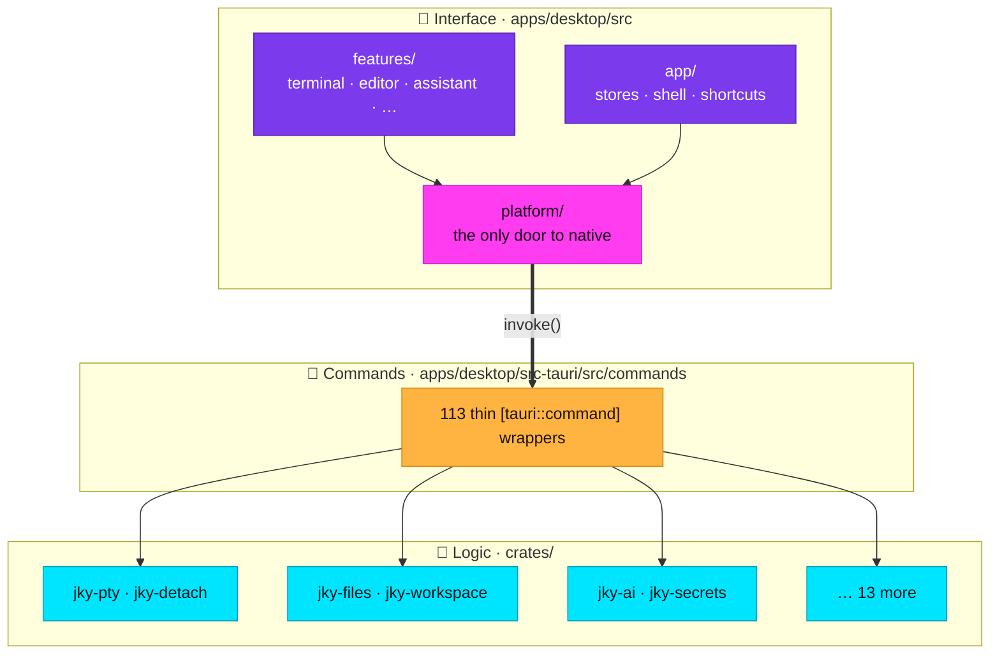
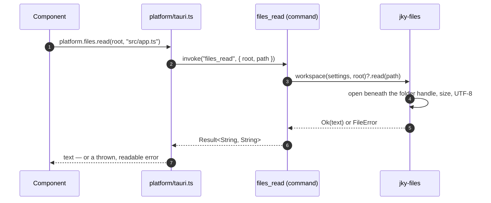
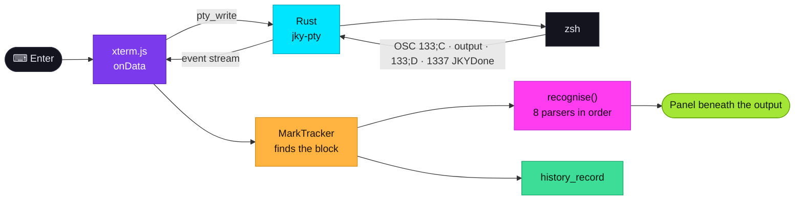
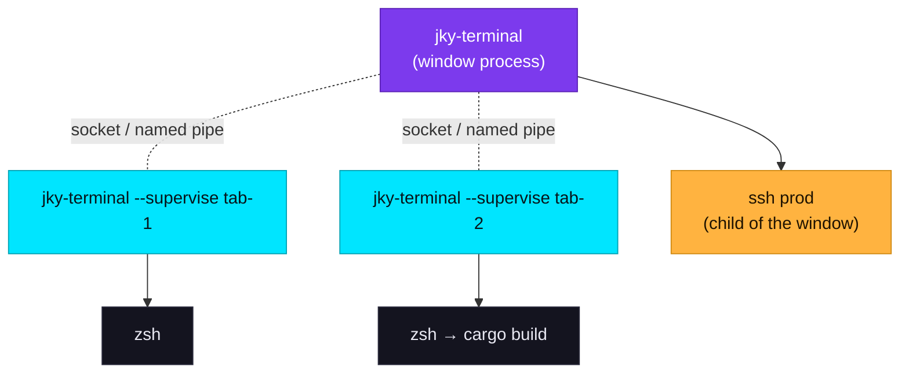
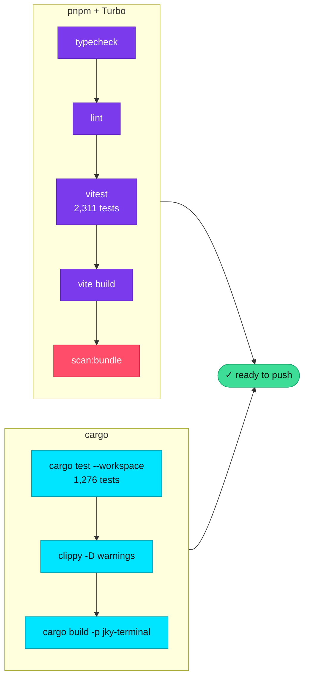

# Architecture

<p align="center">
  
</p>

<p align="center">
  
  
  
  
  
</p>

This page is for contributors and for anyone evaluating how JKY is built. It explains the layers, where
each responsibility lives, and the handful of rules that the tests enforce so the design cannot quietly
erode.

**On this page:** [Three layers](#three-layers) · [Repository layout](#repository-layout) ·
[The crates](#the-nineteen-crates) · [The IPC layer](#the-ipc-layer) · [The platform adapter](#the-platform-adapter) ·
[A command's journey](#a-commands-journey) · [Processes](#processes-at-runtime) ·
[Rules the tests enforce](#rules-the-tests-enforce) · [Build and test](#build-and-test)

---

## Three layers



| Layer | Holds | Rule |
|---|---|---|
| **Interface** | React components, Zustand stores, xterm.js | Never calls Tauri directly. Every native capability goes through `platform/`. |
| **Commands** | `#[tauri::command]` functions | Thin wrappers only — parse arguments, call a crate, return a result. |
| **Crates** | All real logic | Plain Rust libraries with their own unit tests, usable without Tauri. |

**The window can ask; only Rust can act.** That sentence is the architecture. It is why the logic is
testable without a window, why the interface can run in a plain browser, and why the security model can
be described in a page.

---

## Repository layout

```text
jky-terminal/
├── apps/desktop/
│   ├── src/                     React interface
│   │   ├── app/                 shell, rail, tabs, stores, shortcuts, theme
│   │   ├── features/            one folder per section — terminal, editor, assistant, …
│   │   ├── platform/            tauri.ts (real) · web.ts (browser stand-in) · types.ts
│   │   ├── components/          shared UI pieces
│   │   └── styles/              tokens.css · themes.css — every colour lives here
│   └── src-tauri/
│       ├── src/commands/        the 113 IPC commands, thin
│       ├── src/supervisor.rs    the --supervise entry point
│       ├── src/turn.rs          the assistant's tool loop
│       ├── tests/security.rs    the boundary, as tests
│       ├── capabilities/        the window's (minimal) Tauri permissions
│       └── tauri.conf.json      CSP, bundle settings
├── crates/                      19 Rust libraries — all real logic
├── docs/                        you are here
├── scripts/                     clean-dist · scan-bundle
└── .github/workflows/           ci.yml · release.yml
```

---

## The nineteen crates

| Crate | Responsibility |
|---|---|
| 🟢 **jky-pty** | Spawning shells in a PTY, resolving which shell, shell-integration hooks for bash, zsh, fish, Nushell and PowerShell, and the `jky` launchers. |
| 🟢 **jky-detach** | Shells that outlive the window: the supervisor, its socket or named pipe, join/open/end/prune. |
| 🟢 **jky-history** | Every command you have run, the subsequence search and ranking. |
| 🟢 **jky-memory** | Work Memory: every run with its output tail, duration, git branch and revision, pin and note, in SQLite with a trigram full-text index; redacted and bounded before it is stored, schema-versioned with migrations. |
| 🟢 **jky-complete** | What could come next on a command line — without running anything. |
| 🟢 **jky-live** | Re-running one of three known commands so a panel can stay current. |
| 🟢 **jky-keys** | What every key is bound to; the modifier and `Ctrl+C`/`Ctrl+D` rules. |
| 🔵 **jky-persist** | Atomic, flushed writes and schema-numbered JSON documents with migrations — shared by every store. |
| 🔵 **jky-files** | Reading and writing inside one directory and nowhere else. |
| 🔵 **jky-workspace** | Saved workspaces. |
| 🔵 **jky-settings** | Non-secret preferences. |
| 🔵 **jky-store** | Dashboard data and scrollback. |
| 🟣 **jky-ai** | Providers (Anthropic, OpenAI-compatible incl. Ollama), streaming, tools, the path sandbox, risk labels, approved-command execution. |
| 🟣 **jky-redact** | Recognising secrets in text — keys, tokens, JWTs, private keys, credentials in context — and replacing them with labels. |
| 🟣 **jky-secrets** | The keychain, the provider and model catalogue, key shape checks, a zeroising secret type. |
| 🟣 **jky-audit** | The append-only, hash-chained audit log, its keychain anchor and its verifier. |
| 🟠 **jky-remote** | Saved hosts and the `ssh` argument validation. |
| 🟠 **jky-apps** | Apps that fetch: GitHub, Gmail, weather, places, routes, news, the HTTP client, the browser's URL rules. |
| 🟠 **jky-tools** | Developer tools that need a dependency. |
| 🟠 **jky-system** | What the machine is doing: CPU, memory, disks, processes, DNS. |
| 🟠 **jky-ports** | What is listening on this machine. |
| 🟠 **jky-capture** | What happens to a picture once the window has taken one. |

🟢 terminal core · 🔵 data · 🟣 trust · 🟠 integrations

---

## Data on disk

Every file JKY keeps falls into one of two kinds, and each kind has one rule for change.

| Kind | Files | How it changes safely |
|---|---|---|
| **Documents** — read whole, written whole | `settings.json`, `keymap.json`, `workspaces.json`, `hosts.json`, `notes.json`, `todos.json`, `events.json`, `reminders.json` | Each carries a top-level `"schema"` number. `jky-persist` walks an older file forward one migration at a time when it is read, and **refuses** a file from a newer build — for reading and therefore for writing — because an older build would drop the fields it does not know on its next save. Unnumbered files from before schemas are schema 0. |
| **Logs** — appended line by line | `audit.jsonl` | New fields are always optional, so every old line still parses. A log is never rewritten to change its shape. |
| **Database** — SQLite, changed in transactions | `memory.sqlite3` (Work Memory: every run, its output tail, duration, git state, pin and note) | `PRAGMA user_version` is the schema number. Each migration runs in its own transaction, so a crash leaves the last complete version. A database from a newer build is refused **before anything is written to it** — not even its journal mode is changed — and that session keeps its history in memory. The `history.jsonl` of earlier versions is imported once, in one transaction, and only then removed. |

Every whole-file write goes through one function, `jky_persist::atomic_write`: a uniquely named
temporary file, `sync_all`, a rename over the original, and on Unix a flush of the directory. A crash
or power cut leaves the previous contents, never a mixture — and two overlapping writers each get
their own temporary file.

---

## The IPC layer

Each command is a few lines: take arguments, call a crate, map the error to a string. The full list is
pinned by name in a test, with a comment for every entry explaining why that widening of the window's
reach is acceptable.



Long-running work — the PTY stream, assistant streaming, live panels — uses Tauri events rather than
return values, but the same rule holds: the window subscribes; Rust decides what is sent.

---

## The platform adapter

Every native capability the interface uses is declared once, in `platform/types.ts`, and implemented
twice:

| Implementation | Used when | Behaviour |
|---|---|---|
| `platform/tauri.ts` | In the desktop app | Calls the real IPC commands |
| `platform/web.ts` | `pnpm dev` in a browser, and in tests | Keeps values in closures that die with the tab — **never** `localStorage` for anything secret |

**Parity tests** keep the two honest: the browser catalogue of `jky` commands, apps, keymap defaults and
store shapes are checked against the Rust source, so a change on one side without the other fails the
build. A component calling `invoke()` directly is a lint error.

This is what lets 2,200+ interface tests run in a fast, headless environment while the Rust side carries
its own 1,000+ tests.

---

## A command's journey

From a key press to a panel, using `git status -s` as the example:



The recognisers run in the interface because they only interpret text the window already has. Anything
that *acts* — re-running a command for a live panel, reading a file, recording history — goes back
through an IPC command.

---

## Processes at runtime



- Each local pane's shell is held by its own **supervisor**, the same binary run with `--supervise`.
  The window connects as a client.
- Supervisor sockets live in a directory only your user can enter; on Windows each named pipe admits
  only its owner.
- A supervisor exits with its shell. On start, the window ends any supervisor no pane claims.
- **Remote panes are children of the window**, so they end with it and are never reopened
  automatically.

---

## Rules the tests enforce

| Rule | Enforced by |
|---|---|
| Logic lives in `crates/`; commands are thin | Code review, and the pinned command list |
| Every native call goes through `platform/` | ESLint |
| No IPC command returns a secret | `security.rs` — name scan and return-type scan |
| The command surface changes only on purpose | `security.rs` — exact list by name |
| `connect-src` names no external host | `security.rs` |
| The window has no fs, shell or http capability | `security.rs` |
| No literal colour in a component | ESLint |
| Every theme's text meets WCAG contrast on its ground | A theme test computes it |
| `prefers-reduced-motion` honoured by one rule | A test pins it |
| The entry bundle stays within budget, with no credential-shaped strings | `scripts/scan-bundle.mjs` |
| The browser adapter matches the Rust catalogues | Parity tests |
| Recognisers match real shells | Recorded `zsh -i` and `bash -i` sessions |

---

## Build and test



```sh
pnpm run verify                                        # clean, typecheck, lint, test, build, scan
cargo test --workspace                                 # every crate and the app
cargo clippy --workspace --all-targets -- -D warnings  # no warnings, anywhere
```

Test counts are as of October 2026 and grow with the code. The CI pipeline that runs these on Linux,
macOS and Windows is described in [Operations & releases](operations-and-releases.md).

---

<p align="center">
  <a href="apps-and-tools.md">← Apps, tools & games</a> &nbsp;·&nbsp;
  <a href="README.md">Documentation home</a> &nbsp;·&nbsp;
  <a href="troubleshooting.md">Next: Troubleshooting →</a>
</p>
