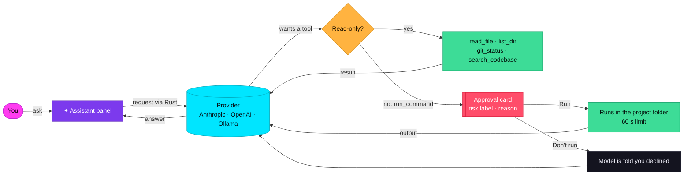
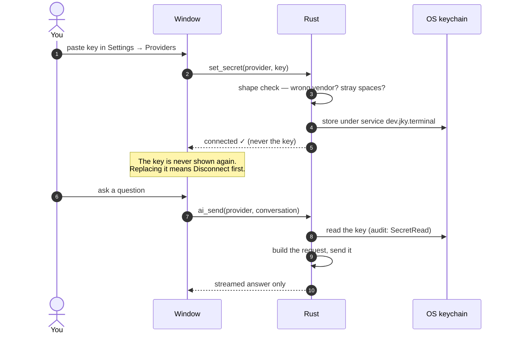
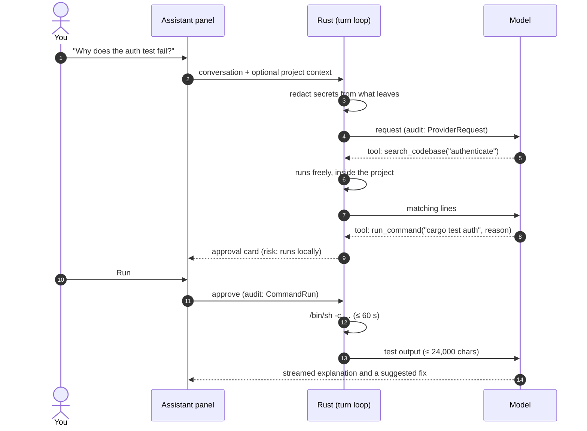

# Assistant & approvals

<p align="center">
  
</p>

<p align="center">
  
  
  
  
</p>

JKY's assistant is a collaborator, not an operator. It can read your project to understand a problem,
and it can **propose** commands — but every command waits for you, and the ones that can destroy
something make you type them back before they run. This guide explains exactly what it can see, what it
can do, what leaves your machine, and how to keep it useful.

**On this page:** [At a glance](#at-a-glance) · [Providers and models](#providers-and-models) ·
[The project folder](#the-project-folder) · [Tools](#what-the-assistant-can-do) ·
[Approvals](#how-approval-works) · [Risk labels](#risk-labels) · [A turn, step by step](#a-turn-step-by-step) ·
[What is sent](#what-leaves-your-machine) · [Context](#local-project-context) ·
[Failure help](#failure-help) · [jky ask](#asking-from-the-shell) · [Records](#conversations-and-the-audit-log) ·
[Good prompts](#prompts-that-stay-bounded) · [Limits](#limits-worth-knowing)

---

## At a glance



| Question | Answer |
|---|---|
| Does it run commands on its own? | **No.** Every command needs your approval. There is no "always allow". |
| Can it read my files? | Only inside the **project folder**, and only text files. |
| Where are my API keys? | In your OS keychain. No IPC command can return one to the window. |
| Can it run without the internet? | Yes — with a local **Ollama** model. |
| Does it send anything until I ask? | No. Not even under a failed command. |

---

## Providers and models

Open **Settings → Providers**. Choose a provider, paste a key (or nothing, for Ollama), and pick a model.

| Provider | Status | Key needed | Default model | Other choices |
|---|---|---|---|---|
| **Anthropic** | 🟢 Wired | Yes | Claude Opus 5 | Sonnet 5, Haiku 4.5, Fable 5, and earlier Opus and Sonnet models |
| **OpenAI** | 🟢 Wired | Yes | GPT-4o mini | GPT-4o, GPT-4.1 family, o3, o3-mini, o4-mini, o1, legacy models |
| **Ollama** | 🟢 Wired | **No** — runs on `localhost:11434` | Llama 3.2 | Llama 3.3, Qwen 2.5 Coder, DeepSeek R1, Mistral 7B, Phi 4, Gemma 2, Code Llama |
| Google · Mistral · Groq · DeepSeek · xAI · OpenRouter | 🟡 Key storage only | Yes | — | Their keys can be stored and their models chosen, but the assistant has **no adapter** for them yet and says so plainly when you try. |

> [!TIP]
> **Fully local:** install [Ollama](https://ollama.com), run `ollama pull llama3.2` (or any model in the
> list), choose **Ollama** in Settings → Providers, and nothing you ask leaves your machine.

### How keys are handled



- **A shape check** catches typos and wrong-vendor keys before they reach the keychain. It does not
  prove a key is live. It rejects surrounding whitespace rather than trimming, so what is stored is
  exactly what you were shown.
- **Errors never contain the key.** A test checks that no error text — shown or logged — echoes key
  material.
- **The window cannot read it back.** No IPC command returns a secret, and a test pins the list of
  commands by name so one cannot be added quietly.

---

## The project folder

The assistant's file tools — and any command you approve — work inside **one project folder**. Set it in
**Settings → Privacy → Project folder**, or switch to a workspace that has a terminal folder: switch to a
workspace whose terminal folder is `~/code/api`, and that is the assistant's project. A folder that does
not exist is refused when you set it, rather than stored and silently ignored.

Falling back to your home folder would make an apparently project-scoped assistant able to read
unrelated personal files, so **there is no fallback**: with no project folder set, tools refuse and the
assistant tells you to choose one first.

---

## What the assistant can do

| Tool | Approval | What it does | Bounds |
|---|---|---|---|
| `read_file` | Runs freely | Reads a UTF-8 text file in the project | Output capped at 24,000 characters |
| `list_dir` | Runs freely | Lists a directory in the project | Up to 1,000 entries |
| `git_status` | Runs freely | Working-tree status of the project | |
| `search_codebase` | Runs freely | Finds a literal string; returns file and line | Up to 5,000 files, 1 MB each, 16 MB total, 32 levels deep |
| `run_command` | **Always asks** | Proposes a shell command with a reason | Runs in the project folder; stopped after **60 seconds**; no input; output capped |

**Every path a tool receives is untrusted.** It is influenced by whatever the model has already read,
which can include text written by someone else — a README, a dependency, a branch name. So the project
is held as an open directory handle and every file is opened **beneath it**, by the same system call that
decides whether it is inside — `../`, a symlink pointing out, and a directory swapped for a link
mid-read are all refused at the moment of the open, with no gap for another process to exploit. The
search walk never follows a link. Paths containing a NUL byte are refused outright.

**The approval list fails closed.** Only the four read-only tools are listed as safe. Anything else —
including any tool added in the future — requires approval by default.

---

## How approval works

When the model asks to run a command, the conversation pauses and an **approval card** appears:

```text
┌─ run_command ───────────────────────────────────── writes files ┐
│ sed -i 's/timeout: 30/timeout: 60/' config/test.yml             │
│                                                                 │
│ This exact command runs only after approval. Review its risk    │
│ label and reason before deciding.                               │
│                                                                 │
│ Why: the integration tests time out on CI at 30 seconds.        │
│                                                                 │
│  [ Run ]   [ Don't run ]                                        │
└─────────────────────────────────────────────────────────────────┘
```

- **Run** executes *exactly* the command shown — `/bin/sh -c` on macOS and Linux, `cmd.exe /C` on
  Windows — in the project folder, with no input, for at most 60 seconds. On Unix it gets its own
  process group, so a timeout stops everything it started rather than leaving a background process
  running.
- **Don't run** tells the model you declined, and it continues from there.
- For a **destructive** command, **Run** stays disabled until you type the command back, character for
  character, into a confirmation field.

Every decision is written to the audit log: `CommandRun` or `CommandRejected`.

> [!CAUTION]
> An approval card is a decision aid, not a safety guarantee. The model can misunderstand a repository
> or a command. Read the command, not just the label. You are the authority for every side effect.

---

## Risk labels

Every proposed command carries the clearest reason it needs attention. **Approval is required for every
command regardless of its label** — the label is for the person deciding, not a policy exception.

| Label | Triggered by (examples) | Confirmation |
|---|---|---|
| 🔴 **destructive** | `rm -rf`, `git push --force` / `-f`, `dd if=`, `mkfs`, `chmod 777 /`, `shutdown`, `reboot`, a fork bomb, `del /f /s /q`, `format c:` | **Type the command** |
| 🟣 **publish** | starts with `git push`, `gh pr`, `npm publish`, `cargo publish` | Click |
| 🔵 **network** | starts with `curl`, `wget`, `ssh`, `scp`, or contains ` curl ` / ` wget ` | Click |
| 🟠 **writes files** | contains `>` or ` tee `, `sed -i`, starts with `git commit` or `git checkout` | Click |
| 🟢 **runs locally** | anything else | Click |

Matching runs over the **whole** command, lower-cased and with spaces squeezed — so `ls && rm -rf /` is
caught even though it starts with `ls`. A command with no keyword is never treated as *safe*; it is
simply labelled *runs locally* and still needs your click.

---

## A turn, step by step



A single turn can go back and forth with the model **at most eight times**, so a confused model cannot
loop forever. **Stop** ends the turn at any point.

---

## What leaves your machine

| Sent to the provider | Not sent |
|---|---|
| Your messages in this conversation | Your API key to the window, or anywhere but the provider |
| Your local project context note, if you wrote one — only when you send | Anything before you press send |
| Results of tools the model asked for: file contents, listings, search matches, `git status`, command output you approved | Files outside the project folder |
| | Your terminal scrollback, history or other conversations |
| | Any key or token Rust recognises — in your message, the context note or a tool result |

**You can see it before you send.** A row of chips above the message box names where the message is
going (`to Anthropic`, or `Ollama · stays on this machine`), how many earlier turns travel with it,
whether your project context note is attached, and that secrets are redacted. When your message did
carry one, the answer opens with a line saying how many were replaced; a tool whose result lost one says
so on its own line. What is recognised is listed in
[Security & privacy](security-and-privacy.md#secrets-in-history-scrollback-and-ai-requests).

With **Ollama**, "the provider" is a process on your own machine. With Anthropic or OpenAI, read their
data-use policies, use a dedicated key, and set a spending limit or alert in their console.

---

## Local project context

Each conversation can carry a **local project context** note — background you would otherwise repeat:
"the API is in `crates/api`, tests need `DATABASE_URL`, we target Rust 1.80".

- Stored with that conversation, **on this device**, labelled with the active workspace.
- Up to **6,000 characters**, so a note cannot silently become a huge prompt.
- Joins a request **only when you send**, as background the model is told not to repeat.

---

## Failure help

When a command fails in a terminal, an offer of help appears beneath it. **Nothing is sent until you
press a button.** Then JKY makes a single, separate request:

| Carries | Bound |
|---|---|
| The command | Up to 256 characters |
| The tail of its output | Up to 700 characters |
| An instruction | "Answer briefly" |

Recognisable secrets in the output are redacted before it leaves. It has **no tools, no history and no
turn state**. A suggestion under a failed command cannot run
anything, and it cannot collide with a conversation in the Assistant panel. A terminal is not a chat
window: three useful sentences under a failed `git push` beat an essay.

---

## Asking from the shell

```sh
jky ask why does cargo say the lockfile needs updating
```

The question opens in the Assistant panel. It travels as an escape sequence through the terminal, so
the `jky` command needs no network access and no socket — and run outside JKY it does nothing at all.
Clicking the bar beside a finished command also offers **Ask about this**, or **Ask why it failed** with
the exit code.

---

## Conversations and the audit log

- **Conversations** are kept locally — the five most recent — in the webview's storage. Treat them like
  any project notes: they can contain code and decisions.
- **The audit log**, `audit.jsonl` in the app's config folder, gains a line for each key read, provider
  request, tool call, approved command and declined command. It is append-only, **written but never
  handed to the window** — a test checks that — and each detail is sanitised so a crafted value cannot
  forge an extra line.

An audit record helps answer *what happened?* It is not a rollback. Keep using Git, backups and your
normal change process.

---

## Prompts that stay bounded

Good requests state a goal, a scope, and what you want back.

```text
Explain this TypeScript error using only the pasted stack trace.
Do not read files or run commands.
```

```text
Look at git status and the failing test file, then propose ONE command
to reproduce the failure. Explain it; do not run anything else.
```

```text
Summarise what changed in src/auth/. List anything that touches secrets
or permissions as a checklist for my review.
```

### Treat these as high-risk — whatever the label says

- deleting files, branches, containers, volumes or cloud resources;
- rewriting Git history or force-pushing;
- anything touching production systems, permissions, secrets or firewall rules;
- sending messages, creating tickets or calling external APIs;
- reading `.env` files, credential stores or SSH configuration;
- running package-manager scripts from a repository you have not reviewed.

---

## Limits worth knowing

| Limit | Value |
|---|---|
| Model round-trips per turn | 8 |
| Approved command time limit | 60 seconds |
| Tool output returned to the model | 24,000 characters |
| Search scope | 5,000 files · 1 MB per file · 16 MB total · depth 32 |
| Directory listing | 1,000 entries |
| Response length | 32,000 tokens (Anthropic) · 16,384 (OpenAI) · 8,192 (others) |
| Conversations kept | 5 most recent |
| Project context note | 6,000 characters |

---

<p align="center">
  <a href="workspaces-and-editor.md">← Workspaces & editor</a> &nbsp;·&nbsp;
  <a href="README.md">Documentation home</a> &nbsp;·&nbsp;
  <a href="security-and-privacy.md">Next: Security & privacy →</a>
</p>
