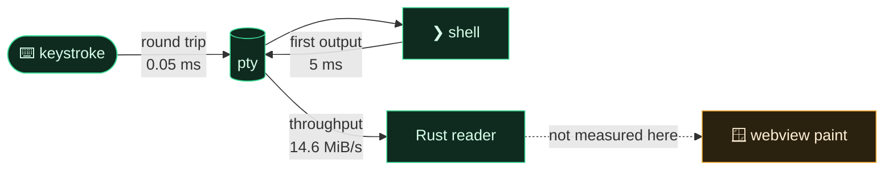

# Benchmarks

<p align="center">
  
  
  
</p>

Numbers for the parts of a terminal that can be timed without a screen, measured on one machine and
reproducible on yours with one command. What is **not** measured is said just as plainly — no number
here stands in for one it is not.

**On this page:** [Results](#results) · [What each number means](#what-each-number-means) ·
[Reproduce them](#reproduce-them) · [What is not measured](#what-is-not-measured) ·
[What the numbers say to fix](#what-the-numbers-say-to-fix)

---

## Results

Measured on 3 October 2026, release build, nothing else heavy running.

| Machine | |
|---|---|
| CPU | 13th Gen Intel Core i7-13620H, 16 threads |
| Memory | 16 GB |
| OS | Fedora 43, Linux 6.18 |
| Shell | `/bin/sh -i` (bash in POSIX mode) |

| Measurement | Median | p99 |
|---|---:|---:|
| First output from a new shell | 5.0 ms | 6.1 ms |
| Keystroke round trip through the pty | 0.052 ms | 0.305 ms |
| Open a held shell — start its supervisor and attach | 127 ms | 152 ms |
| Rejoin a held shell that is already running | 0.46 ms | 0.65 ms |

| Measurement | Result |
|---|---:|
| Throughput — 1,000,000 lines through a pty, every one counted | 14.6 MiB/s |
| The same, read by a minimal Python pty reader, for comparison | 13.1–14.4 MiB/s |
| Memory one held shell adds — private to its supervisor | 10.3 MiB |
| Memory twenty held shells add — private, all supervisors | 206.5 MiB |
| Resident size of one supervisor, shared libraries included | 42.9 MiB |

---

## What each number means



- **First output** — from asking for a pty with an interactive shell in it to the first byte back, which
  is the prompt. What opening a terminal costs before anything is drawn.
- **Keystroke round trip** — one byte written to the pty until its echo is read back. It is the
  latency the terminal's own plumbing adds; at a twentieth of a millisecond it is invisible next to a
  60 Hz frame (16.7 ms).
- **Throughput** — `yes | head -n 1000000` through a real pty, every line counted, none allowed to go
  missing. A minimal Python reader on the same machine gets the same figure, so **JKY's pty layer adds
  no measurable cost**: the ceiling is the kernel's pty line discipline on this machine.
- **Open a held shell** — what opening a pane costs when its shell is held apart from the window:
  starting a supervisor process and completing the handshake. It is paid once per pane.
- **Rejoin a held shell** — what relaunching the app costs per pane: connecting to a supervisor that is
  already running and receiving what was missed.
- **Memory** — a supervisor is the app's own binary, linked against the GUI toolkit it never opens.
  Resident size counts those shared pages again in every process; the **private** figure is what each
  additional held shell actually costs.

---

## Reproduce them

```sh
cargo build --release -p jky-terminal
cargo test --release -p jky-terminal --test bench -- --ignored --nocapture --test-threads=1
```

The harness is [`apps/desktop/src-tauri/tests/bench.rs`](../apps/desktop/src-tauri/tests/bench.rs). It
prints the tables above. It is an ignored test, so it never gates CI: these are facts about a machine,
not about the code. Private memory is read from `/proc/<pid>/smaps_rollup` and so is Linux-only; macOS
reports resident size; Windows reports neither yet.

For the lossless-throughput probe on its own:
`cargo test -p jky-pty --test throughput -- --ignored --nocapture`.

---

## What is not measured

> [!IMPORTANT]
> None of these numbers is a claim about how fast the **window** is. They stop at the Rust side of the
> IPC boundary.

| Not measured yet | Why it matters |
|---|---|
| Cold start of the window | The first thing anyone notices |
| Frame time while output streams | Where a webview terminal and a native GPU terminal differ most |
| Keystroke-to-photon latency | The latency a person actually feels |
| Memory of the window itself | The webview is the largest process |
| Comparisons with other terminals | Only meaningful when they are run the same way, on the same machine |

These need a screen, a frame clock and the same method applied to every terminal compared. Until that
exists, [the comparison](comparison.md) says that native GPU terminals such as Ghostty, Alacritty and
WezTerm are faster under heavy output — which remains the honest default.

---

## What the numbers say to fix

| Finding | Next step |
|---|---|
| A held shell takes ~127 ms to open and 10 MiB of private memory, because its supervisor is the whole app binary — 25 MiB, 166 shared libraries — doing a job that needs a pty and a socket | A small supervisor binary of its own, without the GUI toolkit linked in |
| Throughput sits at the kernel's pty ceiling | Nothing to fix below the IPC boundary; the next limit is the window |

<p align="center">
  <a href="operations-and-releases.md">← Operations & releases</a> &nbsp;·&nbsp;
  <a href="README.md">Documentation home</a> &nbsp;·&nbsp;
  <a href="product-roadmap.md">Next: Product roadmap →</a>
</p>
