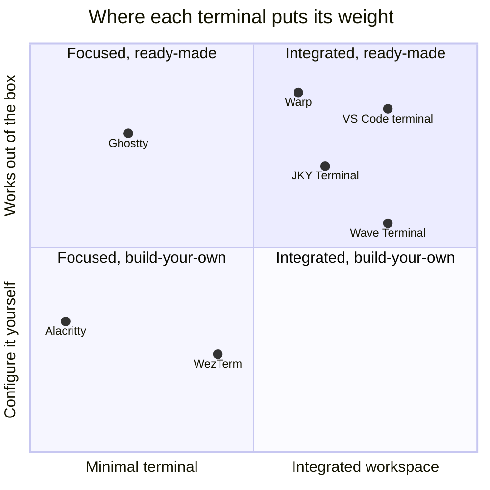

# How JKY Terminal compares

  

> [!NOTE]
> **This page exists to help you choose, not to win.** Every terminal here is excellent at
> something, and most of them are far more mature than JKY. Facts about other projects were checked
> against their own documentation and repositories in **October 2026**. Software moves quickly; if
> anything below is out of date or unfair, please
> [open an issue](https://github.com/kartikeyajay2006/jky-terminal/issues) and it will be corrected.

## The short version

JKY Terminal is a **young, single-maintainer, local-first terminal** built on a Rust core and the
operating system's own webview. It is trying to be good at three specific things:

1. **Shells that outlive the window.** Every pane's shell is held by a small supervisor process, so
   closing the app does not end your build — and reopening shows what it printed while you were
   away. No tmux to learn, nothing to configure.
2. **Command output you can read at a glance.** Eight deterministic parsers turn `git status`,
   `git log`, `docker ps`, `df`, `ps`, `ls`, `mkdir` and JSON into panels *beneath* the raw output
   — never instead of it.
3. **An assistant that has to ask.** Every command it proposes waits for your approval; destructive
   ones need you to type to confirm. API keys live in the OS keychain, and the window itself has no
   network access at all.

It is **not** trying to be the fastest renderer, the most complete terminal emulator, or the most
scriptable. Other projects do those better today, and this page says which.

The chart is an editorial judgement, not a measurement. Its job is to show the shape of the
trade-off: the further right a terminal sits, the more it does besides being a terminal.

---

## At a glance

| | Built with | Platforms | License | Best at |
|---|---|---|---|---|
| **JKY Terminal** | Rust core, Tauri 2, the OS webview, xterm.js | Linux · macOS · Windows | MIT | Persistent shells, command-output panels, approval-first AI |
| **[Ghostty](https://ghostty.org)** | Zig, native UI (AppKit on macOS, GTK4 on Linux), GPU | macOS · Linux | MIT | Native feel, speed, and standards-complete emulation |
| **[Warp](https://www.warp.dev)** | Rust, GPU-rendered UI | macOS · Linux · Windows | AGPL-3.0 (client) | Polished agent workflows, blocks, and team features |
| **[Wave Terminal](https://www.waveterm.dev)** | Go backend, Electron | macOS · Linux · Windows | Apache-2.0 | Terminal, editor, previews, browser and AI in one layout |
| **[WezTerm](https://wezterm.org)** | Rust, GPU | Linux · macOS · Windows · BSD | MIT | Lua-scriptable everything and a built-in multiplexer |
| **[Alacritty](https://alacritty.org)** | Rust, OpenGL | Linux · macOS · Windows · BSD | Apache-2.0 | Minimal and very fast; designed to pair with tmux |
| **[VS Code terminal](https://code.visualstudio.com/docs/terminal/basics)** | xterm.js, Electron | Linux · macOS · Windows | MIT source, proprietary build | A terminal inside a full IDE |

## Capability by capability

**Legend:** 🟢 built in &nbsp;·&nbsp; 🟡 partly, or with setup / an add-on &nbsp;·&nbsp; ⚪ not offered
(often deliberately) &nbsp;·&nbsp; numbers point to the notes below the table.

| Capability | JKY | Ghostty | Warp | Wave | WezTerm | Alacritty | VS Code |
|---|:-:|:-:|:-:|:-:|:-:|:-:|:-:|
| Tabs and split panes | 🟢 | 🟢 | 🟢 | 🟢 | 🟢 | ⚪ 1 | 🟢 |
| Local shells survive quitting the app | 🟢 | ⚪ 2 | ⚪ 3 | 🟡 4 | 🟡 5 | ⚪ 2 | 🟡 6 |
| Native GPU renderer | 🟡 7 | 🟢 | 🟢 | 🟡 7 | 🟢 | 🟢 | 🟡 7 |
| Inline images (Kitty, iTerm2 or Sixel) | 🟡 19 | 🟢 | — 8 | — 8 | 🟢 | ⚪ | 🟡 |
| Command output shown as structured views | 🟢 9 | ⚪ | 🟡 10 | 🟡 11 | ⚪ | ⚪ | 🟡 12 |
| AI assistant | 🟢 13 | ⚪ | 🟢 | 🟢 | ⚪ | ⚪ | 🟢 14 |
| Local models (Ollama) | 🟢 | — | — 8 | 🟢 | — | — | 🟡 |
| Built-in file editor | 🟢 | ⚪ | 🟢 | 🟢 | ⚪ | ⚪ | 🟢 |
| Built-in web browser | 🟢 | ⚪ | ⚪ | 🟢 | ⚪ | ⚪ | 🟡 |
| Scripting or plugin API | ⚪ 15 | ⚪ | 🟡 | 🟡 | 🟢 | ⚪ | 🟢 |
| Account needed | No | No | No 16 | No | No | No | No 17 |
| Signed installers to download today | ⚪ 18 | 🟢 | 🟢 | 🟢 | 🟢 | 🟢 | 🟢 |
| Maturity | v0.1, one maintainer | 1.x, large community | company-backed | company-backed | mature, widely used | mature, since 2017 | Microsoft |

### Notes

1. Alacritty deliberately leaves tabs and splits to your window manager or a multiplexer.
2. Use tmux, zellij or screen. They work in every terminal — JKY included.
3. Warp restores windows, tabs, panes and the last few blocks on restart, but processes that were
   running in those panes end. ([Warp docs: session restoration](https://docs.warp.dev/terminal/sessions/session-restoration))
4. Wave's durable sessions (v0.14) keep **SSH** connections alive across network drops and restarts.
5. WezTerm's multiplexer server — a `unix_domains` entry in its Lua config — keeps sessions alive
   across GUI restarts once you set it up. ([WezTerm docs: multiplexing](https://wezterm.org/multiplexing.html))
6. VS Code reconnects to running processes when a *window reloads*; after a full restart it restores
   the content and starts a new process. ([VS Code docs](https://code.visualstudio.com/docs/terminal/advanced))
7. xterm.js with its WebGL2 renderer, inside a webview. Fast in practice, but a native GPU terminal
   will win on raw throughput and input latency. JKY's [benchmarks](benchmarks.md) stop at the window:
   below it the pty layer runs at the kernel's ceiling; frame timing is not measured yet.
8. Not verified for this page, so it is left blank rather than guessed.
9. Eight deterministic parsers: `git status`, `git log`, `docker ps`, `df`, `ps`, `ls`, `mkdir`, and
   JSON. No model involved, and the raw text always stays in the scrollback.
10. Warp's Blocks group each command with its output for navigation, copying and sharing.
11. Wave previews files (Markdown, images, CSV, PDF, directories) rather than parsing command output.
12. Shell-integration decorations mark each command's success or failure.
13. Anthropic and OpenAI with your own key, or a local Ollama with no key at all. Every proposed
    command needs your approval.
14. Through GitHub Copilot and extensions.
15. Planned, not shipped. A plugin system needs sandboxing and visible permissions first; see the
    [roadmap](product-roadmap.md).
16. Warp dropped its login requirement in late 2024; some cloud and AI features use a Warp account.
17. Signing in is needed for Copilot, not for the terminal.
18. Installers for every platform are on the [Releases page](https://github.com/kartikeyajay2006/jky-terminal/releases/latest), and the one-line installer sets one up. They are **unsigned** for now, so one downloaded by hand gets a first-launch warning on macOS and Windows. See [Operations and releases](operations-and-releases.md).
19. Sixel and the iTerm2 image protocol, decoded within stated size and memory limits. Kitty's graphics protocol is not supported yet.

---

## Where JKY is behind today

These are real limits, written down so nobody discovers them the hard way.

| Limit | What it means for you | Where it is going |
|---|---|---|
| **Installers are not code-signed yet** | The one-line installer is unaffected. An installer downloaded by hand makes macOS Gatekeeper and Windows SmartScreen warn on first launch. | Signing, notarisation and a signed updater are on the [roadmap](product-roadmap.md). |
| **Webview renderer** | Heavy output — megabytes of logs at once — will feel slower than in a native GPU terminal. | [Benchmarks](benchmarks.md) below the window are published; frame timing is next. |
| **No Kitty graphics** | Sixel and iTerm2 images render; Kitty's graphics protocol does not, so `kitty +kitten icat` shows nothing. | Planned. |
| **No scripting or plugins** | Settings are a panel plus `settings.json` and `keymap.json`. There is no Lua, JavaScript or plugin API. | A sandboxed SDK is planned, not promised. |
| **Three AI back-ends wired** | Anthropic, OpenAI and Ollama work. Keys for Google, Mistral, Groq, DeepSeek, xAI and OpenRouter can be stored, but the assistant tells you plainly that they have no adapter yet. | Adapters are straightforward; they will come as they are tested. |
| **Young and small** | v0.1, one maintainer. Expect rough edges and file issues. | Every issue is read. |

## Where JKY is different

<table>
<tr>
<td width="50%" valign="top">

### 🔄 Shells outlive the window

A pane's shell is held by a supervisor — the same binary, run with `--supervise` — and the window is
only a client of it. Close the app mid-build and the build keeps going. Reopen it and each pane is
back on its shell, showing the tail of what it printed while nobody was watching.

**Closing a pane ends its shell. Quitting does not.** Those are different acts, and the app treats
them differently rather than guessing.

</td>
<td width="50%" valign="top">

### ⚡ Output becomes a panel

`df -h` becomes bars, fullest first. `git status -s` splits staged from unstaged. `docker ps` becomes
container cards. Each recogniser refuses more than it accepts; a pipe makes every one of them decline.

**Actions type, never run.** A button places a command at your prompt; you still press
<kbd>Enter</kbd>.

</td>
</tr>
<tr>
<td width="50%" valign="top">

### ✦ The assistant has to ask

Read-only tools (read a file, list a folder, `git status`, search) run freely. **Running a command
always asks** — there is no "always allow". Each proposal is labelled *runs locally*, *writes files*,
*network*, *publish* or *destructive*, and destructive commands need you to type to confirm.

</td>
<td width="50%" valign="top">

### 🛡️ The window cannot reach the network

The webview's Content Security Policy allows `connect-src 'self'` plus Tauri's IPC channel — no
external host. Provider calls, OAuth and fetches happen in Rust. A test pins every one of the 123 IPC
commands by name, and no command exists that returns a secret.

</td>
</tr>
</table>

## Choose something else if…

- **You want the fastest, most complete native terminal** → [Ghostty](https://ghostty.org) on macOS
  and Linux, or [WezTerm](https://wezterm.org) and [Alacritty](https://alacritty.org) everywhere.
- **You live in tmux and want nothing in the way** → [Alacritty](https://alacritty.org).
- **You want to script every behaviour** → [WezTerm](https://wezterm.org) and its Lua config.
- **You want polished AI agents and team features** → [Warp](https://www.warp.dev).
- **You like JKY's "everything in one window" idea but need it mature today** →
  [Wave Terminal](https://www.waveterm.dev) is the closest relative, and further along.
- **You already spend your day in an IDE** → the [VS Code](https://code.visualstudio.com) terminal.

## Choose JKY if…

- you want long-running work to **survive closing the window** without learning a multiplexer;
- you want **structured views of everyday commands** that never hide the raw text;
- you want an AI assistant that **cannot run anything without asking**, keeps keys in the OS
  keychain, and can run entirely on a **local Ollama** model;
- you prefer a **small Tauri app** using the system webview over a bundled Chromium;
- you are happy to run **v0.1 software** and tell its maintainer what breaks.

---

## Sources

Checked October 2026. Corrections are welcome.

- Ghostty — [github.com/ghostty-org/ghostty](https://github.com/ghostty-org/ghostty) (MIT; macOS and Linux, Windows planned)
- Warp — [github.com/warpdotdev/warp](https://github.com/warpdotdev/warp) (client AGPL-3.0),
  [session restoration](https://docs.warp.dev/terminal/sessions/session-restoration),
  [privacy](https://docs.warp.dev/support-and-community/privacy-and-security/privacy/),
  [lifting the login requirement](https://www.warp.dev/blog/lifting-login-requirement)
- Wave Terminal — [github.com/wavetermdev/waveterm](https://github.com/wavetermdev/waveterm) (Apache-2.0),
  [bring your own LLM](https://blog.waveterm.dev/introducing-byollm)
- WezTerm — [multiplexing](https://wezterm.org/multiplexing.html)
- Alacritty — [github.com/alacritty/alacritty](https://github.com/alacritty/alacritty) (Apache-2.0)
- VS Code — [terminal advanced: persistent sessions](https://code.visualstudio.com/docs/terminal/advanced)
- JKY Terminal — this repository: [`tools.rs`](../crates/jky-ai/src/tools.rs) (approval gate and risk
  labels), [`security.rs`](../apps/desktop/src-tauri/tests/security.rs) (pinned IPC surface and CSP),
  [`provider.rs`](../crates/jky-secrets/src/provider.rs) (providers and models)

<a href="README.md">← Documentation home</a>

