# Questions & answers

  

Short answers first, with a link to the long one.

**Topics:** [The basics](#the-basics) · [Privacy](#privacy-and-security) · [The terminal](#the-terminal) ·
[The assistant](#the-assistant) · [Compared with others](#compared-with-other-terminals) ·
[The project](#the-project)

---

## The basics

<b>What is JKY Terminal, in one sentence?</b>

A local-first desktop terminal whose shells survive closing the window, whose everyday command output
can be read as panels, and whose AI assistant has to ask before it runs anything.

<b>Is it free?</b>

Yes. It is open source under the [MIT License](../LICENSE). AI providers you connect bill you directly
for what you use; a local Ollama model costs nothing.

<b>Which platforms does it run on?</b>

Linux, macOS and Windows. CI builds and tests on all three on every push. See
[Getting started](getting-started.md).

<b>Can I download an installer?</b>

Not yet. No public release has been published. Build from source today — four commands once the
prerequisites are installed. The release workflow already produces draft installers; they are unsigned
until certificates are configured. See [Operations & releases](operations-and-releases.md).

<b>Is it an Electron app?</b>

No. It is a [Tauri 2](https://tauri.app) app: a Rust program that draws its interface in the operating
system's own webview (WebKitGTK, WKWebView or WebView2) instead of bundling Chromium.

<b>Do I need an account?</b>

No. Nothing in JKY needs an account. GitHub and Gmail are optional apps you can connect.

---

## Privacy and security

<b>Does JKY collect telemetry?</b>

No telemetry, no analytics, no crash reporting, no update checks. The window itself cannot reach the
network at all. The full list of what contacts the internet — always because you used a feature — is in
[Security & privacy](security-and-privacy.md#every-way-jky-talks-to-the-network).

<b>Where are my API keys stored?</b>

In your operating system's credential store — macOS Keychain, Windows Credential Manager or the Linux
Secret Service — under `dev.jky.terminal`. No IPC command returns a key to the window, and a test pins
that.

<b>Can the assistant read my whole disk?</b>

No. Its file tools are confined to one project folder and refuse anything that resolves outside it,
symlinks included. With no project folder set, its tools refuse to run at all.

<b>Can I stop JKY keeping what I type?</b>

Yes. **Settings → Privacy** turns command history or saved scrollback off, or forgets history after 7,
30 or 90 days or a year. A **private terminal** — from the palette — keeps nothing at all, and says so
on its tab. Recognisable secrets are redacted from history, scrollback and anything sent to an AI
provider either way.

<b>Has JKY had a security audit?</b>

No independent audit yet. The boundary is enforced by tests you can read in
[`security.rs`](../apps/desktop/src-tauri/tests/security.rs), and the limits are written down in
[Security & privacy](security-and-privacy.md#what-this-does-not-protect-against).

<b>Does JKY store my SSH passwords or keys?</b>

No. It runs your own `ssh`, which uses your agent, `~/.ssh/config` and key files. There is no password
or key field anywhere.

---

## The terminal

<b>Do my shells really keep running after I quit?</b>

Yes, for local panes. Each pane's shell is held by a small supervisor process, so quitting the app is a
disconnect. Reopen JKY and the pane rejoins its shell and draws what you missed. Closing a pane, a
reboot or logging out still end it. See [Terminal guide](terminal-guide.md#shells-that-outlive-the-window).

<b>Do I still need tmux?</b>

For keeping local work alive across closing the window, no. For sessions on a *remote* server that must
survive your laptop disconnecting, yes — run tmux or zellij on the server. Both work fine inside JKY.

<b>Will panels ever hide or change my command's output?</b>

No. Panels appear beneath the raw output, which stays in the scrollback untouched. A recogniser that is
unsure shows nothing.

<b>Does a panel button ever run a command?</b>

No. Buttons, completions, history and "Run it again" type the command at your prompt. You press
<kbd>Enter</kbd>.

<b>Which shells are supported?</b>

Any shell runs. bash, zsh, fish, Nushell and PowerShell get **shell integration** — panels, gutter bars,
history and failure help. Your dotfiles are not edited. See [Shells & the jky command](shell-integration.md).

<b>Can I change the keyboard shortcuts?</b>

All sixteen actions, by pressing the keys you want in **Settings → Keyboard**. Every binding needs a
modifier, and <kbd>Ctrl</kbd>+<kbd>C</kbd> / <kbd>Ctrl</kbd>+<kbd>D</kbd> always belong to the shell.

<b>Does it show images in the terminal?</b>

Not yet. Kitty graphics, iTerm2 images and Sixel are planned.

<b>Is it fast?</b>

Fast enough for everyday work, rendering through xterm.js with WebGL2. Native GPU terminals such as
Ghostty or Alacritty will be faster under very heavy output, and JKY has not published benchmarks yet.

---

## The assistant

<b>Which AI providers work?</b>

Anthropic, OpenAI, and a local Ollama model. Keys for Google, Mistral, Groq, DeepSeek, xAI and OpenRouter
can be stored, but the assistant has no adapter for them yet and says so.

<b>Can it run commands without asking?</b>

Never. Every command needs your approval, destructive ones need you to type them back, and there is no
"always allow". Reading files, listing folders, `git status` and search run without asking — inside
the project folder only.

<b>Can I use it completely offline?</b>

Yes, with Ollama. Choose it in **Settings → Providers**; nothing you ask leaves your machine.

<b>Is anything sent when a command fails?</b>

Nothing until you press a button under the failed command. Then a single short request carries the
command and the tail of its output — with recognisable secrets redacted, and no tools or history.

---

## Compared with other terminals

<b>How is it different from Warp?</b>

Both are Rust-based terminals with AI. Warp is more mature, renders natively on the GPU, and has deeper
agent and team features; its AI runs through Warp's service. JKY keeps shells alive across quitting,
parses everyday output into panels, routes AI through your own key or a local model, and makes every
command wait for approval. See the [comparison](comparison.md).

<b>How is it different from Wave Terminal?</b>

Wave is the closest relative — terminal, editor, previews, browser and AI in one window — and it is
further along. Wave uses Electron and a Go backend; JKY uses Tauri and Rust. Wave keeps SSH sessions
durable; JKY keeps local shells alive across quitting. JKY's assistant gates every command behind an
approval.

<b>Should I switch from Ghostty, Alacritty or WezTerm?</b>

Not if raw speed, terminal-protocol completeness or deep scripting are what you value most — those
terminals are better at them. Try JKY if persistent shells, structured views and an approval-first
assistant matter more to you.

---

## The project

<b>Who makes JKY Terminal?</b>

It is built and maintained by [kartikeyajay2006](https://github.com/kartikeyajay2006).

<b>How do I contribute?</b>

Read [CONTRIBUTING.md](../CONTRIBUTING.md) and [Architecture](architecture.md). The short version:
logic goes in a crate, the window goes through `platform/`, no literal colours, and
`pnpm run verify`, `cargo test --workspace` and `cargo clippy` must pass.

<b>What is coming next?</b>

Benchmarks and end-to-end tests first, then signed releases and a signed updater, then — only once the
core is proven — a sandboxed extension system. See the [roadmap](product-roadmap.md).

---

  <a href="troubleshooting.md">← Troubleshooting</a> &nbsp;·&nbsp;
  <a href="README.md">Documentation home</a> &nbsp;·&nbsp;
  <a href="glossary.md">Next: Glossary →</a>

