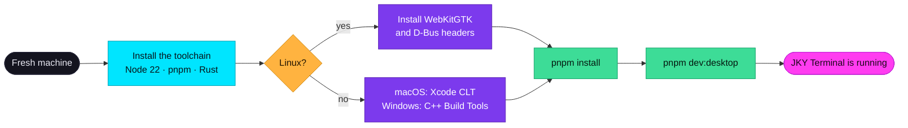
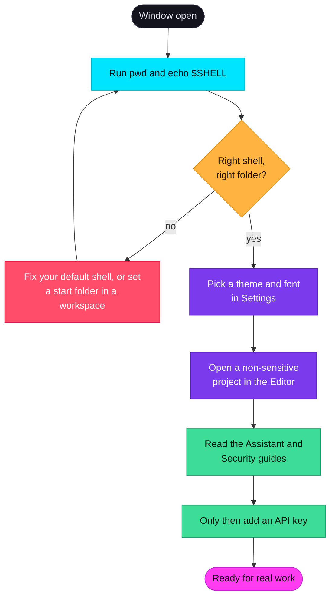

# Getting started

<p align="center">
  
</p>

<p align="center">
  
  
  
</p>

This guide takes you from nothing to a running JKY Terminal window, then walks through a first session
that is worth doing before you trust the app with real work. It assumes you are building from source,
because **no public release has been published yet** — see
[Operations and releases](operations-and-releases.md) for where packaging stands.

> [!TIP]
> Short on time? The whole thing is four commands once the prerequisites are installed:
> `git clone` → `corepack enable` → `pnpm install` → `pnpm dev:desktop`.

**On this page:** [The path](#the-path) · [Prerequisites](#1-prerequisites) ·
[Install and launch](#2-install-and-launch) · [The first window](#3-the-first-window) ·
[A safe first session](#4-a-safe-first-session) · [Your first ten minutes](#5-your-first-ten-minutes) ·
[Where your data lives](#6-where-your-data-lives) · [Updating and removing](#7-updating-and-removing) ·
[If something goes wrong](#if-something-goes-wrong)

---

## The path



---

## 1. Prerequisites

JKY Terminal is a [Tauri 2](https://tauri.app) application: a Rust program that draws its interface in
the operating system's own webview. Building it needs a JavaScript toolchain for the interface and a
Rust toolchain for everything else.

| You need | Version | Why | Check with |
|---|---|---|---|
| **Node.js** | 22 or newer | Builds the interface with Vite. The repository refuses older versions. | `node --version` |
| **Corepack + pnpm** | pnpm 9.15 (pinned) | The repository pins its package manager in `package.json`; Corepack fetches the right one. | `corepack --version` |
| **Rust** | stable | Compiles the nineteen crates and the desktop binary. | `rustc --version` |
| **Git** | any recent | Cloning, plus the Workspaces section uses your Git for worktrees. | `git --version` |
| **A webview + build tools** | per OS, below | Tauri draws through the system webview and links native libraries. | — |

### Platform packages

<details open>
<summary><b>🐧 Linux — Debian, Ubuntu and derivatives</b></summary>

```sh
sudo apt update
sudo apt install -y libwebkit2gtk-4.1-dev libsoup-3.0-dev \
  libjavascriptcoregtk-4.1-dev build-essential curl wget file \
  libssl-dev libayatana-appindicator3-dev librsvg2-dev \
  libdbus-1-dev pkg-config
```

These are exactly the packages CI installs before it builds the Linux desktop binary, so they are a
known-good set. `libdbus-1-dev` is what lets API keys reach the Secret Service (GNOME Keyring or
KWallet) instead of a file.

</details>

<details>
<summary><b>🎩 Linux — Fedora and RHEL</b></summary>

```sh
sudo dnf install webkit2gtk4.1-devel libsoup3-devel openssl-devel \
  curl wget file libappindicator-gtk3-devel librsvg2-devel \
  dbus-devel pkgconf-pkg-config
sudo dnf group install "c-development"
```

</details>

<details>
<summary><b>🍎 macOS</b></summary>

```sh
xcode-select --install          # the Command Line Tools: clang, the SDK, git
```

WebKit ships with macOS, so nothing else is needed. Both Apple Silicon and Intel Macs build natively.

</details>

<details>
<summary><b>🪟 Windows</b></summary>

1. Install the **Microsoft C++ Build Tools** with the *Desktop development with C++* workload
   (Visual Studio Installer).
2. **WebView2** is already part of Windows 10 and 11. On an older or stripped-down image, install the
   Evergreen runtime from Microsoft.
3. Install Rust with `rustup` and choose the default MSVC toolchain.

Use PowerShell or Git Bash for the commands below. JKY itself opens **Windows PowerShell**
(`powershell.exe`) in its terminals on Windows — never `cmd.exe`, which offers no prompt hook for the
features that depend on one.

</details>

> [!NOTE]
> A first Rust build downloads and compiles several hundred crates. Expect a few minutes on a fast
> machine and longer on a laptop on battery. Later builds reuse the cache in `target/` and take seconds.

---

## 2. Install and launch

```sh
git clone https://github.com/kartikeyajay2006/jky-terminal.git
cd jky-terminal
corepack enable
pnpm install
pnpm dev:desktop
```

`pnpm dev:desktop` does two things: it starts the Vite dev server on `http://localhost:1420/`, and it
compiles and launches the native window, which loads the interface from that server. Leave the command
running while you use the app. Editing a file under `apps/desktop/src` reloads the interface; editing a
crate rebuilds and relaunches the binary.

### Two ways to run it

| Command | What starts | Use it for |
|---|---|---|
| `pnpm dev:desktop` | Vite **and** the native Tauri window | Everything real: shells, keys, files, SSH, persistence. |
| `pnpm dev` | Vite only, in your browser | Interface work. A browser has no PTY, keychain or filesystem, so the app swaps in a stand-in platform layer that keeps nothing on disk. |

> [!IMPORTANT]
> Browser mode is **not** a way to test the product. It exists so the interface can be built and
> tested without native code — the whole UI talks to the native side through one adapter in
> `apps/desktop/src/platform/`, and the browser build swaps that adapter for an in-memory one.

### A standalone build

To produce a binary that does not need the dev server:

```sh
pnpm --filter @jky/desktop build                                   # build the interface
cargo build --release -p jky-terminal --features tauri/custom-protocol
```

The binary lands in `target/release/jky-terminal` (`.exe` on Windows). Installers — `.deb`, `.rpm`,
`.AppImage`, `.dmg`, `.msi` — are made by the release workflow; see
[Operations and releases](operations-and-releases.md).

---

## 3. The first window

The app opens on a terminal. Down the left is the **rail**, one glyph per section:

| Glyph | Section | What it is for | Guide |
|:-:|---|---|---|
| `⌂` | **Dashboard** | Notes, todos, a calendar and daily reminders, stored locally. | [Apps & tools](apps-and-tools.md#dashboard) |
| `❯` | **Terminal** | Real shells: tabs, splits, panels, completions, persistence. | [Terminal guide](terminal-guide.md) |
| `↺` | **History** | Every command you have run, searchable by subsequence. | [Terminal guide](terminal-guide.md#history) |
| `⇄` | **Remote** | Saved SSH hosts, opened with the `ssh` you already have. | [Terminal guide](terminal-guide.md#remote-terminals) |
| `✎` | **Editor** | CodeMirror 6 over folders you choose; images and PDFs preview. | [Workspaces & editor](workspaces-and-editor.md) |
| `▦` | **Workspaces** | Named setups — folders, terminals, a host — plus Git worktrees. | [Workspaces & editor](workspaces-and-editor.md) |
| `✦` | **Assistant** | Approval-first AI on Anthropic, OpenAI or a local Ollama. | [Assistant & approvals](assistant-and-approvals.md) |
| `◈` | **Games** | Dino Run, Snake, Tic-Tac-Toe, Flappy Bird and 2048. | [Apps & tools](apps-and-tools.md#games) |
| `⊞` | **Apps** | GitHub, Gmail, Browser, Weather, News, Map, Calculator, Timer. | [Apps & tools](apps-and-tools.md#apps) |
| `⌥` | **Developer** | Twelve tools, from JSON and JWT to Ports and DNS. | [Apps & tools](apps-and-tools.md#developer-tools) |
| `⚙` | **Settings** | Appearance, Terminal, Keyboard, Providers, Commands. | [Keyboard & settings](keyboard-and-settings.md) |

Along the top are the terminal's **tabs**; along the bottom, the **status bar** with what the machine is
doing. In the top-right corner sit the **camera** (a picture of the window) and the **bell**
(notifications and reminders).

Every new terminal greets you with the JKY wordmark. Type `jky commands` to see everything the `jky`
command can do from the shell — or open **Settings → Commands** for the same list with explanations.

---

## 4. A safe first session

A terminal is powerful because it does exactly what you tell it. A first session should prove that it
is telling the truth about *where* it is before you give it anything that matters.



1. **Check the shell.** Run `echo $SHELL` (or `$PSVersionTable` in PowerShell) and `pwd`. JKY starts
   the shell named by `$SHELL` on macOS and Linux (falling back to `/bin/sh`), and Windows PowerShell
   on Windows.
2. **Check integration.** Run something that fails, like `ls /nope`. A red bar should appear in the
   gutter beside it and an offer of help underneath. That is shell integration working; if nothing
   appears, read [Shells & the jky command](shell-integration.md).
3. **Choose how it looks.** **Settings → Appearance** has the seven themes; **Settings → Terminal**
   has font size (8 to 28 points) and nine font choices, each ending in a monospace fallback.
4. **Open a project deliberately.** In the **Editor**, open one small, non-sensitive folder. The editor
   can reach the folders you open and nothing else.
5. **Read before you connect.** Before adding an API key, read
   [Assistant & approvals](assistant-and-approvals.md) and [Security & privacy](security-and-privacy.md).
   Five minutes there tells you exactly what a provider will and will not receive.

> [!CAUTION]
> Do not begin by pasting a production token, a private key or a destructive command. Nothing about
> JKY makes those safer — and a first session is the moment to find out whether the working directory,
> shell and project are the ones you think they are.

---

## 5. Your first ten minutes

A short tour that touches the parts most people end up using every day.

| # | Try this | What you should see |
|:-:|---|---|
| 1 | `git status -s` in any repository | A panel under the output splitting **staged** from **unstaged** files. The raw text stays above it. |
| 2 | `df -h` | Disks as bars, **fullest first**. Toggle *live* on the panel and the bars refresh while you watch. |
| 3 | <kbd>Ctrl</kbd>+<kbd>Shift</kbd>+<kbd>T</kbd>, then <kbd>Ctrl</kbd>+<kbd>Shift</kbd>+<kbd>D</kbd> | The terminal splits right, then down. <kbd>Ctrl</kbd>+<kbd>Shift</kbd>+arrows move between panes. |
| 4 | Start `sleep 600 && echo done`, then quit and reopen JKY | The pane comes back on the same shell, still running. Its output is drawn from where you left. |
| 5 | Type `gi` and pause | Completions appear: programs on your `PATH`, then lines you have run before. <kbd>Tab</kbd> places one; <kbd>Enter</kbd> runs it. |
| 6 | <kbd>Ctrl</kbd>+<kbd>K</kbd> and type `split` | The command palette finds actions, sections, workspaces, hosts, notes and games. |
| 7 | `jky theme nord` | The whole app changes theme from the shell. |
| 8 | `jky todo add try the history search` | A todo appears on the Dashboard. `jky todos` lists them back. |
| 9 | Open **History** and type `gst` | `git status` is found by subsequence. Choosing it *types* it — it never runs it. |
| 10 | Click the bar beside any finished command | Copy its output, copy the command, export a Markdown record, run it again, or ask about it. |

---

## 6. Where your data lives

Everything JKY keeps is on your machine, in plain files you can read. The folder is the platform's
configuration directory for the app id `dev.jky.terminal`:

| Platform | Folder |
|---|---|
| Linux | `~/.config/dev.jky.terminal/` |
| macOS | `~/Library/Application Support/dev.jky.terminal/` |
| Windows | `%APPDATA%\dev.jky.terminal\` |

| File or folder | What it holds |
|---|---|
| `settings.json` | Non-secret preferences: chosen models, active provider, terminal start folder, open editor folders. |
| `keymap.json` | Only the shortcuts you changed. Defaults are not written, so improved defaults still reach you. |
| `history.jsonl` | Commands you ran, where, and how they ended — with recognisable secrets replaced by labels before they are written. Capped at 100,000 entries. |
| `workspaces.json` | Saved workspaces. Plain JSON you can edit. |
| `hosts.json` | Saved SSH hosts — addresses and options, **never** a password or key. |
| `notes.json`, `todos.json`, `events.json`, `reminders.json` | The Dashboard's notes, todos, calendar events and daily reminders. |
| `scrollback/` | Each pane's scrollback, up to 256 KB per pane, so a restart restores it — with recognisable secrets redacted. |
| `detached/` | Records for the supervisors holding your shells. |
| `shell/`, `bin/` | The shell-integration startup files and the `jky` launcher scripts. |
| `audit.jsonl` | An append-only log of privileged actions: key reads, tool calls, approvals, sign-ins, captures. |

**API keys are not in any of these.** They live in the operating system's credential store — macOS
Keychain, Windows Credential Manager, or the Secret Service on Linux. Interface preferences such as
the theme, terminal font and recent assistant chats live in the webview's local storage.

---

## 7. Updating and removing

**To update** a source checkout:

```sh
git pull
pnpm install
pnpm dev:desktop
```

**To remove** JKY completely: delete the checkout, delete the data folder above, and remove any API
keys you stored — the **Disconnect** button in **Settings → Providers** does it from inside the app, or delete the
entries under the service name `dev.jky.terminal` from your OS credential store. Shells held by a supervisor end when their pane is
closed; on start, the app ends any held shell that no pane claims.

---

## If something goes wrong

The [Troubleshooting guide](troubleshooting.md) covers each of these in depth. The three most common:

<details>
<summary><b>The Vite server starts but no window appears</b></summary>

You ran `pnpm dev`, which starts Vite only. Run `pnpm dev:desktop`. If that fails too, read the last
Rust error: it usually names a missing system package such as WebKitGTK or the D-Bus headers.

</details>

<details>
<summary><b>The build fails with "too many open files" or a watcher error on Linux</b></summary>

Busy desktops can exhaust inotify instances. Raise the limit for this session:

```sh
sudo sysctl -w fs.inotify.max_user_instances=512
```

</details>

<details>
<summary><b>Adding an API key fails on Linux</b></summary>

Keys go to the Secret Service over D-Bus. Make sure a provider is running — GNOME Keyring or KWallet —
and that the default collection is unlocked. On a minimal window manager, start
`gnome-keyring-daemon` in your session.

</details>

---

<p align="center">
  <a href="README.md">← Documentation home</a> &nbsp;·&nbsp;
  <a href="terminal-guide.md">Next: Terminal guide →</a>
</p>
