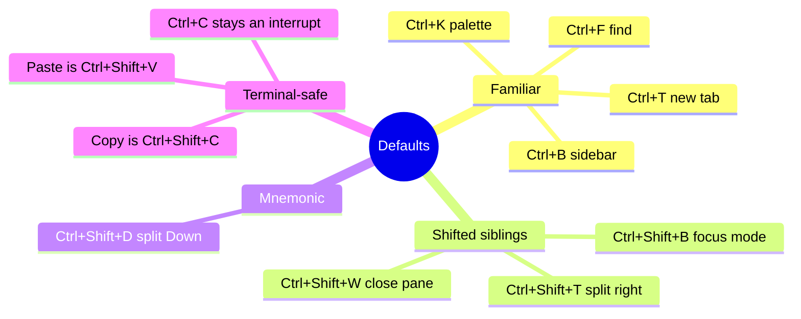
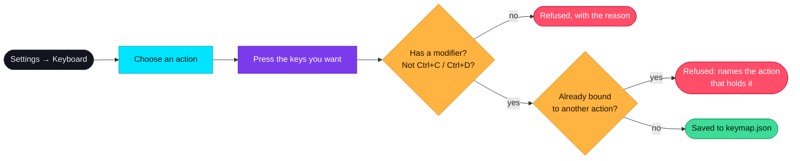

# Keyboard & settings

<p align="center">
  
</p>

<p align="center">
  
  
  
</p>

JKY is designed to be driven from the keyboard. This guide lists every shortcut, explains the two rules
that keep shortcuts from fighting your shell, and walks through each Settings panel.

**On this page:** [Every shortcut](#every-shortcut) · [The two rules](#the-two-rules) ·
[Rebinding](#rebinding-a-shortcut) · [keymap.json](#keymapjson) · [The command palette](#the-command-palette) ·
[Settings panels](#settings-panels) · [Settings on disk](#settings-on-disk)

---

## Every shortcut

On macOS, read <kbd>Ctrl</kbd> as <kbd>⌘</kbd> everywhere below. A keymap stores the two as one
modifier, so a keymap made on a Linux laptop means the same thing on a Mac.

### The sixteen rebindable actions

| Group | Action | Default | Action id |
|---|---|---|---|
| 🟣 **App** | Command palette | <kbd>Ctrl</kbd>+<kbd>K</kbd> | `palette-toggle` |
| | Show or hide the sidebar | <kbd>Ctrl</kbd>+<kbd>B</kbd> | `rail-toggle` |
| | Focus mode | <kbd>Ctrl</kbd>+<kbd>Shift</kbd>+<kbd>B</kbd> | `hud-toggle` |
| 🔵 **Tabs** | New terminal tab | <kbd>Ctrl</kbd>+<kbd>T</kbd> | `tab-new` |
| | Close tab | <kbd>Ctrl</kbd>+<kbd>W</kbd> | `tab-close` |
| | Next tab | <kbd>Ctrl</kbd>+<kbd>Tab</kbd> | `tab-next` |
| 🟢 **Terminal** | Find in terminal | <kbd>Ctrl</kbd>+<kbd>F</kbd> | `terminal-find` |
| | Copy | <kbd>Ctrl</kbd>+<kbd>Shift</kbd>+<kbd>C</kbd> | `terminal-copy` |
| | Paste | <kbd>Ctrl</kbd>+<kbd>Shift</kbd>+<kbd>V</kbd> | `terminal-paste` |
| 🟠 **Panes** | Split terminal right | <kbd>Ctrl</kbd>+<kbd>Shift</kbd>+<kbd>T</kbd> | `pane-split-right` |
| | Split terminal down | <kbd>Ctrl</kbd>+<kbd>Shift</kbd>+<kbd>D</kbd> | `pane-split-down` |
| | Close pane | <kbd>Ctrl</kbd>+<kbd>Shift</kbd>+<kbd>W</kbd> | `pane-close` |
| | Focus pane left | <kbd>Ctrl</kbd>+<kbd>Shift</kbd>+<kbd>←</kbd> | `pane-focus-left` |
| | Focus pane right | <kbd>Ctrl</kbd>+<kbd>Shift</kbd>+<kbd>→</kbd> | `pane-focus-right` |
| | Focus pane up | <kbd>Ctrl</kbd>+<kbd>Shift</kbd>+<kbd>↑</kbd> | `pane-focus-up` |
| | Focus pane down | <kbd>Ctrl</kbd>+<kbd>Shift</kbd>+<kbd>↓</kbd> | `pane-focus-down` |

### Fixed keys and gestures

| Keys | Does | Why it is fixed |
|---|---|---|
| <kbd>Ctrl</kbd>+<kbd>1</kbd> … <kbd>9</kbd> | Jump to tab 1–9 | A family of nine, outside the keymap by design. |
| <kbd>Shift</kbd>+<kbd>Enter</kbd> | Newline without submitting (sends `Ctrl+J`) | Lets multi-line prompts work in assistant CLIs. |
| <kbd>Ctrl</kbd>+drag a pane | Swap two panes | An unmodified drag is a text selection. |
| Double-click a divider | Even the split | |
| <kbd>Ctrl</kbd>/<kbd>⌘</kbd>+<kbd>S</kbd> in the Editor | Save the file | |
| In completions: <kbd>↑</kbd> <kbd>↓</kbd> <kbd>Tab</kbd> <kbd>Enter</kbd> <kbd>Esc</kbd> | Choose, place, run, dismiss | Only while the list is showing. |

### Why the defaults are what they are



---

## The two rules

Both are enforced in Rust, in the `jky-keys` crate, rather than in the panel. That makes them true of a
hand-edited `keymap.json` as well.

> [!IMPORTANT]
> **1. Every binding takes a modifier.** <kbd>Ctrl</kbd> or <kbd>Alt</kbd> (with or without
> <kbd>Shift</kbd>). An unmodified key belongs to the shell, where every keystroke means something —
> so `D` and `Shift+D` are refused.
>
> **2. <kbd>Ctrl</kbd>+<kbd>C</kbd> and <kbd>Ctrl</kbd>+<kbd>D</kbd> can never be taken.** Without
> interrupt a runaway command cannot be stopped, and without end-of-input a shell cannot be left.
> `Ctrl+Shift+C` and `Ctrl+Shift+D` remain free to bind.

This is not a general reservation of shell keys — JKY already claims <kbd>Ctrl</kbd>+<kbd>K</kbd> and
<kbd>Ctrl</kbd>+<kbd>W</kbd>, and pretending otherwise would be theatre. These two are the pair that stop
a terminal being a terminal.

### How app shortcuts coexist with the terminal

xterm.js handles a key by cancelling it, which used to swallow app shortcuts whenever a terminal had
focus. JKY now asks the keymap *before* xterm sees the key: if the chord belongs to an app action, xterm
leaves it alone and the window handles it; otherwise the key goes to your shell untouched. Both sides
ask the same question of the same keymap, so they cannot disagree.

---

## Rebinding a shortcut



**Settings → Keyboard** lists every action by group. You set a binding **by pressing it**, not by
typing its name: typing `Ctrl+Shift+D` into a box would mean agreeing with the app about how a chord is
spelled, and a spelling mistake there is a shortcut that reads correctly and never fires.

- **Reset** beside an action returns it to its default.
- **Reset every shortcut** returns them all.
- If two actions share a chord — only possible in a hand-edited file — the panel says so, and the first
  one wins rather than both firing.

---

## keymap.json

Only **your changes** are written, so an improved default in a later release still reaches you.

```json
{
  "schema": 1,
  "bindings": {
    "pane-split-down": "Ctrl+Alt+D",
    "palette-toggle": "Ctrl+P"
  }
}
```

| Rule | Detail |
|---|---|
| Keys | The action ids from the table above. Binding an unknown id through the app is refused; an unknown id in a hand-edited file is ignored, because there is no action for it to bind. |
| Chord spelling | `Ctrl`, `Alt`, `Shift` plus a key, joined by `+`. `Cmd`, `Command`, `Meta`, `Super` and `Mod` all mean `Ctrl`; `Option`/`Opt` mean `Alt`. Case does not matter: `ctrl+arrowleft` is `Ctrl+ArrowLeft`. |
| The plus key | `Ctrl++` is <kbd>Ctrl</kbd> and the plus key. |
| Validation | A bad chord is refused when the file is read, not when you press it later. |
| Writes | Atomic and flushed — written to a temporary file, synced to disk and moved into place — so a crash cannot leave half a keymap. |
| `schema` | The file's format version. A keymap written by a **newer** JKY is refused rather than overwritten, so an older build can never silently drop what it does not understand. |

The file lives in the app's config folder — see [where your data lives](getting-started.md#6-where-your-data-lives).

---

## The command palette

<kbd>Ctrl</kbd>+<kbd>K</kbd> opens the palette. Type a few letters of anything; matching is the same
forgiving kind History uses.

| You can reach | Examples |
|---|---|
| **Sections and panels** | `Dashboard`, `Settings · Keyboard`, `Developer Tools · JWT` |
| **Terminal actions** | New terminal, New private terminal, Make this tab private, Split right, Split down, Close pane, Close tab |
| **Window** | Show or hide the sidebar, Focus mode |
| **Workspaces** | Switch to any saved workspace, Manage workspaces |
| **Machines** | `Connect to <host>`, Manage saved machines |
| **Folders** | `Open <folder> in the editor`, Open a folder |
| **Dashboard** | New note…, New todo…, New reminder…, `Append to · <note>`, tick a todo |
| **Games** | Arcade, `Play Snake`, `Play 2048`, … |

---

## Settings panels

| Panel | Holds |
|---|---|
| 🎨 **Appearance** | The seven themes, with a swatch of each. Applied instantly, remembered per machine. See the [theme table](../README.md#-seven-themes-one-set-of-tokens). |
| ❯ **Terminal** | Font size (8–28 pt, default 13) and typeface: *App default*, JetBrains Mono, Fira Code, Source Code Pro, DejaVu Sans Mono, Liberation Mono, Noto Sans Mono, Hack, Inconsolata. Each falls back to a monospace font if missing. Also the **power-user essentials** checklist, which states plainly what is ready and what is not (inline images: Sixel and iTerm2 render; Kitty graphics does not yet). |
| ⌨ **Keyboard** | Every action, rebindable by pressing keys; per-action and global reset; conflict warnings. |
| 🔒 **Privacy** | **Keep command history** (on/off), **Forget history older than** (never, 7, 30, 90 days, 1 year), **Clear all history** (after a second click), **Restore scrollback after a restart** (off deletes what was saved), and the **Project folder** — where terminals start and the only folder the assistant's tools may read. Enforced in Rust. |
| 🔑 **Providers** | API keys for AI providers and the model for each. Keys are written to the OS keychain and never shown again — replacing one means disconnecting first. See [Assistant & approvals](assistant-and-approvals.md#providers-and-models). |
| ⌘ **Commands** | Every `jky` command and every name it answers to, with a longer explanation. See [Shells & the jky command](shell-integration.md#command-reference). |

> [!TIP]
> Where terminals **start** is set per workspace, not globally: give a workspace a start folder and every
> terminal it opens begins there. See [Workspaces & editor](workspaces-and-editor.md).

---

## Settings on disk

| Setting | Stored in | Why there |
|---|---|---|
| Shortcuts you changed | `keymap.json` | Enforced by Rust; editable by hand. |
| Chosen models, active provider, start folder, open editor folders | `settings.json` | Non-secret preferences the native side needs. |
| Theme, terminal font, sidebar collapsed | Webview local storage | How *this copy* of the app looks — not content anyone would expect to find in a file. |
| API keys | OS keychain, service `dev.jky.terminal` | Secrets never live in a file. |
| Focus mode | Nowhere | Deliberately forgotten at quit, so the app never opens looking like it failed to start. |

---

<p align="center">
  <a href="shell-integration.md">← Shells & the jky command</a> &nbsp;·&nbsp;
  <a href="README.md">Documentation home</a> &nbsp;·&nbsp;
  <a href="workspaces-and-editor.md">Next: Workspaces & editor →</a>
</p>
