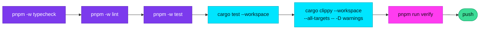
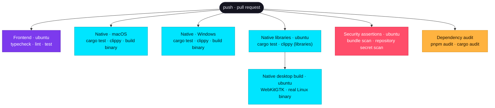
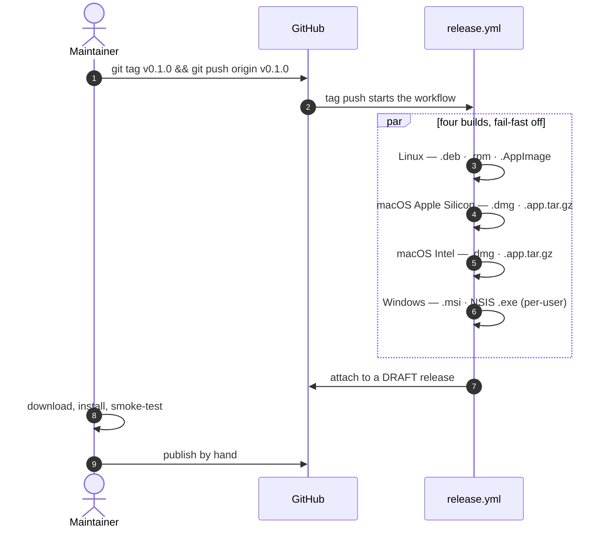

# Operations & releases

  

  
  
  
  

For maintainers, contributors and evaluators who need to *validate* JKY rather than just run it. A green
frontend build alone is not evidence that a desktop release works; this page explains what is checked,
where, and what is still missing before a public release.

**On this page:** [The verification ladder](#the-verification-ladder) · [What CI proves](#what-ci-proves) ·
[Cutting a release](#cutting-a-release) · [Distribution status](#distribution-status) ·
[Release smoke test](#release-smoke-test) · [Maintainer checklist](#maintainer-checklist)

---

## The verification ladder

Run the narrowest check that answers your question while you work, and the whole ladder before you push.

| Command | Covers |
|---|---|
| `pnpm -w typecheck` | TypeScript across the workspace |
| `pnpm -w lint` | ESLint — including *no direct `invoke()`* and *no literal colours* |
| `pnpm -w test` | Vitest: 2,267 interface tests |
| `cargo test --workspace` | 1,097 Rust tests across every crate and the app, including `security.rs` |
| `cargo clippy … -D warnings` | Every warning is an error |
| `pnpm run verify` | Cleans `dist`, then typecheck → lint → test → build → `scan:bundle` (credential scan and entry-bundle budget) |

---

## What CI proves

Every push to `main` and every pull request runs [`ci.yml`](../.github/workflows/ci.yml). Jobs run with
`fail-fast: false`, so one platform failing never hides the others.

| Job | Runs on | Proves |
|---|---|---|
| **Frontend** | Ubuntu | The interface typechecks, lints and passes its tests. Platform-independent, so once is enough. |
| **Native** | macOS, Windows | Every Rust test and clippy pass, and **the shippable binary links** — where a keychain backend or webview binding actually fails. |
| **Native libraries** | Ubuntu | Rust tests and clippy for the crates on Linux. |
| **Native desktop build** | Ubuntu | The real Linux desktop binary compiles against WebKitGTK. |
| **Security assertions** | Ubuntu | A clean production build passes `scan:bundle`, and no API key for any supported provider — Anthropic, OpenAI, Groq, xAI, OpenRouter, Google, GitHub, AWS — is committed outside `docs/`. |
| **Dependency audit** | Ubuntu | `pnpm audit --audit-level high` and `cargo audit` fail on high or critical advisories; lower levels are reported. |

> [!NOTE]
> **CI is evidence, not a release test.** It does not prove a package installs cleanly on every machine,
> that an upgrade preserves local data, or that an interactive program feels right under load. That is
> what the [smoke test](#release-smoke-test) is for.

---

## Cutting a release

The version lives in three places, and they must agree:

| File | Field |
|---|---|
| `apps/desktop/package.json` | `version` |
| `apps/desktop/src-tauri/tauri.conf.json` | `version` |
| `Cargo.toml` | `workspace.package.version` |

The **draft** is deliberate: it is the last chance to notice that something built cleanly and is still
wrong. To exercise the pipeline without spending a version, run the workflow by hand from the Actions
tab (`workflow_dispatch`).

The Windows installer is **per-user**, so installing needs no administrator rights; the app only writes
to the user's own config folder.

Full step-by-step details, including every secret name, are in [RELEASING.md](RELEASING.md).

---

## Distribution status

| Capability | Status | What it takes |
|---|---|---|
| Draft installers for Linux, macOS ×2, Windows | 🟢 Working | — |
| **macOS signing and notarisation** | 🔴 Not configured | A paid Apple Developer account; six repository secrets. The workflow already passes them through. |
| **Windows code signing** | 🔴 Not configured | A code-signing certificate from a CA; two secrets. |
| **Signed auto-updater** | ⚪ Deliberately off | A keypair that someone actually holds. Shipping a build that trusts a key nobody holds would be worse than no updates. |
| Linux ARM64 packages | ⚪ Not built | Linux builds are x86_64 today. |
| Checksums, SBOM, provenance | 🟢 Working | Every release carries `SHA256SUMS`, an SPDX SBOM and build-provenance attestations — see [checking a download](RELEASING.md#checking-a-download). |
| A published public release | ⚪ Not yet | |

**What unsigned means for users today:**

- **macOS** refuses to open the app from Finder. Right-click → **Open**, or
  `xattr -d com.apple.quarantine "/Applications/JKY Terminal.app"`.
- **Windows** SmartScreen warns. **More info** → **Run anyway**.
- **Linux** does not check signatures.

Do not describe an unsigned build as production-trusted.

---

## Release smoke test

Test the built package outside the development checkout. Record the platform, package hash, result and
any exceptions.

| Area | Verify |
|---|---|
| **Install and launch** | Installs, starts, and can be removed cleanly. |
| **Terminal** | A shell opens; typing, output, resize, <kbd>Ctrl</kbd>+<kbd>F</kbd> and <kbd>Ctrl</kbd>+<kbd>C</kbd> work; `vim` or `htop` redraws cleanly. |
| **Integration** | `ls /nope` shows a red gutter bar and failure help; `git status -s` shows a panel. |
| **Persistence** | `sleep 300` in a pane, quit, reopen: the pane rejoins the same shell. |
| **Files** | Open, edit, save, and cancel-on-close in an explicit folder; a symlink out of the folder is refused. |
| **Settings** | Theme, font and a rebound shortcut survive a restart. |
| **Assistant** | No key is visible anywhere after saving; an approval card appears for every command; *destructive* needs typing. |
| **Remote** | A saved host connects with normal SSH identity and host-key checks. |
| **Upgrade** | A previous version upgrades without losing settings, history or workspaces. |

Never smoke-test with live production secrets or irreversible infrastructure.

---

## Maintainer checklist

- [ ] Versions agree in all three files.
- [ ] Docs describe what ships, and known limits are current.
- [ ] `pnpm run verify`, `cargo test --workspace` and `cargo clippy` pass locally.
- [ ] CI is green on all jobs for the commit being tagged.
- [ ] The draft's assets install and pass the smoke test on each platform available.
- [ ] Signing status is stated plainly in the release notes.
- [ ] A human publishes the draft.
- [ ] Issues are watched after release, with a rollback plan.

---

  <a href="glossary.md">← Glossary</a> &nbsp;·&nbsp;
  <a href="README.md">Documentation home</a> &nbsp;·&nbsp;
  <a href="product-roadmap.md">Next: Product roadmap →</a>

