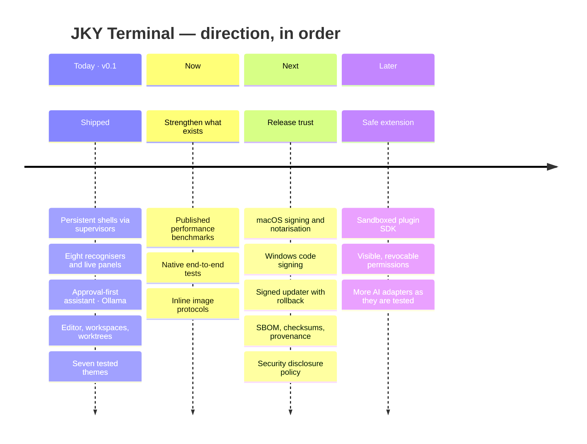

# Product roadmap

  

  
  
  

This is a prioritised direction, not a list of promises. JKY becomes a great terminal by making the core
loop faster and safer first — not by adding every possible panel. Anything marked **planned** here is
not available today.

---

## The shape of it

---

## Principles

| # | Principle | In practice |
|:-:|---|---|
| 1 | **The shell stays primary.** | Every extra interface preserves direct command visibility and keyboard control. |
| 2 | **Local-first is the default.** | Providers and integrations are explicit choices, never background dependencies. |
| 3 | **Approval is a feature.** | Meaningful side effects are shown before they happen. |
| 4 | **Cross-platform means tested.** | Linux, macOS and Windows get real builds and tests, not claims. |
| 5 | **Trust compounds.** | Honest limits, predictable releases and clear recovery beat feature count. |

---

## Now — strengthen what exists

The codebase already covers a broad surface: PTYs and supervisors, panes, recognisers and live panels,
history and completions, workspaces and worktrees, an editor, the assistant, remote hosts, developer
tools and a themed shell. The near-term job is to make it dependable under real use.

| Work | Why | Status |
|---|---|---|
| Publish benchmarks — first prompt, sustained output, split and reconnect time, memory | "Fast" should be a number anyone can reproduce | Planned |
| Native end-to-end tests — interactive shells, resize, paste, Unicode, persistence, approvals | Unit tests cannot prove a terminal *feels* right | Planned |
| Inline images — Kitty graphics, iTerm2, Sixel | Listed in **Settings → Terminal** as the one missing essential | Planned |
| Known gaps — `jky games 5`, Windows `jky split/history/workspace/host`, a project-folder field for the assistant | Small, visible rough edges, documented where they apply | Known |
| Quieter test output | A green run should be trustworthy at a glance | Ongoing |

## Next — release trust

Public packages need more than a successful build.

| Capability | Why it matters | Status |
|---|---|---|
| macOS signing and notarisation | Installs without Gatekeeper workarounds | Planned — workflow already wired for the secrets |
| Windows code signing | Fewer SmartScreen warnings, a trust signal | Planned — workflow already wired |
| Signed updater | Safe, verifiable upgrades with a rollback policy | Planned — deliberately off until a real keypair exists |
| SBOM, checksums, provenance | Lets organisations assess supply-chain risk | Planned |
| Public support matrix | Clear expectations per OS, shell and architecture | Planned |
| Security reporting policy | A safe private path for researchers | Planned |

## Later — intentional extension

A plugin system has to be designed as a security product, not merely an API:

- untrusted logic sandboxed with minimal capabilities;
- permissions visible and revocable;
- a versioned API with defined upgrade behaviour;
- a test harness and supply-chain policy;
- no way for an extension to bypass the native approval boundary.

---

## Explicitly not promised

Worthwhile ideas that should **not** be described as shipped:

| Idea | Why not yet |
|---|---|
| **Database cockpit** (PostgreSQL, SQLite, Redis explorers) | Needs a purpose-built, safe design before it belongs in a terminal. |
| **Automatic updates** | Needs signing keys, hosted metadata, rollback and channels first. |
| **Broad account integrations** | Each provider needs least-privilege scopes and a documented data boundary. |
| **Mobile or team-hosted services** | Outside the local desktop focus until the core is proven. |
| **A plugin marketplace** | Comes after a sandboxed SDK, not before. |

---

## What "best terminal" means here

JKY should not win by copying every editor, browser, dashboard or chat product. It should become the
terminal people trust during serious work:

1. Starts quickly and renders consistently.
2. Behaves correctly with real shells and interactive programs.
3. Makes sessions, history and output easier to recover.
4. Protects secrets and avoids hidden authority.
5. Gives AI useful context without silently widening access.
6. Ships signed, reproducible, well-tested releases.
7. Opens a safe extension path after the foundation is solid.

That sequence *is* the roadmap. A feature that improves none of those has a high bar to clear before it
competes with reliability work.

---

  <a href="operations-and-releases.md">← Operations & releases</a> &nbsp;·&nbsp;
  <a href="README.md">Documentation home</a>

