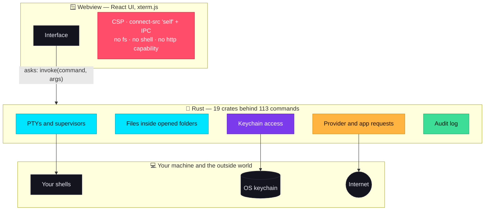
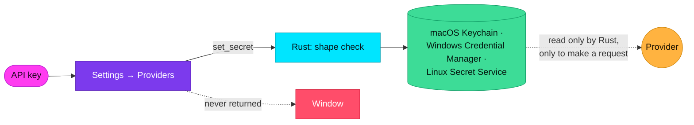
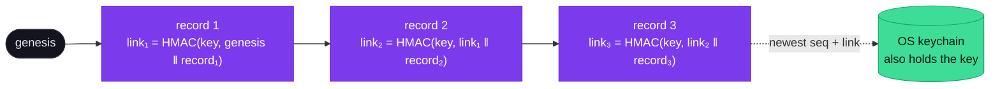

# Security & privacy

<p align="center">
  
</p>

<p align="center">
  
  
  
  
</p>

JKY Terminal is built around one rule: **the window can ask; only Rust can act.** This guide explains
what that rule means in practice, what it protects you from, what it does not, and every way the app
talks to the network. It is written in plain language and backed by references to the tests that
enforce each claim.

> [!IMPORTANT]
> This is a description of the design, not a certification. JKY has **not** had an independent security
> audit. A terminal runs commands with your full permissions — no design changes that. Read the
> [limits](#what-this-does-not-protect-against) as carefully as the protections.

**On this page:** [The boundary](#the-boundary) · [Enforced by tests](#enforced-by-tests) ·
[Secrets](#secrets) · [Network](#every-way-jky-talks-to-the-network) · [Files](#files-and-folders) ·
[Terminal output](#terminal-output-is-untrusted-input) · [Remote](#remote-hosts) ·
[Accounts](#connected-accounts) · [Browser](#the-browser-app) · [Audit log](#the-audit-log) ·
[Data on disk](#what-is-stored-where) · [Limits](#what-this-does-not-protect-against) ·
[Reporting](#reporting-a-security-issue)

---

## The boundary



The webview — where the interface and the terminal rendering live — is treated as the least trusted
part of the app, because it is the part that displays text from everywhere: command output, files,
web pages, model responses. So it is given nothing it could misuse:

- **No network.** Its Content Security Policy is the complete list of where it may connect:

  ```text
  default-src 'self'; script-src 'self'; worker-src 'self' blob:;
  style-src 'self' 'unsafe-inline'; font-src 'self'; img-src 'self' data:;
  frame-src https://www.openstreetmap.org;
  connect-src 'self' ipc: http://ipc.localhost
  ```

  `connect-src` names only the app itself and Tauri's IPC channel. Even if a malicious payload ran in
  the window, it would have nowhere to send anything. The one framed origin is the OpenStreetMap embed
  used by the Map app.
- **No capabilities.** The window is granted Tauri's `core:default` set plus `core:window:allow-destroy`
  — the latter only so "quit anyway" can actually quit. No filesystem, shell or HTTP plugin permission.
- **No secrets.** No command exists that returns a key.
- **Only named actions.** Everything else goes through one of 113 explicit IPC commands, each a thin
  wrapper over logic in a Rust crate.

---

## Enforced by tests

Claims in a README are promises with nothing keeping them. These are checked by
[`apps/desktop/src-tauri/tests/security.rs`](../apps/desktop/src-tauri/tests/security.rs) and the build
scripts — locally with `cargo test --workspace`, and in CI on every push (the desktop crate's tests run on
the macOS and Windows jobs; Linux CI tests the libraries and compiles the desktop binary).

| Test or check | What it guarantees |
|---|---|
| `the_exposed_command_surface_is_exactly_what_the_spec_allows` | The list of IPC commands is pinned **by name**. Adding one fails the build until it is added — with a reason — to the list. |
| `no_ipc_command_is_shaped_like_a_secret_getter` | No command name looks like `get_key`, `read_secret` and so on. |
| `no_command_returns_a_secret_type` | No command's return type is a secret. |
| `no_ipc_command_is_declared_inside_a_macro` | Commands cannot hide from the scan above. |
| `csp_connect_src_permits_no_external_origin` | `connect-src` may contain only `'self'`, `ipc:` and `http://ipc.localhost`. |
| `the_csp_frames_only_the_embed_endpoints_the_spec_allows` | `frame-src` names only the OpenStreetMap embed. |
| `a_worker_may_only_come_from_this_app` | Workers come from the app or a `blob:` it made. |
| `the_renderer_is_granted_no_filesystem_shell_or_network_capability` | No `fs:`, `shell:` or `http:` capability, ever. |
| `the_capabilities_granted_are_exactly_these` | The capability list is pinned too. |
| `no_capability_is_scoped_by_window_where_a_child_webview_would_inherit_it` | A web page in the Browser app cannot inherit the app's capabilities. |
| `the_browser_webview_is_granted_no_capability_at_all` | The Browser app's webview cannot call a single command. |
| `the_audit_log_is_written_but_never_handed_to_the_renderer` | The audit log is write-only from the window's point of view. |
| `pnpm run scan:bundle` | Fails if anything shaped like an Anthropic, OpenAI, GitHub or AWS key, or a private key block, is in the shipped bundle. |
| CI repository scan | Fails if an Anthropic, OpenAI, Groq, xAI, OpenRouter, Google, GitHub or AWS key is committed anywhere outside `docs/`. |
| ESLint rule | A component calling Tauri's `invoke()` directly is a lint error — every native call goes through `src/platform/`. |
| CI audit job | `pnpm audit --audit-level high` and `cargo audit` on every push. |

---

## Secrets



- **Where:** the OS credential store, under the service name `dev.jky.terminal`. On Linux that is the
  Secret Service over D-Bus with session encryption. The `keyring` crate is built with each OS backend
  explicitly enabled — without them it silently falls back to a store that keeps nothing while
  reporting success, and the UI would cheerfully say *connected*.
- **In memory:** keys are wrapped in a type that is zeroed when dropped.
- **In errors:** never. Errors name the provider, not the value — tested.
- **In the window:** never returned. Presence checks and setters only.
- **In the bundle:** scanned for on every build.
- **SSH:** JKY stores no SSH credential at all. Your agent and key files are used by your own `ssh`.
- **OAuth tokens** (GitHub, Gmail) go to the keychain too; no token, code or PKCE verifier reaches the
  window.

---

## Every way JKY talks to the network

**The window itself cannot reach the network.** Everything below happens in Rust — and **only when you
use the feature**. There is no telemetry, no analytics, no crash reporting, and no update check (the
updater is deliberately not configured; see [Operations](operations-and-releases.md)).

| Feature | Contacts | When |
|---|---|---|
| **Assistant** | `api.anthropic.com` or `api.openai.com` — or `localhost:11434` for Ollama | When you send a message, or press a failure-help button |
| **GitHub** app | `github.com` (device-code sign-in), `api.github.com` | When you sign in and browse |
| **Gmail** app | `accounts.google.com` (you approve in your browser), `oauth2.googleapis.com`, `gmail.googleapis.com` | When you sign in and read |
| **Weather** | `api.open-meteo.com`, `geocoding-api.open-meteo.com` | When you open it or search a place |
| **Approximate location** | `ipwho.is` (city-level, from your IP) | Only when you press *use my location* |
| **Map** | `www.openstreetmap.org` (embedded frame); `router.project-osrm.org` for routes | When you open it or ask for a route |
| **News** | The RSS feeds it lists — BBC World, Hacker News, The Hindu, The Indian Express, Times of India | When you open it |
| **Browser** app | Whatever site you open | When you browse |
| **HTTP** tool | The URL you enter | When you press send |
| **DNS** tool | Your system resolver | When you look a name up |
| **Remote** | The host you connect to, via your `ssh` | When you connect |
| **Links in output** | Opened by your OS browser, not by JKY | When you click one |

---

## Files and folders

The editor and the assistant's file tools can reach **the folders you open and nothing else.**

1. Every path the window sends is **relative** to one of those folders — never absolute.
2. The folder must be one you actually opened, and it is **re-resolved on every call**, so a deleted or
   unplugged one stops working instead of answering for a ghost.
3. The folder is held as an **open directory handle**, and every file is opened *beneath* it by the
   same system call that decides containment — `openat2` with `RESOLVE_BENEATH` on Linux, an
   equivalent step-by-step walk on macOS and Windows (via `cap-std`). There is no gap between
   checking a path and using it, so another process cannot swap a directory for a link pointing out
   in between; a test attempts exactly that thousands of times a second. A symlink with an absolute
   target is refused even when it points inside, because only a relative link can be followed safely
   beneath the handle.
4. Reads are **text-only and size-capped** (2 MB to edit, 4 MB to preview). A binary is refused rather
   than mangled.
5. Creating never overwrites, renaming never overwrites, and a non-empty folder is never deleted.

The assistant's tools follow the same principle with one root — the project folder — and also refuse
paths containing a NUL byte.

---

## Secrets in history and scrollback

Commands and their output are exactly where tokens end up — `export GITHUB_TOKEN=…`, a
`curl -H "Authorization: Bearer …"`, `cat .env`. So before a command reaches `history.jsonl`, and
before a pane's scrollback is saved for the next launch, the `jky-redact` crate replaces every secret
it recognises with a label:

```text
export GITHUB_TOKEN=ghp_0123…wxyz && gh pr list          ← what you typed
export GITHUB_TOKEN=[redacted github-token] && gh pr list ← what is kept
```

| Recognised | Examples |
|---|---|
| AI provider keys | Anthropic `sk-ant-…`, OpenAI `sk-proj-…` and legacy `sk-…`, OpenRouter `sk-or-…`, Groq `gsk_…`, xAI `xai-…`, Google `AIza…` |
| Platform tokens | GitHub `ghp_…` / `github_pat_…`, AWS access keys `AKIA…`, Slack `xox…-`, Stripe `sk_live_…` |
| Structured secrets | JWTs, `-----BEGIN … PRIVATE KEY-----` blocks |
| Secrets in context | the value of an `Authorization:` / `X-Api-Key:` header, a password in a URL (`https://user:…@host` keeps the user), `--password=…` / `--token …` flags, and `*_TOKEN=` / `*_SECRET=` / `*_PASSWORD=` / `*_API_KEY=` assignments |

What it deliberately leaves alone: numbers (`MAX_TOKENS=4096`), variable references
(`API_KEY=$API_KEY`), git SHAs, UUIDs and ordinary words. Your live terminal still shows what was
printed; only what is *kept* is redacted, so a restored pane shows the label instead.

**Controls.** **Settings → Privacy** turns history or saved scrollback off, sets a retention window
(7, 30 or 90 days, or a year), and clears history. A **private terminal** keeps nothing at all. All of it
is enforced in the Rust commands that write, not in the window. See
[Private terminals](terminal-guide.md#private-terminals).

> [!WARNING]
> Redaction recognises **shapes**, not meaning. A password typed as a bare word — `mysql -p hunter2` —
> has no shape to recognise and is kept. Use **Forget** in History for anything it missed, and rotate
> a secret that reached a terminal at all.

---

## Terminal output is untrusted input

Output can come from anywhere — a remote machine, a build log, a package script, a model. JKY treats it
accordingly:

| Threat | Defence |
|---|---|
| A program silently replacing your clipboard (OSC 52) | **Blocked.** Copying is always something you do. |
| A link that is really `file://` or `javascript:` | Only `http`/`https` links open, after Rust checks them for length, control characters and quotes. Your OS browser opens them. |
| A command line injected into the shell-integration stream | The command text is base64-encoded before it goes near an escape sequence. |
| A panel action running something | Actions only **type** a command. Nothing runs until you press <kbd>Enter</kbd>. |
| A misleading parse | Recognisers decline on anything unexpected; raw output always stays. |

You still need judgment. Be suspicious of output that asks for a token, edits shell startup files, pipes
`curl` into `sh`, asks for `sudo`, disables host-key checks, or claims a safety control must be turned
off.

---

## Remote hosts

`ssh` takes its options as arguments, so a field that reaches its command line unchecked is not a string
— it is an option. An address of `-oProxyCommand=…` is a documented way to turn *connect to this host*
into *run this on my laptop*. So:

- addresses, users, identity paths and jump hosts are **validated and refused**, not escaped;
- validation runs **when you save and again when you connect**, so the two cannot disagree;
- the destination goes after `--`;
- the IPC command takes a host **id**, never a command line;
- remote panes are **never reopened automatically** on launch.

---

## Connected accounts

| Account | Sign-in | Scopes | Notes |
|---|---|---|---|
| **GitHub** | Device code, approved on github.com under your own 2FA | `repo`, `read:org`, `notifications` | JKY only reads. Be aware that GitHub has no read-only scope for private repositories: `repo` is the narrowest that can read them, and GitHub grants write access with it. |
| **Gmail** | Authorization code + PKCE, loopback redirect, in your own browser | `gmail.readonly`, `userinfo.email` | A test keeps `gmail.send` out. The list never fetches message bodies; an opened message arrives as text, so nothing in it can load a tracking image. Needs your own Google client id — none ships. |

Both sign-ins happen in **your browser**, never an embedded one. Linking and unlinking an account, and
starting a sign-in, are written to the audit log.

---

## The Browser app

Most of the web refuses to be framed — GitHub and Jira send `X-Frame-Options: deny`, Slack and Notion
`SAMEORIGIN` — so the Browser app is a **native child webview** drawn by the system engine (WebKitGTK,
WKWebView or WebView2). It is granted **no capability at all**, keeps nothing, and opens only `http` and
`https`. A web page there cannot call a single JKY command; tests above pin that.

---

## The audit log

`audit.jsonl`, in the app's config folder, is an append-only, local-only record of the moments that
matter:

| Event | Written when |
|---|---|
| `SecretRead` | A stored key was read to make a request |
| `ProviderRequest` | A request went to an AI provider |
| `ToolCall` | The model asked for a tool |
| `CommandRun` / `CommandRejected` | You approved or declined a command |
| `AccountConnected` / `AccountDisconnected` | An account was linked, or unlinked and its token deleted |
| Sign-in started | A browser was opened at a provider's authorisation page |
| `Captured` | A picture of the window was taken — and where it went |
| Process signals | The Processes tool asked a process to stop |

Each detail is sanitised so a crafted value cannot forge an extra line. The window can cause entries to
be written but cannot read the log. It is a record, not a rollback.

### Tamper-evident, and checkable

Anything running as you can edit a file you own, so a plain log is only a record. Every line of
`audit.jsonl` is therefore **chained**:



- Each record carries a **sequence number** and a **link**: an HMAC-SHA-256 over the previous link and
  the record, keyed with a random 256-bit key kept in the OS keychain (`audit-signing-key`). Changing,
  removing, reordering or inserting any record breaks every link after it.
- Deleting the **newest** records would leave a valid chain behind, so the newest sequence number and
  link are kept in the keychain too (`audit-head`).
- Without a keychain the chain falls back to plain SHA-256 — edits are still caught, but a forger who
  rewrites the whole file is not — and the report says so rather than implying more.

Run **`jky audit`** in any JKY terminal (or `jky-terminal --verify-audit` from any shell):

```text
Audit log: ~/.config/dev.jky.terminal/audit.jsonl
✓ The audit log is intact: 214 records.
  The newest record matches the one remembered in the keychain.
  214 records are signed with the key in your OS keychain.
```

It exits `0` when intact, `1` when anything was altered, removed, reordered or inserted — naming the
record — and `2` when the log cannot be read. Records written before chaining existed are counted and
labelled, not condemned. The checker opens the keychain **read-only**, so checking can never change
what it is checked against.

> [!NOTE]
> **What this does and does not prove.** On macOS the keychain item is readable only by JKY without
> your approval, so a forger who can edit the file still cannot sign. On Linux's Secret Service and
> Windows Credential Manager, other programs running as you can read keychain items once it is
> unlocked — there the chain proves the log has not been edited *by something that did not also read
> your keychain*.

---

## What is stored where

| Data | Location | Leaves the machine? |
|---|---|---|
| API keys, OAuth tokens | OS keychain | Only to the provider they belong to |
| Settings, keymap, workspaces, hosts | JSON files in the config folder | No |
| Command history | `history.jsonl` | No |
| Scrollback | `scrollback/`, 256 KB per pane | No |
| Dashboard data | `notes.json`, `todos.json`, `events.json`, `reminders.json` | No |
| Audit log | `audit.jsonl` | No |
| Theme, font, recent chats | Webview local storage | Chats: only what you send to a provider |

Folder locations are in [Getting started](getting-started.md#6-where-your-data-lives).

---

## What this does not protect against

> [!WARNING]
> - **Commands you run.** A terminal executes what you type, as you. JKY does not sandbox your shell.
> - **Commands you approve.** An approval is a decision; read the command, not just its label.
> - **Malware on your machine** running as your user, or an unlocked keychain.
> - **A provider's handling of what you send it.** Read their data policies, or use Ollama.
> - **Unsigned builds.** Today's installers are not code-signed or notarised; verify what you run.
> - **Webview engine bugs.** The UI runs in your OS webview and inherits its security posture.

Planned hardening, from the [roadmap](product-roadmap.md): signed and notarised releases, a signed
updater, SBOMs and provenance, fuzzing of the boundary parsers, and a published disclosure policy.

---

## Reporting a security issue

**Please do not open a public issue** for a suspected vulnerability. [SECURITY.md](../SECURITY.md)
explains how to report one privately, what is in scope, and what to expect — acknowledgement within
seven days, and coordinated disclosure after a fix, credited to you unless you prefer otherwise.

For ordinary bugs, include your OS, JKY commit, steps to reproduce, what you expected and what
happened, with logs redacted.

---

<p align="center">
  <a href="assistant-and-approvals.md">← Assistant & approvals</a> &nbsp;·&nbsp;
  <a href="README.md">Documentation home</a> &nbsp;·&nbsp;
  <a href="apps-and-tools.md">Next: Apps, tools & games →</a>
</p>
