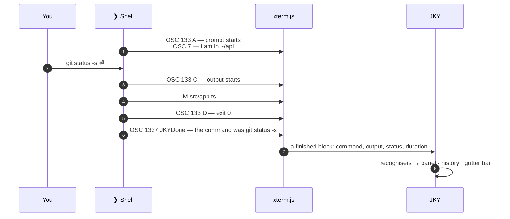
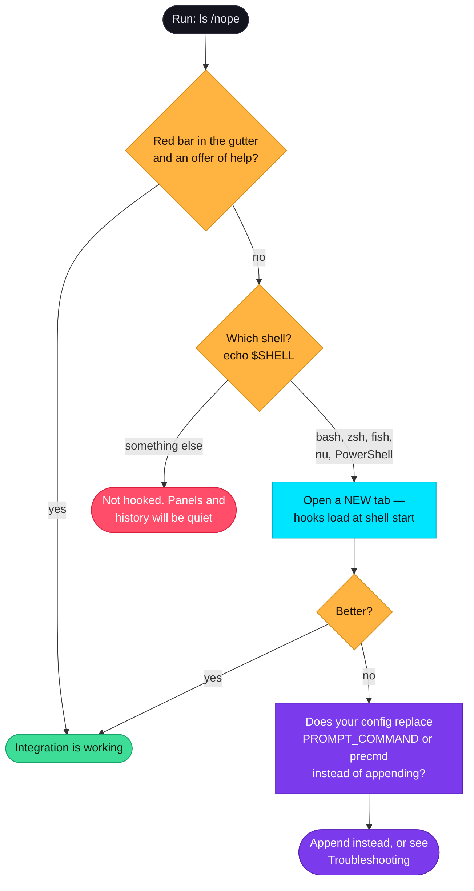

# Shells & the `jky` command

<p align="center">
  
</p>

<p align="center">
  
  
  
  
  
  
</p>

A terminal emulator sees bytes, not commands. It cannot know where one command ended, what it was, or
whether it worked — but your shell knows all three. **Shell integration** is how JKY asks the shell,
through the prompt hooks every shell already provides. It is what powers command panels, the gutter
bars, failure help, history, the session strip and "open the new tab where I already am".

This guide explains what is hooked, how, what it costs, and the `jky` command that rides the same
channel back into the app.

**On this page:** [What the shell reports](#what-the-shell-reports) · [Per shell](#how-each-shell-is-hooked) ·
[Is it working?](#is-it-working) · [The jky command](#the-jky-command) ·
[Command reference](#command-reference) · [Using JKY inside tmux](#inside-tmux-ssh-and-containers)

---

## What the shell reports

JKY uses two escape sequences that other terminals already speak, plus one of its own.

| Sequence | Standard? | Carries | Powers |
|---|---|---|---|
| **OSC 133** `A` | Shared convention — iTerm2, WezTerm, Kitty, Ghostty and Windows Terminal speak it too | Where a prompt begins | The session strip, gutter bars |
| **OSC 133** `C` | 〃 | Where a command's output begins | Panels know exactly what to parse |
| **OSC 133** `D` | 〃 | The exit status | Green/red bars, failure help, history |
| **OSC 7** | Shared convention | The working directory, on every prompt | New tabs and splits open where you are; panes reopen in their folder |
| **OSC 1337** `JKYDone=` / `JKYAsk=` / `JKYCmd=` | JKY's own, in the iTerm2 application range | The command text, and messages from the `jky` command | Recognisers, `jky ask`, `jky theme`, … |

OSC 133 `B` — the boundary between your prompt and what you typed — is **deliberately not emitted**. It
has to live inside `PS1`, and rewriting somebody's prompt risks their line wrapping for a mark no
feature here needs.

Because these are shared conventions, a shell configured for JKY keeps working in other terminals, and
a shell configured for those keeps working here. Terminals that do not understand OSC 1337 ignore it
silently.



---

## How each shell is hooked

**Your startup files are never edited.** Each shell is hooked through the mechanism it already offers,
using startup files JKY writes into its own config folder (`shell/`) and environment variables set only
for the shells it starts. Anything else is left alone rather than half-hooked.

| Shell | Mechanism | Your config |
|---|---|---|
| **bash** | `PROMPT_COMMAND` and `PS0` in the environment. Your existing values are kept and chained. | `~/.bashrc` loads as normal |
| **zsh** | `ZDOTDIR` points at JKY's `shell/` folder, whose files source yours by path; `.zshrc` restores your `ZDOTDIR` at the end. | `~/.zshenv`, `.zprofile`, `.zshrc` all load as normal |
| **fish** | `--init-command` with a small hook | `config.fish` loads as normal |
| **Nushell** | `--config` with an overlay that sources your usual `config.nu` first, then appends hooks | `config.nu` loads as normal |
| **PowerShell** | `-NoExit -Command . <hook>` after your profile has loaded, wrapping your real prompt | `$PROFILE` loads as normal |
| **cmd.exe** | Not hooked — it has no prompt hook worth the name. JKY opens PowerShell on Windows instead. | — |

> [!NOTE]
> **zsh's ordering is the subtle one.** zsh reads `.zshenv` first and then looks for every later file in
> whatever `ZDOTDIR` says at that moment — so restoring it in `.zshenv`, the obvious place, sends zsh to
> your directory for `.zshrc` and the hook is silently never read. JKY's files source yours by path
> and only `.zshrc` puts `ZDOTDIR` back, at the end.

### What it costs

Very little, and nothing in the background:

- **Before each prompt:** one `printf` writing three marks — the last exit status, the working
  directory, and the prompt start.
- **When a command starts:** one `printf` for the output-start mark.
- **After each command:** one short report of its status, directory and text, base64-encoded so that no command line — quotes, semicolons, newlines, even the terminator — can
  break out of the sequence. In bash, zsh and fish the encoding uses your system's `base64`; if it is missing,
  the report is skipped silently rather than printing an error after every command.

Every command is reported, not only failures. That was a deliberate reversal: `ls`, `git log` and
`docker ps` do not fail, and they are exactly the commands that panels exist for.

---

## Is it working?



The usual culprit is a shell config that **assigns** a hook rather than adding to it — for example
`PROMPT_COMMAND="my_thing"` in `.bashrc`, which replaces whatever was there. Prefer
`PROMPT_COMMAND="my_thing;${PROMPT_COMMAND}"`. In zsh, use `add-zsh-hook precmd my_thing` rather than
defining `precmd()` directly.

---

## The `jky` command

Every shell JKY starts has a small `jky` command on its `PATH`. It talks to the app by printing an
escape sequence — the same channel shell integration uses — so it needs no socket, no address and no
running server. Run outside JKY, it prints nothing and does no harm.

```sh
jky ask why does this test only fail on CI   # opens the question in the Assistant
jky theme nord                                # switches the whole app's theme
jky todo add review the release notes         # adds a todo to the Dashboard
jky open developer                            # jumps to a section
```

Nothing is installed system-wide and nothing outlives the session: the launchers live in JKY's own
`bin/` folder, which is put on the `PATH` of the shells JKY spawns. Arguments are base64-encoded before
they are sent, so a question containing quotes, newlines or the terminator itself cannot break out of
the sequence.

```mermaid
flowchart LR
    U([jky todo add ship it]):::ink --> L[jky launcher<br/>in JKY's bin/]:::cyan
    L --> E["printf ESC ] 1337 ; JKYCmd=&lt;base64&gt; BEL"]:::violet
    E --> P[PTY → xterm.js]:::amber
    P --> A[JKY decodes it and<br/>applies its own rules]:::mint
    A --> D([Todo on the Dashboard]):::magenta

    classDef ink fill:#14141f,stroke:#2a2a3c,color:#e8e8f2
    classDef cyan fill:#00e5ff,stroke:#00a3b5,color:#06141a
    classDef amber fill:#ffb340,stroke:#d18a12,color:#1f1300
    classDef violet fill:#7c3aed,stroke:#5b21b6,color:#ffffff
    classDef mint fill:#3ddc97,stroke:#15a36b,color:#04170f
    classDef magenta fill:#ff3cf0,stroke:#c026d3,color:#1a0618
```



The launcher only *packages* what you typed. Every rule about what a note, todo or theme may be lives in
the app, which is why the shell scripts stay tiny and identical in spirit across bash, zsh, fish, Nushell
and PowerShell.

---

## Command reference

The same list, with longer explanations, is in **Settings → Commands**, and `jky commands` prints it in
the terminal.

### Ask and navigate

| Command | Does |
|---|---|
| `jky ask <question>` | Sends the question to the Assistant panel. |
| `jky open <section>` | Jumps to a section: `dashboard`, `terminal`, `history`, `remote`, `editor`, `workspaces`, `assistant`, `games`, `apps`, `developer`, `settings`. |
| `jky theme <name>` | Changes the theme: `cyberpunk`, `dracula`, `nord`, `solarized`, `light`, `gold`, `contrast`. Prints `theme set to …`. |
| `jky split [down]` | Divides this terminal in two — right by default. |
| `jky history [text]` | Searches everything you have run. |
| `jky workspace [name]` | Lists your workspaces, or switches to one. |
| `jky host [name]` | Lists saved machines, or opens a terminal on one. |
| `jky audit` | Checks the audit log's chain and the newest record against the keychain; exits 0 if intact. See [Security & privacy](security-and-privacy.md#tamper-evident-and-checkable). |
| `jky commands` | Prints this list. |
| `jky` · `jky banner` · `jky-terminal` | Prints the JKY wordmark. `jkyterminal` and `jkyTerminal` work too. |

### Notes, todos and reminders

| Command | Does |
|---|---|
| `jky notes` · `jky notes <n>` | Lists notes, or prints note *n*. |
| `jky note new <title>` | Creates a note. |
| `jky note write <n> <text>` | **Appends** a line to note *n* — never replaces its body. |
| `jky note rename <n> <title>` | Renames a note; the body is untouched. |
| `jky note rm <n>` | Deletes a note. |
| `jky todos` · `jky todos <n>` | Lists todos, or prints one. |
| `jky todo add <text>` | Adds a todo. |
| `jky todo done <n>` · `jky todo undone <n>` | Ticks or unticks a todo. Ticked todos stay on the list. |
| `jky todo rm <n>` | Deletes a todo. |
| `jky reminders` · `jky reminders <n>` | Lists reminders, or prints one. |
| `jky reminder add <HH:MM> <text>` | Sets a **daily** reminder. |
| `jky reminder done <n>` | Ticks a reminder off for today. |
| `jky reminder rm <n>` | Deletes a reminder. |

Numbers follow the listing, so run the list first if anything has been deleted since. Verbs accept the
spellings people reach for: `add`/`new`, `rm`/`delete`/`del`, `done`/`tick`, `undone`/`untick`.

### Games

| Command | Does |
|---|---|
| `jky games` | Lists the games with your records. (Open the Games section once so the listing is written.) |
| `jky games <n>` | Opens game *n*: 1 Dino Run, 2 Snake, 3 Tic-Tac-Toe, 4 Flappy Bird, 5 2048. |

---

## Inside tmux, SSH and containers

| Situation | What happens |
|---|---|
| **tmux or zellij inside JKY** | Works as a normal terminal. Panels and marks depend on the escape sequences reaching JKY, which multiplexers may or may not pass through. JKY's own persistence usually makes the outer multiplexer unnecessary locally. |
| **SSH from a JKY pane** | The remote shell is not hooked — JKY only hooks shells it starts. You get a normal, fully working terminal; panels and gutter bars will be quiet for remote commands. |
| **A container shell** (`docker exec -it … sh`) | The same: a normal terminal, without integration inside the container. |
| **A shell started inside a shell** | The inner shell inherits the environment. bash and zsh hooks generally follow; behaviour depends on how the inner shell is started. |

If you want integration on a remote machine, the OSC 133 and OSC 7 conventions are the same ones other
terminals document — a remote shell configured for Ghostty, WezTerm or iTerm2 integration will produce
marks JKY understands.

---

<p align="center">
  <a href="terminal-guide.md">← Terminal guide</a> &nbsp;·&nbsp;
  <a href="README.md">Documentation home</a> &nbsp;·&nbsp;
  <a href="keyboard-and-settings.md">Next: Keyboard & settings →</a>
</p>
