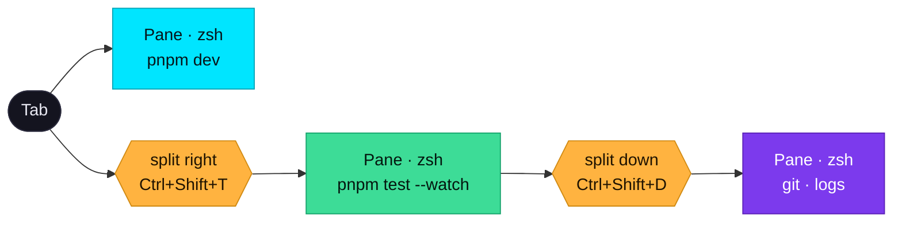
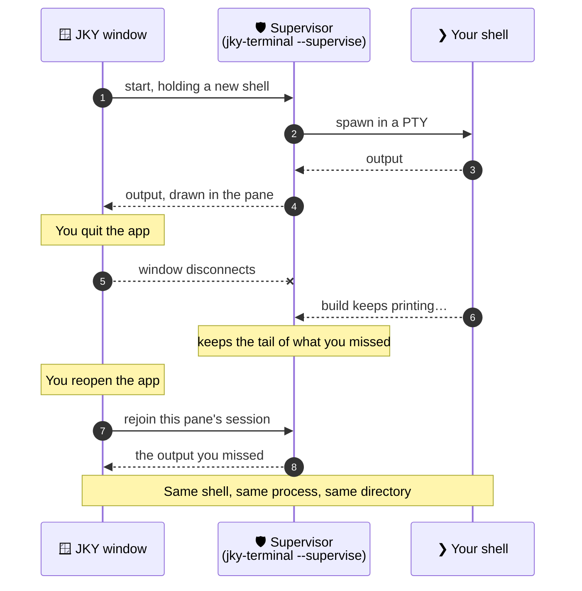
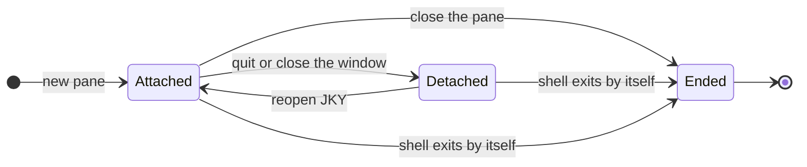
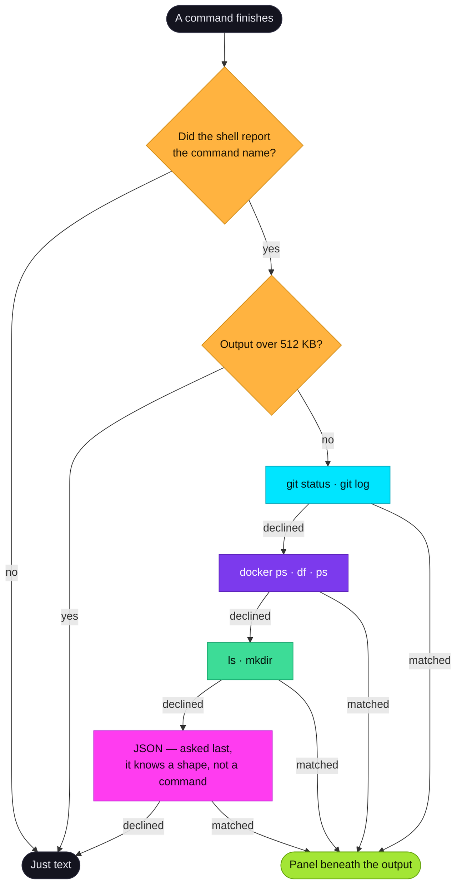

# Terminal guide

<p align="center">
  
</p>

<p align="center">
  
  
  
</p>

The terminal is the centre of JKY. Everything else in the app — panels, history, the assistant — exists
to make the loop of *type, read, decide* faster and safer, without taking any part of that loop away
from you. This guide covers how that loop works in detail.

**On this page:** [The contract](#the-terminal-contract) · [Tabs and panes](#tabs-and-panes) ·
[Shells that outlive the window](#shells-that-outlive-the-window) ·
[Command panels](#every-command-can-become-a-panel) · [Live panels](#live-panels) ·
[Command blocks](#command-blocks) · [When a command fails](#when-a-command-fails) ·
[Completions](#completions) · [History](#history) · [Search, copy and paste](#search-copy-and-paste) ·
[Remote terminals](#remote-terminals) · [Private terminals](#private-terminals) · [Focus mode](#focus-mode) ·
[Compatibility](#terminal-compatibility) · [Performance](#performance-honestly)

---

## The terminal contract

Five promises the terminal keeps no matter which feature is involved. They are the reason the extra
features can be left switched on.

| # | Promise | What it rules out |
|:-:|---|---|
| 1 | **What you type reaches your shell.** Every unmodified key belongs to the shell; app shortcuts all need a modifier. | An app shortcut eating a key your editor or REPL needed. |
| 2 | **Output stays in the scrollback.** Panels appear *beneath* it and can be dismissed. | A panel that misread the output hiding what was really printed. |
| 3 | **<kbd>Ctrl</kbd>+<kbd>C</kbd> and <kbd>Ctrl</kbd>+<kbd>D</kbd> are the shell's.** They cannot be rebound — the keymap refuses. | A runaway command you cannot interrupt, a shell you cannot leave. |
| 4 | **Nothing runs a command for you.** Panel actions, completions, history and "run it again" all *type* the command. You press <kbd>Enter</kbd>. | A button that quietly runs `docker stop` on the wrong container. |
| 5 | **When in doubt, it is just a terminal.** A recogniser that is unsure shows nothing. | Confidently wrong tables. |

---

## Tabs and panes

A **tab** is one terminal until you ask for another. Splitting is deliberate, and nothing arrives split —
a layout comes back only because you saved it in a [workspace](workspaces-and-editor.md).



| Do this | Default keys | Notes |
|---|---|---|
| New tab | <kbd>Ctrl</kbd>+<kbd>T</kbd> | Opens where the current pane is, thanks to [OSC 7](shell-integration.md#what-the-shell-reports). |
| Close tab | <kbd>Ctrl</kbd>+<kbd>W</kbd> | Ends the shells in it. |
| Next tab | <kbd>Ctrl</kbd>+<kbd>Tab</kbd> | |
| Jump to tab *n* | <kbd>Ctrl</kbd>+<kbd>1</kbd> … <kbd>9</kbd> | |
| Split right | <kbd>Ctrl</kbd>+<kbd>Shift</kbd>+<kbd>T</kbd> | The shifted sibling of "new tab": same key, divides the terminal you are in. |
| Split down | <kbd>Ctrl</kbd>+<kbd>Shift</kbd>+<kbd>D</kbd> | **D** for down. |
| Close pane | <kbd>Ctrl</kbd>+<kbd>Shift</kbd>+<kbd>W</kbd> | Ends that pane's shell — see below. |
| Move between panes | <kbd>Ctrl</kbd>+<kbd>Shift</kbd>+<kbd>←</kbd><kbd>↑</kbd><kbd>↓</kbd><kbd>→</kbd> | Geometric, not structural. |
| Resize | Drag the divider | 15 px of grab area for 2 px of drawn line. Arrow keys work when a divider has focus. |
| Even a split | Double-click the divider | |
| Swap two panes | <kbd>Ctrl</kbd>+drag one onto another | Only the leaves move; no shell is disturbed. |

On macOS, <kbd>Ctrl</kbd> in every app shortcut means <kbd>⌘</kbd>. All of these can be rebound in
**Settings → Keyboard** — see [Keyboard & settings](keyboard-and-settings.md).

**Geometric navigation** means *right* is the pane drawn to the right. Split a tab right, then split the
left half down: *right* from either left-hand pane reaches the same right-hand one, which is what the
eye expects and what walking the layout tree gets wrong.

**Each pane keeps its own scrollback** across a restart — up to 256 KB of it — and its own working
directory, so a relaunch puts each pane back where it was rather than in your home folder. Closing a
pane forgets only that pane.

> [!TIP]
> Three panes is often the sweet spot: a server, a test watcher, and one for everything else. Fifteen
> panes is usually two workspaces trying to be one.

---

## Shells that outlive the window

Close the window in the middle of a build and the build keeps going. Open the app again and each pane
is back on the shell it had, showing what that shell printed while nobody was looking.

### How it works

A shell used to be a child of the window, and a child dies with its parent. In JKY each pane's shell is
held by a small **supervisor** — the same `jky-terminal` binary, started with `--supervise` — and the
window is only ever a client of it. The window closing is an ordinary disconnect rather than the end of
anything. It is the shape `dtach` settled on, and the reason people keep tmux running underneath their
terminal; here it is simply how the terminal works.



### The three rules

| Rule | Why |
|---|---|
| **Closing a pane ends its shell. Quitting does not.** | They are different acts, and the app treats them differently instead of guessing which you meant. |
| **Reopening draws what was missed, not what was there.** | The rejoined shell sends the tail of what it printed while detached — up to 256 KB. When it printed more, a dim line above the tail says how much was not kept, so a pane that opens mid-build never looks like a build that began mid-way. The old scrollback is not drawn again — that would be the same session twice. |
| **Quitting asks only about what it would lose.** | Unsaved files, and commands running in a shell the window still owns. A remote `ssh` session is one of those: it is a child of the window and ends with it. |



### Who can reach a held shell

A supervisor answers a connection by sending what the shell printed, so *who may connect* is *who may
read the shell*. On macOS and Linux the sockets live in a directory only your user can enter; on Windows
each named pipe admits its owner and no one else.

A Unix socket path may be at most 104 bytes on macOS, and a long user name plus
`~/Library/Application Support/…` can use that up. When the usual path would not fit, the socket goes
in `/tmp/jky-<your uid>/` instead — the shape tmux uses. Because `/tmp` is shared, JKY creates that
folder owner-only and will not use one that is a link, belongs to anyone else, or that it cannot make
private; the pane then says its shell will end with the window rather than risk it.

### Upgrading with shells running

A supervisor outlives the app that started it, so it also outlives an **upgrade**: install a new JKY
with a build still running and the new window rejoins a supervisor that is the old binary. Each
supervisor therefore records, beside its socket, the **session protocol** it speaks, the JKY version
that started it, its process id and when it started. A window reads that record before it connects:

| The held shell speaks… | What the window does |
|---|---|
| this build's protocol, or an older one | rejoins it, as always |
| a **newer** protocol (you went back to an older JKY) | does not read a single frame from it, and does not start a second shell on top of it. The pane opens a shell of the window's own and says why — *"this shell will end when JKY closes — this pane's shell was started by JKY Terminal 0.2.0 … update JKY to rejoin it"* |

A record from before records existed is just the pane's name; it reads as protocol 1, which is exactly
what such a supervisor speaks.

### Seeing what is held

`jky sessions` lists every shell held in the background:

```text
$ jky sessions
2 shells held in the background

  pane-1a2b  pid 41231    started 2h 14m ago    JKY 0.1.0 · protocol 1
  pane-9f8e  pid 41290    started 3d 4h ago     JKY 0.1.0 · protocol 1

Listed from what each shell recorded when it started. One that has since
exited is cleared the next time JKY looks for it.
```

It is the same binary run with `--sessions`, so it also works outside JKY:
`jky-terminal --sessions --config-dir <folder>`.

### Nothing is left behind by accident

A supervisor ends when its shell does, and takes its socket and record with it. On start, the app ends
any held shell that no pane claims — one left over when a crash kept a pane's close from arriving. On
Windows, a job object that forbids breakaway can still take held shells down with it; that is the job's
rule, and a terminal still opens.

> [!WARNING]
> **Persistence is continuity for the window, not immortality for the process.** A reboot, logging out,
> an explicit kill or running out of memory still end a shell. For work that must survive those, use a
> system service, a container, CI, or a remote host.

---

## Every command can become a panel

A shell answers in text because a pipe is the only thing it can answer in. That has nothing to do with
what the answer *is*: `df` reports how full your disks are, `docker ps` the state of your containers.
Both are tables flattened on the way out. JKY reads the flattening back.

| Command | Becomes |
|---|---|
| `git status -s` | Staged and unstaged, kept apart, with file-kind chips |
| `git log` | A commit timeline |
| `docker ps` | Container cards, running and stopped |
| `df -h` | Disk bars, **fullest first** |
| `ps aux` | A searchable process table |
| `ls -l` | A listing with kinds, sizes and dates |
| `mkdir <dir>` | The confirmation `mkdir` never prints, with a way to jump in |
| anything that prints **JSON** | A collapsible tree |



**No model is involved.** These are parsers. A wrong table presented confidently is worse than a wall of
text, because text is at least honestly text — so every recogniser refuses more than it accepts, and the
moment output stops looking like what it expects, it shows nothing. A recogniser that throws is treated
exactly like one that declined: the panel does not appear and the terminal is untouched.

### Three rules that make it safe to leave on

1. **It never replaces the output.** The text stays exactly where it was.
2. **Actions type a command; nothing runs one.** A panel that could quietly `docker stop` would be one
   you had to trust. This one only has to be read.
3. **A pipe means it declines.** `docker ps | grep api` prints grep's output, and reading it as docker's
   would be confidently reading the wrong thing.

The recognisers are checked against real recorded sessions — `zsh -i` and `bash -i` driven through a
real PTY — not only hand-written fixtures. The first run found a `git log` line beginning with a stray
keypad escape that silently cost one commit in three.

---

## Live panels

A panel is normally a photograph of one run. Three can stay **live** instead: `df -h`, `ps aux` and
`docker ps`. Turn on *live* and the panel re-runs the command and re-parses it — bars fill while you
watch, and a container's row turns red the moment it dies.

Keeping a panel live means running a command again, and an IPC command that ran whatever it was told
would be arbitrary execution wearing a refresh button. So the window does not send a command: it sends
the *id* of one of those three, and the argument list is a constant in the `jky-live` crate, handed to
the operating system with no shell in between.

| Property | Behaviour |
|---|---|
| Offered when | What you typed is **exactly** one of the three. `df -x tmpfs` is a different question. |
| Default | Off. You turn it on per panel. |
| Paused | When its pane is hidden. |
| On failure | Stops at the first refusal and says so — no retrying every two seconds forever. |
| On unparseable output | Stops, and leaves the last good answer on screen. |

---

## Command blocks

Shell integration tells JKY exactly where each command starts and ends, so every finished command is a
thing you can point at.

- **A bar in the gutter** runs from each command's prompt to the end of its output, coloured by how it
  ended. Click it for: **Copy output** (with how long it took) · **Copy command** · **Copy both** ·
  **Export record · Markdown** · **Run it again** (types it; you press <kbd>Enter</kbd>) · **Ask about
  this**, or **Ask why it failed · exit *n*** for a failure.
- **The session strip** down the left edge draws one mark per command, as tall as the command was long
  on a log scale, so the four-minute build stands out from a hundred quick commands. Click a mark to
  jump back to it.
- **The window tells you what terminals are doing.** A thread of light runs along the top while a
  command has been running for more than 600 ms, its tab shows a dot, and a failure flashes red once
  and fades after four seconds.

The Markdown record is built only from facts the shell reported — the command, exit status, duration
and output — never from a guess made off the prompt. It is designed to paste straight into an issue or
an incident note:

````markdown
## JKY command record

- Result: exit 1
- Duration: 2.4 s

```sh
cargo test -p jky-pty
```

```text
…the output…
```
````

---

## When a command fails

When a command exits non-zero, an offer of help appears underneath it. The offer itself is built from
what the terminal already knows and costs nothing.

**Nothing is sent to a model until you press a button.** When you do, the request carries three
bounded things: the command (up to 256 characters), the tail of its output (up to 700 characters), and
an instruction to answer briefly. It is a one-shot question with **no tools** — a suggestion under a
failed command cannot run anything. See [Assistant & approvals](assistant-and-approvals.md#failure-help).

---

## Completions

Start typing and what could come next appears. <kbd>↑</kbd> <kbd>↓</kbd> or the mouse choose;
<kbd>Tab</kbd>, <kbd>Enter</kbd> or a click put it **on the prompt**; <kbd>Enter</kbd> again runs it.
<kbd>Esc</kbd> dismisses.

| Where the cursor is | What is offered |
|---|---|
| The first word | Programs on your `PATH`, then whole lines you have run before |
| After `git checkout ` | Branches, read from `.git` — including linked worktrees — never by running Git |
| After `git add ` | Files, because that is what `git add` takes |
| After `npm run ` | The scripts in `package.json`, with what each one runs |
| After `cd ` | Directories, never files |
| After `-` | That command's flags, with what each is for |
| Anywhere else | Paths |

**Nothing is run to find out what to offer** — not the command, not `git`, not `--help`. A completion
engine that executed something would execute it on every keystroke, at a prompt where you have not
decided anything yet. **Nothing is guessed** either: a command JKY was not told about gets paths and
nothing else, and a command your machine does not have is not described at all.

The prompt is read off the screen rather than rebuilt from keystrokes, so recalling a line with
<kbd>↑</kbd> does not confuse it.

---

## History

Every command that finishes is recorded — what was typed, where it ran, and how it ended — in
`history.jsonl`, up to 100,000 entries. The shell reports all three through the same hook the panels
use, so nothing is inferred from the screen.

Open **History** (`↺`), or run `jky history <text>` from any terminal.

- **Subsequence search**, because that is how people remember commands: `dkrps` finds `docker ps`,
  `gcm` finds `git commit -m`.
- **Ranking** weighs how tightly the query matched, how often you ran the command (damped by a
  logarithm, so an `ls` run five hundred times does not bury everything else), and how recently.
- **One row per command**, with a count, rather than forty identical lines.
- **Choosing one types it** at the prompt. It never runs it.
- **Secrets are redacted before they are written.** A token typed into a command — `ghp_…`,
  `sk-ant-…`, an `Authorization:` header, a `*_TOKEN=` assignment — is kept as
  `[redacted github-token]` and so on. See [what is recognised](security-and-privacy.md#secrets-in-history-scrollback-and-ai-requests).
- **Forget** removes *every* run of that command — someone deleting a line with a credential in it
  means all of them.

History is not scrollback. Scrollback is what commands *printed*; history is what you *typed*.

---

## Search, copy and paste

| Action | Keys | Notes |
|---|---|---|
| Find in the terminal | <kbd>Ctrl</kbd>+<kbd>F</kbd> | Searches this pane's scrollback. |
| Copy | <kbd>Ctrl</kbd>+<kbd>Shift</kbd>+<kbd>C</kbd> | Or select and use the right-click menu. |
| Paste | <kbd>Ctrl</kbd>+<kbd>Shift</kbd>+<kbd>V</kbd> | |
| Newline without sending | <kbd>Shift</kbd>+<kbd>Enter</kbd> | Sends a line feed (`Ctrl+J`), which assistant CLIs read as "insert a newline". |
| Right-click menu | — | Copy · Paste · Search · Clear · Split right · Split down · Close pane |

**Links** in output are clickable. The window does not open them: it asks Rust, which accepts only
`http` and `https` URLs without control characters or quotes, and hands them to your real browser.

**Clipboard writes from programs are blocked.** OSC 52 lets output ask a terminal to replace your
clipboard; a remote host or a pasted log could use it to swap the next thing you paste. In JKY, copying
is always something you do.

---

## Remote terminals

The **Remote** section (`⇄`) saves hosts and opens a terminal on them. It runs the `ssh` your computer
already has, which is the whole design: your agent, your `~/.ssh/config`, your `known_hosts` and your
keys are the ones in use, so a host that works in any other terminal works here.

| Field | Meaning |
|---|---|
| Label | What to call it. Falls back to the address. |
| Address | A hostname, an IP, or a `Host` name from `~/.ssh/config`. |
| User | Optional. Empty means whatever `ssh` would choose. |
| Port | Optional. Empty means 22 or your config's `Port`. |
| Identity file | Optional, for when the agent is not enough. |
| Jump host | Optional, validated by the same rules. |

**There is no password field and no key field.** JKY stores no SSH credential and never sees one.

The sharp edge is the argument list. `ssh` takes options as arguments, so an address of
`-oProxyCommand=…` is a documented way to turn *connect* into *run this on my laptop*. Every field is
validated — refused rather than escaped — when you save and again when you connect, the destination goes
after `--`, and the IPC command takes a host **id**, never a command line.

### Importing from `~/.ssh/config`

**Import from ~/.ssh/config** lists every concrete host the file names — with where each goes, as
`deploy@203.0.113.10:2222 via bastion` — ticked, minus any already saved. Each is saved under its
**alias** and nothing else: `ssh` reads the file itself on every connection, so `HostName`, `User`,
`Port` and `ProxyJump` come from the one place they are kept and never go stale in JKY.

Not offered: wildcard and negated patterns (`Host *`, `Host *.internal`, `!secret`), which name no single
machine; anything inside a `Match` block, which only ssh can evaluate; and hosts named only in an
`Include`d file — add those by hand under their alias. An alias that could not be saved by hand (one
starting with `-`, say) is not offered either.

### Host keys

**Host key** on a saved host asks this machine what it already knows, without connecting. `ssh -G`
works out where the host really goes — `HostName`, `Port`, `HostKeyAlias`, and which `known_hosts`
files apply — and `ssh-keygen -F` looks it up, hashed entries included. The answer is one of:

| Shown | Meaning |
|---|---|
| `ED25519 SHA256:sjivcp…` — already trusted on this machine | `known_hosts` holds this key; ssh will connect without asking. The fingerprint is the one ssh prints. |
| **Not in known_hosts** | The first connection will show a fingerprint and ask. Compare it with one the server's owner gives you before typing `yes`. |
| … — revoked | The key is marked `@revoked`; ssh will refuse it. |

### Always clear which machine you are on

A remote terminal says so above its output for as long as it is open — **Remote · prod
`deploy@203.0.113.10` — commands here run on that machine, not this one** — and its tab carries a
**remote** badge. Local and remote terminals otherwise look identical, and the difference is the whole of
what matters before `rm` or `systemctl stop`.

Two behaviours worth knowing:

- **Splitting a remote terminal gives you a local one.** Usually what you want when you are looking at a
  server and need to check something here.
- **Remote panes are not restored on the next launch.** Starting the app must never reconnect to a
  production machine on its own.

From a shell: `jky host` lists saved machines, `jky host <name>` opens one.

---

## Private terminals

Some work should leave no trace on disk — a production investigation, a session with credentials on
screen. Open **New private terminal** from the palette (<kbd>Ctrl</kbd>+<kbd>K</kbd>), or run
**Make this tab private** on a tab you already have.

| A private tab | |
|---|---|
| Records history | **No** — nothing it runs reaches `history.jsonl` |
| Saves scrollback | **No** — and making a tab private deletes what its panes had already saved |
| Looks different | A **private** badge on its tab, every time |
| Survives a restart | Yes, and it comes back **still private** |
| Persistent shell | Yes — privacy is about what is *kept*, not about the shell |

For the whole app, **Settings → Privacy** can turn history or saved scrollback off entirely, and set a
retention window after which history is forgotten. Those settings are enforced in Rust, in the commands
that write, so they hold whatever the window asks for.

---

## Focus mode

<kbd>Ctrl</kbd>+<kbd>Shift</kbd>+<kbd>B</kbd> drops the rail, the tabs, the status bar and the camera,
and the terminal takes the whole window — the shifted sibling of <kbd>Ctrl</kbd>+<kbd>B</kbd>, which
hides only the sidebar.

<kbd>Esc</kbd> deliberately does **not** leave it: Escape is the most meaningful key in a terminal, and a
mode that read it would fall apart the first time you used vim. A small readout in the corner shows the
way out instead. Focus mode is forgotten at quit, so the app never launches looking like it failed to
start.

---

## Terminal compatibility

| Area | Status |
|---|---|
| Renderer | xterm.js 6 with the WebGL2 addon |
| Synchronized output (DEC mode 2026) | Supported — full-screen programs repaint without tearing. A test asks the real xterm with DECRQM. |
| Shell integration marks | OSC 133 (prompt, output start, exit status) and OSC 7 (working directory) for bash, zsh, fish, Nushell and PowerShell |
| Hyperlinks in output | Clickable, opened by the OS browser, `http`/`https` only |
| OSC 52 clipboard | Blocked by design |
| Kitty keyboard protocol | Not yet — it is in an xterm.js beta. <kbd>Shift</kbd>+<kbd>Enter</kbd> is handled specially instead. |
| Inline images (Kitty, iTerm2, Sixel) | **Not rendered yet** — listed as planned in **Settings → Terminal** |
| Font ligatures | Off, to keep every glyph exactly one cell wide |
| Font size | 8–28 points, nine font choices, each ending in a monospace fallback |

---

## Performance, honestly

The terminal renders through xterm.js inside the operating system's webview. That is fast enough for
everyday work, and it is not a native GPU renderer: under very heavy output — megabytes of logs at once
— Ghostty, Alacritty, WezTerm or Warp will be faster. JKY has **not** published benchmarks yet, and the
roadmap lists doing so as near-term work.

If something feels slow, it helps to know which layer is responsible:

| Suspect | Quick test |
|---|---|
| The command itself | Run it with output redirected: `cmd > /dev/null`. Still slow? It is not the terminal. |
| The renderer | Run the same command in another terminal on the same machine. |
| A remote link | Compare a local command with the same command over `ssh`. |
| The machine | Watch the status bar's CPU reading, or the **Developer → System Monitor** tool. |

A useful report names a reproducible command, the shell, the OS, the pane size and what you saw.

---

<p align="center">
  <a href="getting-started.md">← Getting started</a> &nbsp;·&nbsp;
  <a href="README.md">Documentation home</a> &nbsp;·&nbsp;
  <a href="shell-integration.md">Next: Shells & the jky command →</a>
</p>
