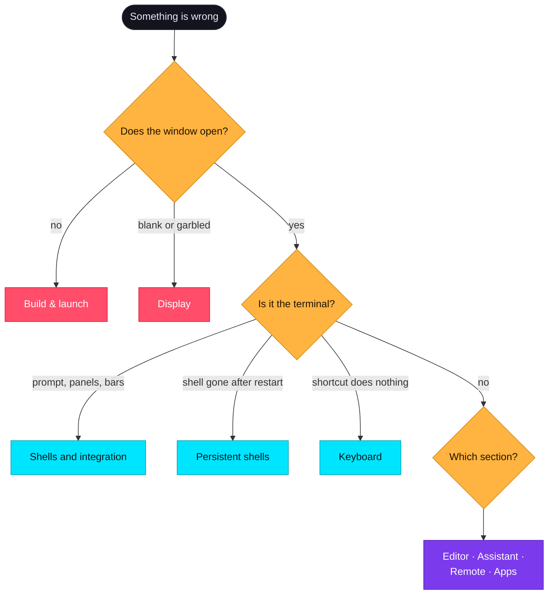

# Troubleshooting

<p align="center">
  
</p>

Find your symptom, read the likely cause, apply the fix. Each section starts with the most common
problem. If nothing here helps, the end of this page explains how to write a report that gets fixed
quickly.

**Jump to:** [Build & launch](#build-and-launch) · [Display](#display-and-rendering) ·
[Shells](#shells-and-integration) · [Persistence](#persistent-shells) · [Keyboard](#keyboard) ·
[Panels, history & completions](#panels-history-and-completions) · [Editor](#editor-and-files) ·
[Assistant](#assistant-and-providers) · [Remote](#remote-hosts) · [Apps](#apps-and-accounts) ·
[Installers](#unsigned-installers) · [Resetting](#resetting-things) · [Reporting](#writing-a-good-report)



---

## Build and launch

<details open>
<summary><b>Vite starts, but no window appears</b></summary>

**Cause:** you ran `pnpm dev`, which starts only the browser dev server.
**Fix:** run `pnpm dev:desktop`. If it fails, read the *last* Rust or Tauri error — it nearly always
names the missing piece.

</details>

<details>
<summary><b>Linker or <code>pkg-config</code> errors mentioning webkit2gtk, soup, javascriptcore or dbus</b></summary>

**Cause:** the Linux development packages are missing.
**Fix:** install the list in [Getting started → Platform packages](getting-started.md#platform-packages).
They are the same packages CI installs, so they are known to be sufficient.

</details>

<details>
<summary><b><code>pnpm install</code> fails, or the wrong pnpm runs</b></summary>

**Cause:** Corepack is not enabled, or Node is older than 22.
**Fix:** `node --version` (needs 22+), then `corepack enable`, then `pnpm install` again. The
repository pins pnpm 9.15 and Corepack fetches it.

</details>

<details>
<summary><b>The first build takes a very long time</b></summary>

**Cause:** expected. Cargo compiles several hundred crates once.
**Fix:** let it finish. Do not delete `target/` to "clean up" — the next build would start from zero
again. Later builds take seconds.

</details>

<details>
<summary><b>"Too many open files" or a file-watcher error on Linux</b></summary>

**Cause:** the desktop has used up its inotify instances; the dev server watches many files.
**Fix:** `sudo sysctl -w fs.inotify.max_user_instances=512` for this session, or set it in
`/etc/sysctl.d/` to keep it.

</details>

<details>
<summary><b>Windows: build tools or <code>link.exe</code> not found</b></summary>

**Cause:** the MSVC toolchain is missing.
**Fix:** install *Microsoft C++ Build Tools* with **Desktop development with C++**, and make sure
`rustup` uses the MSVC host (`rustup default stable-msvc`).

</details>

---

## Display and rendering

<details open>
<summary><b>The window is blank or flickers on Linux (often NVIDIA, sometimes Wayland)</b></summary>

**Cause:** a known WebKitGTK problem with its DMA-BUF renderer on some GPU drivers — it affects many
Tauri and WebKitGTK apps, not only JKY.
**Fix:** launch with the renderer disabled:

```sh
WEBKIT_DISABLE_DMABUF_RENDERER=1 pnpm dev:desktop
```

</details>

<details>
<summary><b>Box-drawing characters do not line up, or the font looks wrong</b></summary>

**Cause:** the chosen typeface is not installed, or a proportional font slipped in.
**Fix:** **Settings → Terminal** → pick a face you have installed, or *App default*. Every choice ends
in a monospace fallback, and ligatures are off so each glyph stays one cell wide. Sizes under ~10 pt
can make box-drawing ragged on some displays.

</details>

<details>
<summary><b>Images from <code>imgcat</code>, <code>kitty +kitten icat</code> or Sixel tools do not show</b></summary>

**Cause:** inline image protocols are not supported yet.
**Fix:** none today. **Settings → Terminal** lists it as planned.

</details>

---

## Shells and integration

<details open>
<summary><b>No panels, no gutter bars, nothing in History</b></summary>

**Cause:** shell integration is not running in this shell.
**Fix:**

1. `echo $SHELL` — bash, zsh, fish, Nushell (`nu`) and PowerShell are hooked; others are not.
2. Open a **new** tab — hooks load when a shell starts.
3. Check that your config **adds to** prompt hooks rather than replacing them. In bash, write
   `PROMPT_COMMAND="mine;${PROMPT_COMMAND}"`, not `PROMPT_COMMAND="mine"`. In zsh, use
   `add-zsh-hook precmd mine` rather than defining `precmd()`.
4. In bash, zsh and fish the hook uses `base64`; on a minimal system make sure it is installed.

See [Shells & the jky command](shell-integration.md#is-it-working).

</details>

<details>
<summary><b>"… was written by a newer JKY Terminal"</b></summary>

**Cause:** you ran an older build against files a newer build wrote. Each settings file carries a
schema number, and an older build refuses a newer file rather than overwriting it — overwriting would
silently drop whatever it does not understand.
**Fix:** run the newer build again. The file has been left exactly as it was.

</details>

<details>
<summary><b>The wrong shell starts</b></summary>

**Cause:** JKY starts `$SHELL` on macOS and Linux (or `/bin/sh` if unset), and Windows PowerShell on
Windows.
**Fix:** change your login shell (`chsh -s $(which zsh)`), log out and in so `$SHELL` updates, then open
a new tab.

</details>

<details>
<summary><b><code>jky</code>: command not found</b></summary>

**Cause:** you are in a shell JKY did not start (inside `ssh`, a container, or `sudo -i`), or a startup
file rewrote `PATH` completely.
**Fix:** use `jky` from a JKY pane's own shell. If your config sets `PATH=…` from scratch, append to it
instead: `PATH="$HOME/bin:$PATH"`.

</details>

<details>
<summary><b>A command typed by a panel or history did not run</b></summary>

**Cause:** by design. Actions, completions, history and "Run it again" only **type** the command.
**Fix:** read it, then press <kbd>Enter</kbd>.

</details>

---

## Persistent shells

<details open>
<summary><b>After reopening, a pane started a fresh shell instead of rejoining</b></summary>

**Possible causes:**

- The shell exited while you were away — the process finished, or crashed.
- The machine rebooted or you logged out; supervisors do not survive that.
- The pane was **closed** rather than the app quit. Closing a pane ends its shell by design.
- It was a **remote** pane. Those are children of the window and never reopen automatically.
- The pane said *"this shell will end when JKY closes"*. Its held shell was started by a **newer** JKY
  than the one running now, so this one would not risk misreading it. Update JKY and reopen to rejoin
  it; `jky sessions` shows it, with its process id, in the meantime.

</details>

<details>
<summary><b>A rejoined pane starts with "… of earlier output were not kept"</b></summary>

**Cause:** while detached, the shell printed more than the 256 KB a supervisor keeps. That line says
how much was dropped; everything below it is the most recent output, in order.
**Fix:** none needed. For a log you will want in full, write it to a file: `cargo build 2>&1 | tee build.log`.

</details>

<details>
<summary><b>Quitting asked about running commands</b></summary>

**Cause:** a command is running in a shell the window still owns — usually an `ssh` session.
**Fix:** answer the question; it names exactly what would be lost. Local panes held by a supervisor do
not trigger it.

</details>

<details>
<summary><b>I suspect leftover shells are running</b></summary>

**Cause:** rare — a crash can stop a pane's close from arriving.
**Fix:** run `jky sessions` to see every held shell, its process id and its age. Starting JKY ends any
held shell that no pane claims.

</details>

---

## Keyboard

<details open>
<summary><b>A shortcut does nothing</b></summary>

1. **Settings → Keyboard** — is it bound to what you think? Is there a conflict warning?
2. On macOS, app shortcuts use <kbd>⌘</kbd>, not <kbd>Ctrl</kbd>.
3. Your desktop environment or OS may grab the chord first (common for <kbd>Ctrl</kbd>+<kbd>Alt</kbd>
   combinations on Linux). Rebind to something free.

</details>

<details>
<summary><b>"That shortcut cannot be used"</b></summary>

**Cause:** every binding needs <kbd>Ctrl</kbd> or <kbd>Alt</kbd>, and <kbd>Ctrl</kbd>+<kbd>C</kbd> /
<kbd>Ctrl</kbd>+<kbd>D</kbd> are permanently the shell's. See
[the two rules](keyboard-and-settings.md#the-two-rules).

</details>

<details>
<summary><b>Shift+Enter inserted a newline instead of submitting</b></summary>

**Cause:** by design — it sends `Ctrl+J`, which assistant CLIs read as "new line". Use
<kbd>Enter</kbd> to submit.

</details>

---

## Panels, history and completions

| Symptom | Cause | Fix |
|---|---|---|
| No panel for `docker ps \| grep api` | A pipe makes every recogniser decline — on purpose. | Run the plain command for a panel. |
| No panel for a huge output | Output over 512 KB is treated as a log. | Expected. |
| No *live* toggle on `df -x tmpfs` | Live panels exist only for exactly `df -h`, `ps aux`, `docker ps`. | Use the exact command. |
| A live panel stopped refreshing | It stops at the first failure or unparseable output, and says so. | Fix the cause (e.g. start Docker) and turn it on again. |
| No completions for a tool's flags | Only commands JKY knows get flags; others get paths. Nothing is guessed. | Expected. |
| History search misses a command | Search is by subsequence; try fewer, more distinctive letters. Commands are recorded only when shell integration is working. | See [Shells](#shells-and-integration). |

---

## Editor and files

| Symptom | Cause | Fix |
|---|---|---|
| A symlink will not open: "outside the open folder" | Its target is **absolute**. Only relative links are followed beneath the folder's handle. | Recreate it relative: `ln -sf ../shared/config.json config.json` |
| A folder shows as **missing** | Deleted, moved or unplugged since it was opened. | Reconnect the drive, or close it from the editor. |
| "Cannot be edited here" | Binary, not UTF-8, or over 2 MB. | Expected; images and PDFs still preview. |
| A rename or new file was refused | It would overwrite something. | Choose another name. |
| A folder delete was refused | It is not empty. | Empty it in a terminal if you really mean it. |
| Only the first 30 pages of a PDF show | The preview caps at 30 pages. | Open it in a PDF reader for more. |

---

## Assistant and providers

<details open>
<summary><b>"Choose a project folder … before using AI tools"</b></summary>

**Cause:** the assistant's tools need a project folder and there is no fallback to your home folder.
**Fix:** set one in **Settings → Privacy → Project folder**, or switch to a workspace that has a
terminal folder — that folder becomes the assistant's project.

</details>

<details>
<summary><b>"… is in the key vault but has no adapter yet"</b></summary>

**Cause:** you selected Google, Mistral, Groq, DeepSeek, xAI or OpenRouter. Their keys can be stored,
but the assistant only talks to Anthropic, OpenAI and Ollama today.
**Fix:** switch provider in **Settings → Providers**.

</details>

<details>
<summary><b>The key was rejected as invalid</b></summary>

**Cause:** the shape check failed — a stray space, a key from another vendor, or a truncated paste.
**Fix:** paste again exactly. The check does not trim whitespace on purpose.

</details>

<details>
<summary><b>Ollama does not answer</b></summary>

**Fix:** make sure `ollama serve` is running and listening on `localhost:11434`, and that the model you
chose is pulled: `ollama pull llama3.2`.

</details>

<details>
<summary><b>Linux: storing a key fails</b></summary>

**Cause:** no Secret Service is running, or its collection is locked.
**Fix:** run GNOME Keyring or KWallet in your session and unlock it. On a bare window manager, start
`gnome-keyring-daemon --start --components=secrets`.

</details>

<details>
<summary><b>A command was stopped after 60 seconds</b></summary>

**Cause:** approved commands have a 60-second limit so a command waiting on input cannot wedge the
conversation.
**Fix:** run long commands yourself in a terminal pane.

</details>

---

## Remote hosts

| Symptom | Fix |
|---|---|
| A host works in another terminal but not here | JKY uses the same `ssh`, so compare `ssh -v <host>` in a JKY pane. Make sure your agent is running in the environment JKY was started from. |
| A field was refused when saving | Addresses, users, key paths and jump hosts that could become `ssh` options are refused, not escaped. Use a `Host` alias in `~/.ssh/config` for unusual setups. |
| Remote panes did not come back after a restart | By design — the app never reconnects to a machine on its own. |

---

## Apps and accounts

| Symptom | Fix |
|---|---|
| Gmail asks for a client id | None ships: a Google OAuth client belongs to whoever made it. The panel walks you through creating your own. |
| GitHub sign-in waits forever | Approve the code at `github.com/login/device` in your browser, signed in to the right account. |
| The Browser will not open a link | Only `http` and `https` open. |
| A copied capture disappeared on Linux | On Wayland the clipboard is served by the app; it lasts while JKY runs. Use a clipboard manager, or **Save** instead. |

---

## Unsigned installers

Installers from the release workflow are **not signed** yet.

- **macOS** refuses to open them from Finder. Right-click → **Open**, or remove the quarantine flag:
  `xattr -d com.apple.quarantine "/Applications/JKY Terminal.app"`.
- **Windows** SmartScreen warns. **More info** → **Run anyway**.
- **Linux** does not check.

Only do this for a build whose origin you trust. See [Operations & releases](operations-and-releases.md).

---

## Resetting things

| To reset | Do this (with JKY closed) |
|---|---|
| All shortcuts | **Settings → Keyboard → Reset every shortcut**, or delete `keymap.json` |
| Workspaces | Delete or edit `workspaces.json` |
| Saved hosts | Delete or edit `hosts.json` |
| Command history | **History → Forget** per command, or delete `history.jsonl` |
| Scrollback | Delete the `scrollback/` folder |
| API keys | **Settings → Providers → Disconnect**, or remove `dev.jky.terminal` entries from your keychain |
| Everything | Delete the whole config folder — see [where your data lives](getting-started.md#6-where-your-data-lives) |

---

## Writing a good report

A report that can be reproduced gets fixed. Include:

```text
JKY commit:    (git rev-parse --short HEAD)
OS:            e.g. Fedora 43, GNOME, Wayland · macOS 15 on M3 · Windows 11
Shell:         e.g. zsh 5.9
Steps:         1. … 2. … 3. …
Expected:      …
What happened: …
Output:        the last lines of `pnpm dev:desktop`, with secrets removed
```

> [!CAUTION]
> Never paste API keys, tokens, private hostnames or private code into a public issue. For anything that
> looks like a security problem, read [Reporting a security issue](security-and-privacy.md#reporting-a-security-issue).

---

<p align="center">
  <a href="architecture.md">← Architecture</a> &nbsp;·&nbsp;
  <a href="README.md">Documentation home</a> &nbsp;·&nbsp;
  <a href="faq.md">Next: Questions & answers →</a>
</p>
