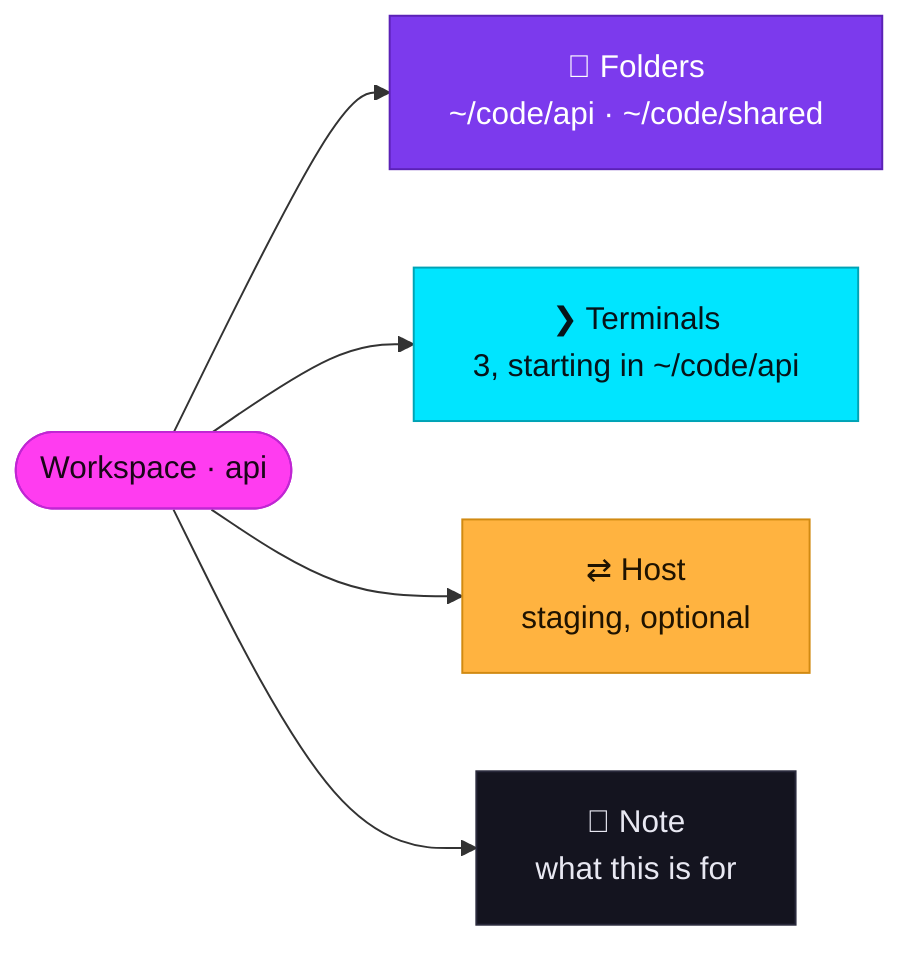
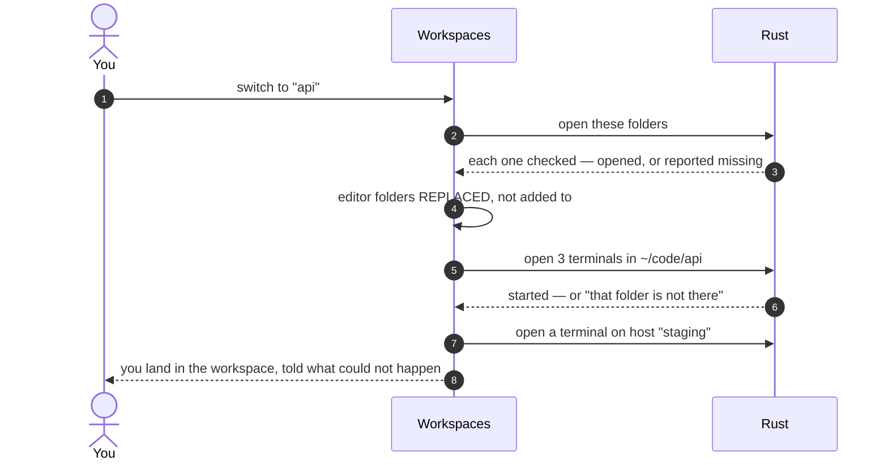
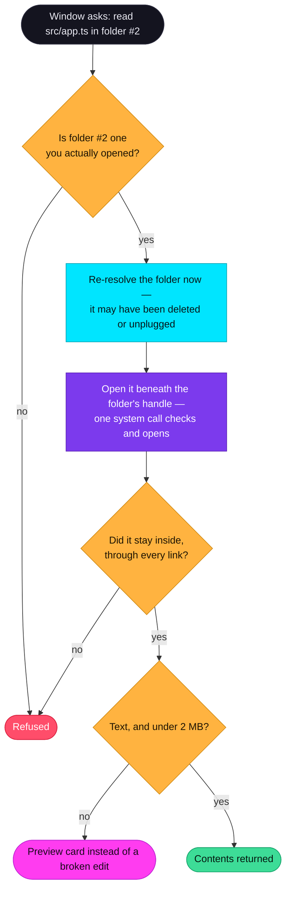
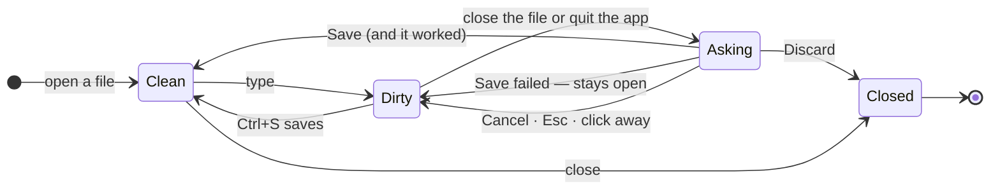

# Workspaces & editor

  

  
  
  
  

A **workspace** is the answer to *put me back where I was on that project*: which folders the editor
opens, where terminals start and how many, and which machine, if any. The **editor** is a fast,
deliberately small CodeMirror 6 editor that can reach the folders you open and nothing else.

**On this page:** [Workspaces](#workspaces) · [Switching](#what-switching-does) ·
[Git worktrees](#git-worktrees) · [The editor](#the-editor) · [The folder boundary](#the-folder-boundary) ·
[Files it cannot edit](#files-it-cannot-edit) · [Never losing work](#never-losing-work) ·
[Patterns that work](#patterns-that-work)

---

## Workspaces

| Field | Meaning | Limits |
|---|---|---|
| **Name** | What you call it. | Up to 60 characters |
| **Note** | One line about what it is for, shown under the name. | |
| **Folders** | Folders the editor opens. Paths as typed — `~` works. | |
| **Terminal folder** | Where new terminals start. Empty means wherever they would anyway. | Checked when set and on switching |
| **Terminals** | How many to open on switching. Zero leaves your terminals alone. | 0–8 |
| **Host** | A saved SSH host to open a terminal on. | |

**Save what is open** turns what you have already arranged into a workspace — which is how most
workspaces get made: the arrangement exists, and naming it is the only step left.

The **Workspaces** section (`▦`) shows the **current work** at the top, with **Edit** and **Leave**, and
a **library** below it, filterable and ordered by what you used last. From the shell:
`jky workspace` lists them and `jky workspace <name>` switches. From anywhere: <kbd>Ctrl</kbd>+<kbd>K</kbd>
and type its name.

---

## What switching does

| Behaviour | Why |
|---|---|
| **Replaces** the open folders rather than adding to them. | A workspace is where you were, not where you were plus the last project. |
| A folder that is missing is **reported and kept**. | An unplugged drive is a folder that comes back. Quietly editing your workspace to drop it would lose the setup you saved. |
| A start folder that is missing is **said**, not silently ignored. | A PTY falls back to your home folder when a directory is missing — right for spawning, useless as feedback. |
| At most **8** terminals per switch. | Not a terminal limit — a bound on what one click can do to a hand-editable file. |

> [!NOTE]
> **A workspace *names* things; it does not grant them.** Opening its folders goes through exactly the
> checks that opening one by hand does. `workspaces.json` is plain JSON you can edit, and editing it is a
> wish, not a way to read the machine.

---

## Git worktrees

A Git worktree is a second checkout of the same repository on another branch — perfect for reviewing a
pull request or running a long test without stashing your work. The **Git worktrees** panel in
Workspaces manages them for any project folder open in the editor.

| You can | How it is done |
|---|---|
| **See** every worktree with its branch, short commit, and whether it is **clean** or has **uncommitted changes** (and whether it is **locked**) | `git worktree list --porcelain`, plus `git status --porcelain` in each |
| **Create** one: a folder name, a new branch, and a base (default `HEAD`) | `git worktree add -b <branch> <folder> <base>`. The folder is created **next to** your project. |
| **Open** one as a workspace | One click — folders, terminals and all |
| **Remove** one | After you confirm. **Never forced:** Git refuses if there are uncommitted changes. The main checkout and locked worktrees cannot be removed here. |

**Your own Git does the work**, so behaviour matches the command line exactly. Every call is an
argument list — branch names and paths are never pasted into a shell string — the folder name must be a
single plain name (no `/`, `\`, `.` or `..`), and the branch name is checked with
`git check-ref-format --branch` before anything is created.

Completions follow worktrees too: `git checkout ` inside a linked worktree offers the same branches as
the main checkout, read from Git's files rather than by running Git.

---

## The editor

| Feature | Detail |
|---|---|
| **Engine** | CodeMirror 6, loaded as its own chunk the first time you open the Editor. |
| **Languages** | JavaScript, TypeScript, JSX/TSX, Rust, Python, JSON, Markdown, CSS, HTML — each fetched only when a file needs it. Other text opens as plain text. |
| **Save** | <kbd>Ctrl</kbd>/<kbd>⌘</kbd>+<kbd>S</kbd>. An unsaved file shows a dot on its tab. |
| **Several folders** | Open as many as you like, each with its own tree. Files from any of them open side by side. |
| **File operations** | Right-click a tree entry, or **+** on a folder heading: new file, new folder, rename, delete. |
| **Text size limit** | 2 MB for editing; 4 MB for previews. |
| **Skipped in the tree** | `node_modules`, `.git`, `target`, `dist`, `.next`, `.turbo` — never worth listing, expensive to walk. |

**Why CodeMirror and not Monaco?** Monaco is several megabytes that ship whether or not anyone opens it.
CodeMirror, with a chunk per language, adds **33 kB** to what everyone downloads — and that budget is
enforced: `pnpm run scan:bundle` fails the build if the entry bundle grows past its limit.

### Three file-operation rules, enforced in Rust

1. **A new file will not take a name that is already there** — that would be erasing, not creating.
2. **A rename will not overwrite another file.**
3. **A folder with anything in it will not be deleted.**

There is no undo and no wastebasket here, and the shell is right there for anyone who really means it.
Each rule has a test.

---

## The folder boundary

Folders are opened **in the editor**, not in Settings — choosing what to work on is the work. Every
path the window sends is **relative to one of those folders**; it never names an absolute path.

The folder is held as an **open directory handle**, and every path is opened *beneath* it by the same
system call that decides whether it is inside. `../`, a symlink pointing out of the tree, and a directory
swapped for a link between a check and an open are all refused by that one rule — there is no gap for
another process to slip through, and tests try exactly that thousands of times a second. A folder that
has been deleted or unplugged stops working rather than answering for a ghost, and is shown as
**missing** rather than quietly dropped.

> [!NOTE]
> **Symlinks:** relative links that stay inside the folder work normally. A link with an **absolute**
> target is refused even when it points inside — only a relative link can be followed beneath the
> handle without a second lookup that could be raced. Git and most tools create relative links.

> [!IMPORTANT]
> This boundary covers the **editor and the assistant's file tools**. It is not a sandbox for commands
> you run in a terminal — those run as you, with your permissions, like in any terminal.

---

## Files it cannot edit

A file the editor cannot edit still **opens**, with a plain explanation, instead of an error and an
empty pane.

| File | What you see |
|---|---|
| **Images** | Drawn. |
| **PDFs** | Drawn page by page (up to 30 pages), by rendering each page to a picture. |
| **Other binaries** | A card naming what the file is and how big, saying plainly that it cannot be edited here. |
| **Text that is not valid UTF-8** | Refused rather than mangled — an editor that rewrote bytes it could not decode would corrupt the file on the next save. |

**Why PDFs are pictures.** Handing the document to the webview would mean widening `frame-src` to
accept `data:` — a hole in the one rule that matters — and the webview JKY uses on Linux does not render
PDFs inline anyway. The renderer is 1.7 MB, so it is fetched only the first time somebody opens a PDF,
and its font data is served from the app itself: `connect-src 'self'` means a renderer that wanted a CDN
would be one this app could not use.

---

## Never losing work

Closing a file with changes **asks**: **Save**, **Discard**, or **Cancel**. Three answers because there
are three things you might mean — a two-button version makes one of them unreachable. <kbd>Esc</kbd> and
clicking away both mean Cancel, so a stray keystroke never costs anything, and a save that fails leaves
the file open; closing it anyway would be discarding under another name.

**Quitting asks too**, from any section. Which files are open lives outside the editor, so wandering off
to the terminal costs you the scroll position and nothing else.

---

## Patterns that work

<table>
<tr>
<td width="33%" valign="top">

### 🧩 One workspace per project

Folders, a start folder, three terminals. Switching is one keystroke away in the palette, and every
terminal opens where it should.

</td>
<td width="33%" valign="top">

### 🌿 A worktree per review

Create a worktree for the pull request, **Open workspace**, run its tests in its own terminals. Your
main checkout never moves.

</td>
<td width="33%" valign="top">

### 🚦 Production apart

A separate workspace whose host is the production machine — with a note that says so. It is never
reopened automatically.

</td>
</tr>
</table>

---

  <a href="keyboard-and-settings.md">← Keyboard & settings</a> &nbsp;·&nbsp;
  <a href="README.md">Documentation home</a> &nbsp;·&nbsp;
  <a href="assistant-and-approvals.md">Next: Assistant & approvals →</a>

